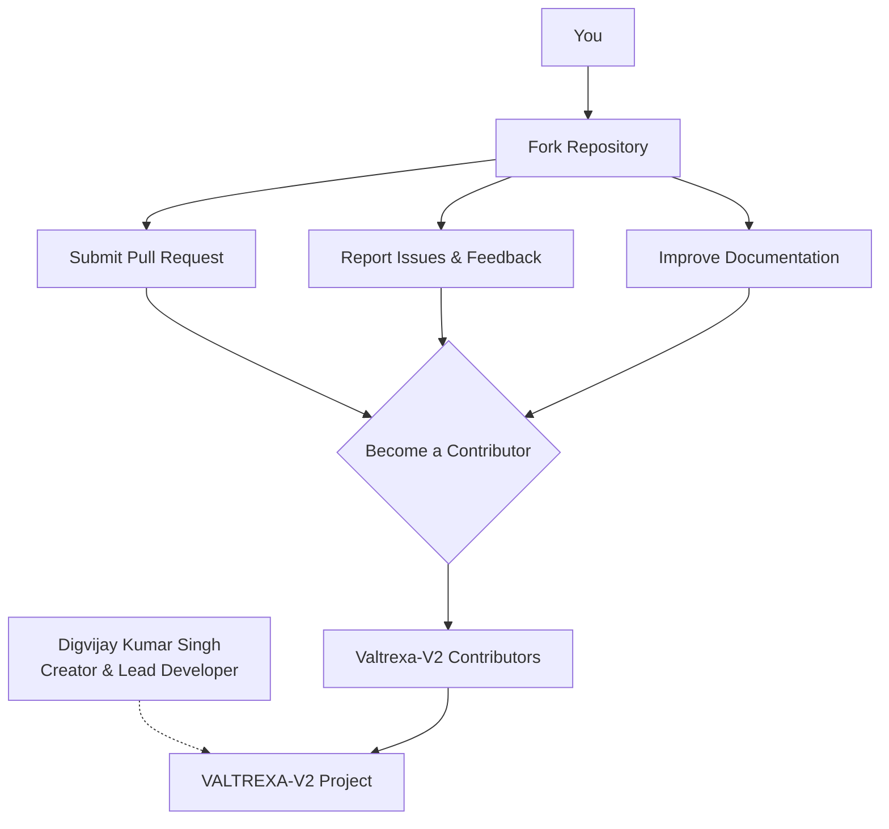

  <picture>
    <source media="(prefers-color-scheme: dark)" srcset="docs/assets/favicon.svg">
    
  </picture>

<h1 align="center">📄 Authors</h1>

  <strong>Version:</strong> v1.0.1 •
  <strong>Last Updated:</strong> 2026-07-05 •
  <strong>Category:</strong> Credits

**Description:** Author credits and contributor information for VALTREXA-V2.

---

## Table of Contents

- [Creator & Lead Developer](#creator--lead-developer)
- [Contributors](#contributors)
- [Related Documents](#related-documents)

---

## Creator & Lead Developer

- **Digvijay Kumar Singh**
  - Email: chauhandigvijay669@gmail.com
  - LinkedIn: [@digvijaykumarsingh](https://www.linkedin.com/in/digvijaykumarsingh/)
  - Portfolio: [dsc-portfolio-website.netlify.app](https://dsc-portfolio-website.netlify.app/)

> [!TIP]
> Interested in contributing? Check out the [Contributing Guide](CONTRIBUTING.md) to get started.

## Contributors

> [!NOTE]
> Contributions are welcome! See [CONTRIBUTING.md](CONTRIBUTING.md) for how to get started.

---

**VALTREXA-V2** — AI-native software engineering career operating system.

## Related Documents

- [Contributing Guide](CONTRIBUTING.md) — Development guide and conventions
- [Code of Conduct](CODE_OF_CONDUCT.md) — Community standards
- [README](README.md) — Project overview

---
