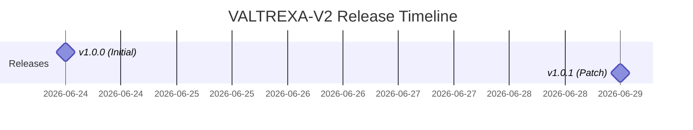
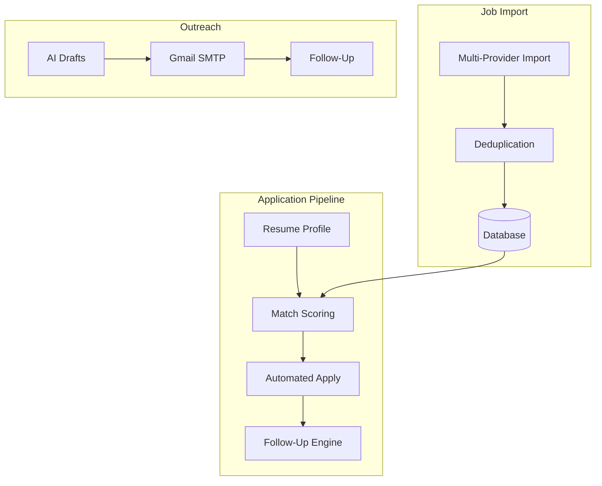

  <picture>
    <source media="(prefers-color-scheme: dark)" srcset="docs/assets/favicon.svg">
    
  </picture>

<h1 align="center">📄 Version History</h1>

  <strong>Version:</strong> v1.0.1 •
  <strong>Last Updated:</strong> 2026-07-05 •
  <strong>Category:</strong> Changelog

**Description:** Complete changelog documenting all notable changes to the VALTREXA-V2 project.

---

## Table of Contents

- [Release Lifecycle](#release-lifecycle)
- [1.0.1 — 2026-06-29](#101--2026-06-29)
- [1.0.0 — 2026-06-24](#100--2026-06-24)
- [Related Documents](#related-documents)

---

> [!NOTE]
> The format is based on [Keep a Changelog](https://keepachangelog.com/en/1.1.0/), and this project adheres to [Semantic Versioning](https://semver.org/spec/v2.0.0.html).

## Release Lifecycle

---

## [1.0.1] — 2026-06-29

### Fixed

- **Multi-tenant cookie isolation**: Removed `LINKEDIN_COOKIE`, `INDEED_COOKIE`, `NAUKRI_COOKIE`, `WELLFOUND_COOKIE`, `INSTAHYRE_COOKIE` env-var fallbacks from `cookie-manager.ts` and `playwright-platform.ts`. Cookies are now exclusively per-user stored in `provider_cookies` table — no shared env-var fallback.
- **Telegram inbound isolation**: Removed `TELEGRAM_USER_ID` env-var fallback from `resolveUserIdFromTelegramChat`. Unbound chats now correctly receive "not connected" instead of being silently attributed to a fixed user.
- **BotFather command registration**: Fixed `/start` description (was "System health check", same as `/health`); added missing `/help` command; removed invalid `refresh-cookies` (hyphen) — Telegram commands only allow `[a-z0-9_`.
- **Source cleanup**: Removed invalid `refresh-cookies` entry from `BOT_COMMANDS` array in `telegram-init.ts`.

### Changed

- **All 32 BotFather commands re-registered** with correct descriptions.
- **`resolveStorageState`** (`playwright-platform.ts`): Removed env-var fallback path — now only checks DB cookies and stored browser sessions.
- **`checkProviderCookie`** (`cookie-manager.ts`): Removed auto-write of env-var cookies to user's DB row — new unconfigured users get "missing" status instead of inheriting shared env cookies.
- **`.env.example`**: Removed `LINKEDIN_COOKIE`, `TELEGRAM_USER_ID` env vars.
- **`vitest.config.ts`**: Removed `LINKEDIN_COOKIE` test env var.
- **Prettier formatting applied** across all files (161 formatting fixes).
- **Stale docs removed**: `RELEASE_REPORT.md`, `DEPLOYMENT_CHECKLIST.md`, `docs/screenshots/`.

> [!IMPORTANT]
> The v1.0.1 patch introduces strict multi-tenant isolation. All cookie and user identity env-var fallbacks have been removed. Existing deployments relying on shared env cookies must migrate per-user credentials.

---

## [1.0.0] — 2026-06-24

### Initial Release

#### Core Capabilities

- **Resume-Driven Candidate Profile** — Upload, parse, analyze, and tailor resumes. AI-powered skill extraction, keyword gap analysis, and role suitability scoring. Resume version history with primary resume selection.
- **Job Import Engine** — Multi-provider job import from Greenhouse, Lever, Ashby, Workable, LinkedIn, Indeed, Naukri, Wellfound, and Instahyre. Deduplication and upsert by `user_id + source + external_id`.
- **Match Scoring** — Algorithmic resume-to-job matching with skill overlap, experience alignment, location fit, salary compatibility, and freshness weighting.
- **High-Value Target Assessment** — Strategic value scoring for target companies using hiring signals, funding data, growth signals, open job count, recruiter density, tech stack analysis, and AI-powered assessment (v3).
- **Recruiter Discovery** — AI-powered recruiter contact discovery (v2) and multi-source enrichment (v3). Email verification and confidence scoring.
- **Automated Application Pipeline** — End-to-end application submission via Playwright browser automation. Supports application package generation (cover letter, tailored resume), manual apply fallback, and approval workflow.
- **Batch Apply** — Apply to multiple jobs in a single operation with configurable strategies (balanced, aggressive, conservative). Approval mode for manual review before execution.
- **Outreach Engine** — AI-generated outreach drafts for email, LinkedIn DM, and Loom video scripts. Gmail SMTP sending via OAuth2.
- **Follow-Up Engine** — Automated follow-up cadence scheduling and generation for applications and recruiter contacts. Due follow-up listing and sent tracking.
- **Gmail Inbox Intelligence** — OAuth2 Gmail inbox sync with automatic message classification (interview, assessment, offer, rejection, networking, other).
- **Browser Profile Management** — Playwright-based authenticated session management with storage state capture, listing, and deletion per provider.
- **Provider Control System** — Enable, disable, and pause provider integrations with automatic failure detection and self-disabling after 3 consecutive failures. Health event logging.
- **Telegram Bot** — Real-time notifications and provider management via Telegram. Commands for provider status, enable/disable/pause, interview tracking, and stats.
- **Event Bus & Telegram** — Workflow event system with Telegram notifications.
- **Job Queue System** — BullMQ-based background job processing for imports, applications, recruiter discovery, outreach, follow-ups, Gmail sync, and analytics.
- **Analytics Dashboard** — Summary and daily analytics with key metrics, trends, and activity tracking.
- **Company CRM** — Target company tracking with quality scoring, strategic value assessment, and founder detection.
- **Interview Preparation** — Interview prep workspace with company research, question tracking, and preparation materials.
- **Settings & Configuration** — User settings, integration configuration, and provider credential management UI.
- **Supabase Auth** — Email/password and Google OAuth authentication with Row Level Security for multi-tenant data isolation.
- **Rate Limiting** — Per-IP rate limiting with configurable window and max requests.
- **Sentry Error Tracking** — Server-side error reporting with health endpoint exclusion.

#### Architecture Flow

- **TanStack Start** server framework with Vite build tooling.
- **File-based API routing** via `api/[...route].ts` catch-all handler.
- **Phase A (Data) / Phase B (Action)** handler separation in `api/phase-handlers.ts`.
- **Shared library pattern** in `api/_lib/` for all backend modules.
- **TypeScript strict mode** with ESLint and Prettier.
- **Vitest** for unit testing.
- **Vercel SSR** output via build-time preparation script.
- **PostgreSQL** database with auto-migration support.
- **Redis** for BullMQ queue backend.
- **Zustand + React Query** for state management.
- **Radix UI + Tailwind CSS v4** for component library.

> [!TIP]
> v1.0.0 is the foundational release with 22+ feature modules. For detailed migration notes, see the [README](README.md).

## Related Documents

- [README](README.md) — Project overview and getting started
- [Contributing Guide](CONTRIBUTING.md) — Development conventions and pull request process
- [Security Policy](SECURITY.md) — Vulnerability reporting

---
