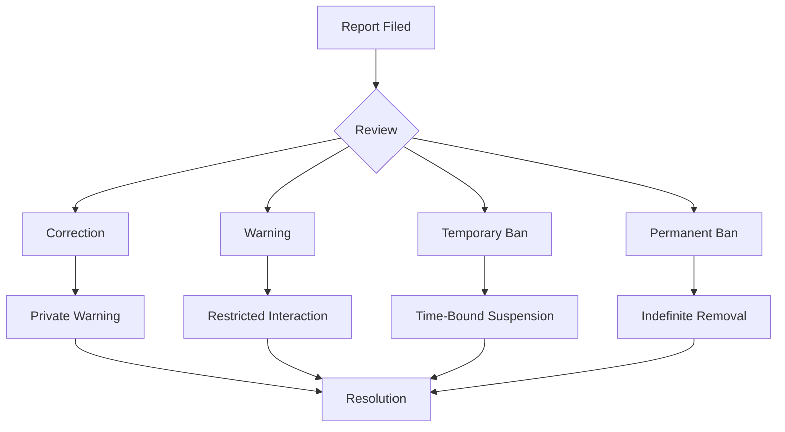

  <picture>
    <source media="(prefers-color-scheme: dark)" srcset="docs/assets/favicon.svg">
    
  </picture>

<h1 align="center">📄 Code of Conduct — VALTREXA-V2</h1>

  <strong>Version:</strong> v2.1 •
  <strong>Last Updated:</strong> 2026-07-05 •
  <strong>Category:</strong> Community Standards

**Description:** Contributor Covenant Code of Conduct — our pledge for a harassment-free, welcoming open-source community.

---

## Table of Contents

- [Our Pledge](#our-pledge)
- [Our Standards](#our-standards)
- [Enforcement Responsibilities](#enforcement-responsibilities)
- [Scope](#scope)
- [Enforcement](#enforcement)
- [Attribution](#attribution)
- [Related Documents](#related-documents)

---

## Our Pledge

We as members, contributors, and leaders pledge to make participation in our community a harassment-free experience for everyone, regardless of age, body size, visible or invisible disability, ethnicity, sex characteristics, gender identity and expression, level of experience, education, socio-economic status, nationality, personal appearance, race, religion, or sexual identity and orientation.

We pledge to act and interact in ways that contribute to an open, welcoming, diverse, inclusive, and healthy community.

---

## Our Standards

Examples of behavior that contributes to a positive environment for our community include:

- Demonstrating empathy and kindness toward other people
- Being respectful of differing opinions, viewpoints, and experiences
- Giving and gracefully accepting constructive feedback
- Accepting responsibility and apologizing to those affected by our mistakes, and learning from the experience
- Focusing on what is best not just for us as individuals, but for the overall community

Examples of unacceptable behavior include:

- The use of sexualized language or imagery, and sexual attention or advances of any kind
- Trolling, insulting or derogatory comments, and personal or political attacks
- Public or private harassment
- Publishing others' private information, such as a physical or email address, without their explicit permission
- Other conduct which could reasonably be considered inappropriate in a professional setting

> [!NOTE]
> This list is not exhaustive. Community leaders reserve the right to address any behavior they deem inappropriate, even if not explicitly listed.

---

## Enforcement Responsibilities

Community leaders are responsible for clarifying and enforcing our standards of acceptable behavior and will take appropriate and fair corrective action in response to any behavior that they deem inappropriate, threatening, offensive, or harmful.

Community leaders have the right and responsibility to remove, edit, or reject comments, commits, code, wiki edits, issues, and other contributions that are not aligned to this Code of Conduct, and will communicate reasons for moderation decisions when appropriate.

---

## Scope

This Code of Conduct applies within all community spaces, and also applies when an individual is officially representing the community in public spaces. Examples of representing our community include using an official e-mail address, posting via an official social media account, or acting as an appointed representative at an online or offline event.

---

## Enforcement

Instances of abusive, harassing, or otherwise unacceptable behavior may be reported to the community leaders responsible for enforcement at **chauhandigvijay669@gmail.com**. All complaints will be reviewed and investigated promptly and fairly.

All community leaders are obligated to respect the privacy and security of the reporter of any incident.

### Enforcement Guidelines

Community leaders will follow these Community Impact Guidelines in determining the consequences for any action they deem in violation of this Code of Conduct:

| Violation | Impact Level | Consequence |
|-----------|-------------|-------------|
| **1. Correction** | Minor — use of inappropriate language or other unprofessional behavior | Private written warning from community leaders, clarifying the nature of the violation and an explanation of why the behavior was inappropriate. A public apology may be requested. |
| **2. Warning** | Moderate — a violation through a single incident or series of actions | Warning with consequences for continued behavior. No interaction with the people involved for a specified period, including unsolicited interaction with those enforcing the Code of Conduct. Violating these terms may lead to a temporary or permanent ban. |
| **3. Temporary Ban** | Significant — a serious violation of community standards | Temporary ban from any sort of interaction or public communication with the community for a specified period. No public or private interaction with the people involved is permitted during this period. Violating these terms may lead to a permanent ban. |
| **4. Permanent Ban** | Severe — demonstrating a pattern of violation of community standards, including sustained inappropriate behavior, harassment of an individual, or aggression toward or disparagement of classes of individuals | Permanent ban from any sort of public interaction within the community. |

> [!WARNING]
> Retaliation against anyone who reports a violation or participates in an investigation is strictly prohibited and will result in immediate escalation.

---

## Attribution

This Code of Conduct is adapted from the [Contributor Covenant](https://www.contributor-covenant.org), version 2.1, available at [https://www.contributor-covenant.org/version/2/1/code_of_conduct.html](https://www.contributor-covenant.org/version/2/1/code_of_conduct.html).

Community Impact Guidelines were inspired by [Mozilla's code of conduct enforcement ladder](https://github.com/mozilla/diversity).

For answers to common questions about this code of conduct, see the FAQ at [https://www.contributor-covenant.org/faq](https://www.contributor-covenant.org/faq). Translations are available at [https://www.contributor-covenant.org/translations](https://www.contributor-covenant.org/translations).

---

## Related Documents

- [Contributing Guide](CONTRIBUTING.md) — Development guide and conventions
- [Security Policy](docs/SECURITY.md) — Reporting security vulnerabilities
- [README](README.md) — Project overview

---
