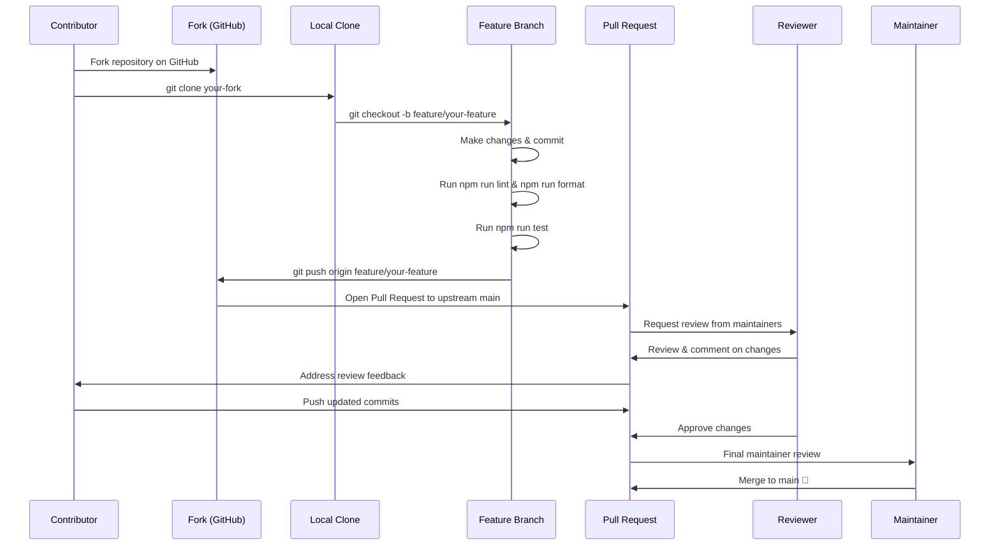

<p align="center">
  <picture>
    <source media="(prefers-color-scheme: dark)" srcset="docs/assets/favicon.svg">
    
  </picture>
</p>

<h1 align="center">📄 Contributing</h1>

<p align="center">
  <strong>Version:</strong> v1.0.1 •
  <strong>Last Updated:</strong> 2026-07-05 •
  <strong>Category:</strong> Development
</p>

**Description:** Development guide, conventions, and contribution process

---

## Table of Contents

- [Overview](#overview)
- [Quickstart Flow](#quickstart-flow)
- [Project Conventions](#project-conventions)
- [Code Style](#code-style)
- [Testing Framework](#testing-framework)
- [Pull Request Process](#pull-request-process)
- [Adding a New Job Provider](#adding-a-new-job-provider)
- [Contribution Workflow](#contribution-workflow)
- [Best Practices](#best-practices)
- [Related Documents](#related-documents)

---

## Overview

VALTREXA-V2 is an open-source project and welcomes contributions from the community. This guide covers everything you need to know to get started — from setting up your development environment to submitting your first pull request.

> [!IMPORTANT]
> By contributing to VALTREXA-V2, you agree to abide by the [Code of Conduct](CODE_OF_CONDUCT.md). Please ensure your contributions follow the conventions outlined in this document.

---

## Quickstart Flow

### Prerequisites

- Node.js 22+
- npm 10+
- A Supabase project (free tier works)
- A PostgreSQL database (via Supabase)

### Configuration Lifecycle

```bash
# 1. Clone the repository
git clone https://github.com/chauhandigvijay1/Valtrexa-V2.git
cd Valtrexa-V2

# 2. Install dependencies
npm install

# 3. Set up environment variables
cp .env.example .env
# Edit .env with your Supabase credentials, API keys, and provider cookies

# 4. Start the development server
npm run dev
```

The dev server starts on `http://localhost:5173` (Vite default). API routes are served at `/api/*` via the TanStack Start server handler.

### Command Reference

```bash
npm run dev             # Start development server
npm run build           # Production build (Vite + Vercel SSR preparation)
npm run preview         # Preview production build
npm run lint            # Run ESLint on all files
npm run format          # Auto-format with Prettier
npm run test            # Run unit tests (vitest)
npm run test:watch      # Run tests in watch mode
npm run worker          # Start the Railway worker for queue processing
```

---

## Project Conventions

### File-Based Routing

The project uses **TanStack Start** with a file-based API route structure:

- `api/[...route].ts` — single catch-all handler for all `/api/*` requests. Routes are dispatched via a `switch` statement based on the path.
- New endpoints should be added as a new `case` in the switch statement and a corresponding handler function defined in the same file or imported from `api/phase-handlers.ts`.

### Shared API Code (`api/_lib/`)

All shared backend logic lives in `api/_lib/` with 59 modules organized by domain:

| Module | Purpose |
|---|---|
| `auth.ts` | Authentication middleware (`requireApiUser`) |
| `supabase.ts` | Supabase admin client singleton |
| `http.ts` | Response helpers (`json`, `methodNotAllowed`, `readJson`) |
| `providers.ts` | Provider registry and type definitions |
| `provider-controls.ts` | Provider enable/disable/pause lifecycle |
| `match-engine.ts` | Resume-to-job matching algorithm |
| `high-value-engine.ts` | Strategic value scoring |
| `recruiter-discovery.ts` | Recruiter contact discovery |
| `apply-engine.ts` | Application submission pipeline |
| `batch-apply-engine.ts` | Batch application orchestration |
| `outreach-engine.ts` | Outreach message generation |
| `followup-engine.ts` | Follow-up scheduling and generation |
| `inbox-intelligence.ts` | Gmail inbox sync and classification |
| `playwright-platform.ts` | Browser profile and session management |
| `playwright-apply.ts` | Playwright-based automated apply |
| `queue.ts` | BullMQ job queue management |
| `event-bus.ts` | Webhook/event delivery system |
| `rate-limiter.ts` | In-memory rate limiting |
| `telegram.ts` | Telegram bot operations |
| `telegram-init.ts` | Telegram webhook and command registration |
| `job-sources.ts` | Individual job source importers |
| `ai-provider.ts` | Multi-provider AI client abstraction |
| `env.ts` | Environment variable loading |
| `auto-migrate.ts` | Database schema migrations |
| `self-healing.ts` | Automated provider recovery |

### Phase A / B Handler Pattern

Handlers follow a consistent pattern:

```typescript
export async function handleSomeAction(request: Request) {
  // 1. Authenticate
  const user = await requireApiUser(request);

  // 2. HTTP method guard
  if (request.method !== "POST") return methodNotAllowed(["POST"]);

  // 3. Parse and validate body
  const body = await readJson<{ someField: string }>(request);
  if (!body.someField) return json({ error: "someField required" }, { status: 400 });

  // 4. Execute business logic
  const result = await someEngine(user.id, body.someField);

  // 5. Return JSON response
  return json(result);
}
```

- **Phase A** handlers are data-centric: they analyze, score, discover, and prepare.
- **Phase B** handlers are action-centric: they apply, submit, send, and execute.

Both are defined in `api/phase-handlers.ts` and wired in `api/[...route].ts`.

### Frontend Conventions

- **UI Components**: React components using Radix UI primitives and Tailwind CSS v4
- **State Management**: Zustand for global state, React Query for server state
- **Routing**: TanStack Router (file-based routing in `src/routes/`)
- **Forms**: React Hook Form with Zod validation
- **API Client**: `src/lib/api-client.ts` provides `apiGet`/`apiPost` helpers that attach Supabase auth tokens

---

## Code Style

### TypeScript

- **Strict mode** enabled in `tsconfig.json` (`"strict": true`)
- Target `ES2022`, module resolution `Bundler`
- Path alias `@/*` maps to `./src/*`
- No unused locals/params warnings (configured off)

### ESLint

Configuration in `eslint.config.js`:

- Extends `@eslint/js` recommended and `typescript-eslint` recommended
- React Hooks rules enforced
- `react-refresh/only-export-components` as warning
- Integrated with Prettier via `eslint-plugin-prettier`

Run: `npm run lint`

### Prettier

Configuration in `.prettierrc`:

```json
{
  "printWidth": 100,
  "semi": true,
  "singleQuote": false,
  "trailingComma": "all"
}
```

Run: `npm run format`

---

## Testing Framework

### Unit Tests (Vitest)

Unit tests live in `tests/` and are run with **Vitest**.

```bash
npm run test            # Single run
npm run test:watch      # Watch mode
```

Configuration: `vitest.config.ts` — includes test environment variables (mocked credentials) and 30-second timeout.

Test files follow the pattern `tests/**/*.test.ts`. Write tests for:

- Engine functions (match engine, high-value engine, follow-up engine)
- Utility functions (rate limiter, providers, role taxonomy)
- Handler logic (request validation, response shapes)

### End-to-End Tests (Playwright)

Playwright is available as a dev dependency for E2E testing. Configuration is done via `PLAYWRIGHT_TEST_BASE_URL` environment variable.

---

## Pull Request Process

1. Create a feature branch from `main`
2. Make your changes following the project conventions above
3. Run `npm run lint` and `npm run format` to ensure code quality
4. Add or update tests as appropriate
5. Run `npm run test` to verify all tests pass
6. Create a pull request with a clear description of the change
7. Ensure the PR description includes:
   - What the change does
   - Why it's needed
   - Any breaking changes or migration steps

---

## Adding a New Job Provider

1. **Define the provider** in `api/_lib/providers.ts`:
   - Add the provider name to `PROVIDER_REGISTRY`
   - Define its `authMethod` (public_board, api_key, cookie, oauth)
   - Set its `capabilities` (jobsSupported, recruitersSupported, applicationsSupported)

2. **Create a source importer** in `api/_lib/job-sources.ts` (or a dedicated file):
   - Implement an `import<Provider>` function that fetches jobs from the provider's API or scrapes their board
   - Return an array of `ImportedJob` objects

3. **Register environment variables** in `.env.example`:
   - Add the required API keys, cookies, or tokens

4. **Add Playwright support** (if automated apply is needed):
   - Add provider-specific selectors and workflows in `api/_lib/playwright-apply.ts`
   - Register in the browser profile management system

5. **Add provider controls** in `api/_lib/provider-controls.ts`:
   - Add the provider name to the `PROVIDERS` array for lifecycle management

6. **Wire the import route** — the `case "providers/import"` handler in `api/[...route].ts` will automatically pick up new providers from the registry

7. **Test** the import with `npm run test` and verify via the provider audit endpoint

---

## Contribution Workflow



---

## Best Practices

- **Follow the Phase A/B pattern**: Keep data-centric logic in Phase A handlers and action-centric logic in Phase B handlers for consistency across the codebase.
- **Run lint and format before committing**: Always execute `npm run lint` and `npm run format` to ensure code quality and consistency with project standards.
- **Write tests for new engines and utilities**: Add unit tests in `tests/` following the `*.test.ts` naming convention — focus on edge cases and error paths.
- **Keep PRs focused and atomic**: One feature or fix per pull request. Clear descriptions with "what", "why", and migration notes help reviewers understand your changes.
- **Document new environment variables**: When adding provider integrations, update `.env.example` and the [Environment Variables](docs/ENVIRONMENT.md) doc so others know what is required.
- **Respect the file-based routing convention**: Add new API endpoints as `case` branches in `api/[...route].ts` rather than creating separate route files.

---

## Related Documents

- [Setup Guide](docs/SETUP.md) — Local development setup
- [Testing Guide](docs/TESTING.md) — Testing strategy details
- [Architecture](docs/ARCHITECTURE.md) — System design overview
- [FAQ](docs/FAQ.md) — Frequently asked questions
- [Code of Conduct](CODE_OF_CONDUCT.md) — Community standards
- [Authors](AUTHORS.md) — Project contributors
- [Security Policy](SECURITY.md) — Vulnerability reporting

---
