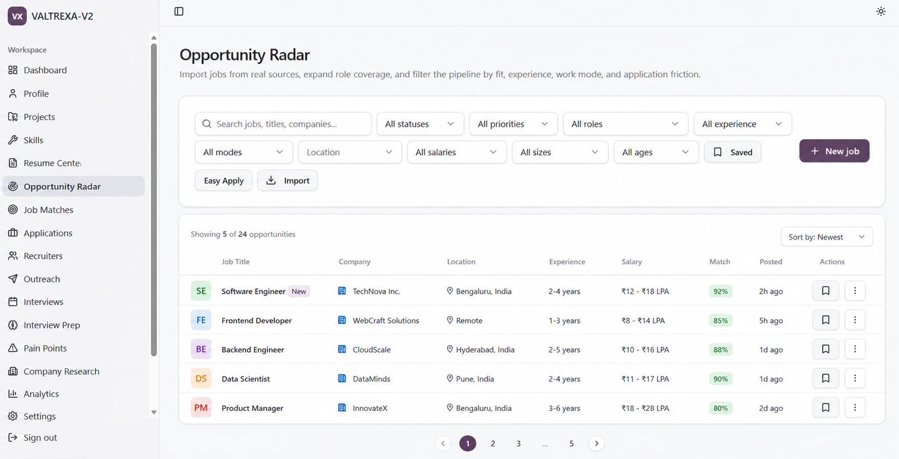
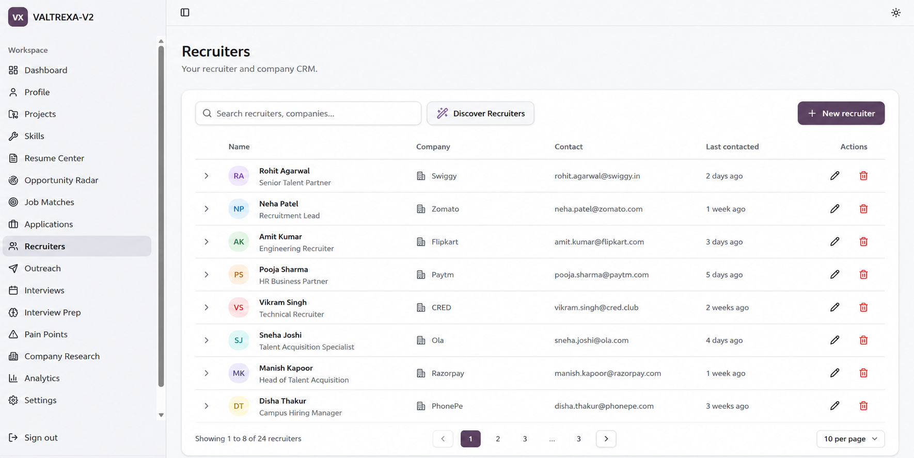
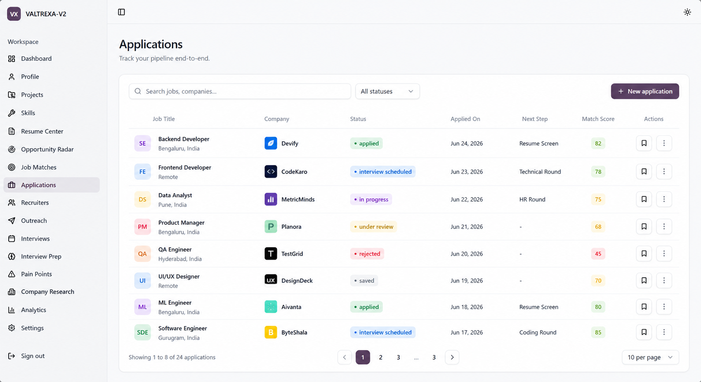
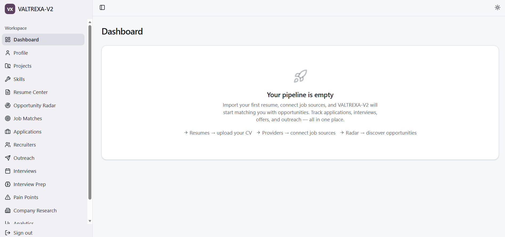
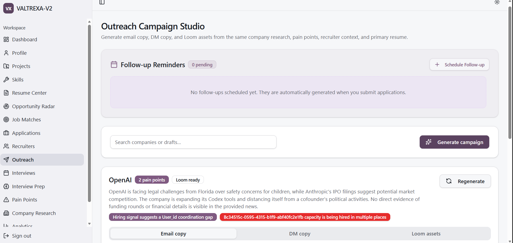
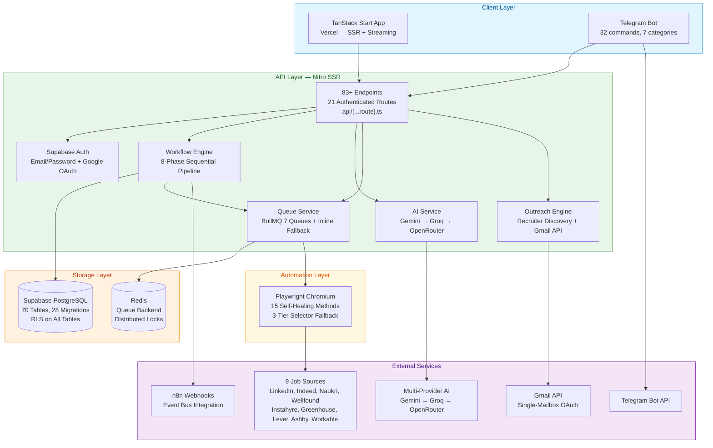
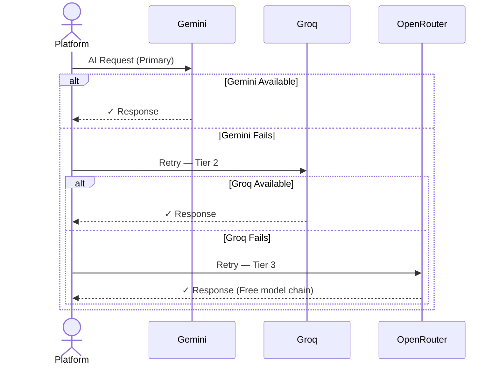

<p align="center">
  <picture>
    <source media="(prefers-color-scheme: dark)" srcset="docs/assets/favicon.svg">
    
  </picture>
</p>

<p align="center">
  <strong>Your AI Career Operating System — Automate every application, land every opportunity.</strong>
</p>

<p align="center">
  VALTREXA-V2 automates the end-to-end software engineering job search — from resume parsing<br/>
  and job discovery through automated applications and outreach orchestration.
</p>

<br/>

<p align="center">
  <a href="https://valtrexa-v2.vercel.app/" target="_blank">
    
  </a>
  <a href="docs/ARCHITECTURE.md" target="_blank">
    
  </a>
  <a href="https://github.com/chauhandigvijay1/Valtrexa-V2" target="_blank">
    
  </a>
</p>

<br/>

<p align="center">
  
  
  
  
  
  
  
  
  
  
</p>

<br/>

---
## 🎬 Demo Video
<p align="center">
  <a href="https://player.cloudinary.com/embed/?cloud_name=dtdvtkzsm&public_id=Valtrexa_uqdfzg" target="_blank">
    
  </a>
  <br/>
  <em>Click above to watch the official VALTREXA-V2 demo video.</em>
</p>
<br/>

<details>
<summary><strong>📑 Table of Contents</strong></summary>

- [Overview](#-overview)
- [Feature Showcase](#-feature-showcase)
- [Architecture](#️-architecture)
- [Tech Stack](#-tech-stack)
- [Getting Started](#-getting-started)
- [Environment Variables](#-environment-variables)
- [API Reference](#-api-reference)
- [Database Schema](#️-database-schema)
- [Security](#️-security)
- [Performance](#-performance)
- [Roadmap](#️-roadmap)
- [Known Limitations](#-known-limitations)
- [Best Practices](#-best-practices)
- [Documentation](#-documentation)
- [Contributing](#-contributing)
- [License](#-license)
- [Author](#-author)
- [Support](#-support)

</details>

<br/>

---

## 🌍 Overview

### The Problem

Software engineers waste hours every day manually checking job boards, copy-pasting applications, tracking follow-ups in spreadsheets, writing recruiter emails from scratch, and losing track of where they stand. Every missed follow-up is a missed opportunity. There is no single platform that handles the full job search lifecycle — and manual processes don't scale.

### The Solution

**VALTREXA-V2** is a full-stack, AI-native career operating system that automates the end-to-end software engineering job search. It integrates with **nine job sources** (LinkedIn, Indeed, Naukri, Wellfound, Instahyre, Greenhouse, Lever, Ashby, Workable), uses **multi-provider AI** (Gemini → Groq → OpenRouter) for matching and discovery, runs **Playwright-based browser automation** for applications, and surfaces everything through a dashboard and **Telegram bot with 32 commands**.

The platform runs an **8-phase sequential workflow** — `import_jobs → match_jobs → discover_recruiters → high_value_pipeline → apply_pipeline → followups → health_check → analytics` — fully automated, fully observable, and always under your control.

<br/>

---

## 🌟 Feature Showcase

<p align="center">
  <sub>🖥️ Explore the <strong>Core Interfaces</strong> of VALTREXA-V2 below.</sub>
</p>

<br/>

<details open>
<summary><strong>🖥️ View Core Interfaces</strong></summary>
<br/>

<table>
  <tr>
    <td align="center" width="50%">
      <strong>1 — Analytics Dashboard</strong><br/>
      <sub>Pipeline metrics & conversion rates</sub><br/><br/>
      <br/><br/>
      <kbd>Pipeline Funnel</kbd> &nbsp; <kbd>Weekly Trends</kbd>
    </td>
    <td align="center" width="50%">
      <strong>2 — Opportunity Radar</strong><br/>
      <sub>AI-scored job matches from 9 providers</sub><br/><br/>
      <br/><br/>
      <kbd>8-Factor Scoring</kbd> &nbsp; <kbd>Tier Bucketing</kbd>
    </td>
  </tr>
  <tr>
    <td align="center" width="50%">
      <strong>3 — Recruiter Discovery</strong><br/>
      <sub>Multi-strategy contact discovery</sub><br/><br/>
      <br/><br/>
      <kbd>Multi-Strategy</kbd> &nbsp; <kbd>High-Value Targeting</kbd>
    </td>
    <td align="center" width="50%">
      <strong>4 — Settings & Configuration</strong><br/>
      <sub>Full workspace & AI provider configuration</sub><br/><br/>
      <br/><br/>
      <kbd>Provider Config</kbd> &nbsp; <kbd>Cookie Management</kbd>
    </td>
  </tr>
  <tr>
    <td align="center" width="50%">
      <strong>5 — Application Pipeline</strong><br/>
      <sub>Macro-level dataset view</sub><br/><br/>
      
    </td>
    <td align="center" width="50%">
      <strong>6 — Main Dashboard</strong><br/>
      <sub>Unified home view & quick actions</sub><br/><br/>
      
    </td>
  </tr>
  <tr>
    <td align="center" width="50%">
      <strong>7 — Outreach Orchestration</strong><br/>
      <sub>AI-generated drafts via Gmail API</sub><br/><br/>
      
    </td>
    <td align="center" width="50%">
      <strong>8 — Provider Controls</strong><br/>
      <sub>Per-provider health & cookies</sub><br/><br/>
      
    </td>
  </tr>
</table>

</details>

<br/>

---

## 🏛️ Architecture

### System Overview



### 8-Phase Workflow Pipeline


Each phase is independently executable with per-phase error isolation — a failure in one phase does not block subsequent phases. State is persisted in the workflow state machine (`idle / running / paused / stopped`). Stale workflows exceeding **2 hours** without updates are auto-stopped.

### Multi-Provider AI Fallback Chain



> **OpenRouter Free Model Chain:** `google/gemma-4-26b-a4b-it:free` → `qwen/qwen3-next-80b-a3b-instruct:free` → `nvidia/nemotron-nano-9b-v2:free`

<br/>

---

## 💻 Tech Stack

| Layer | Technology | Purpose |
|-------|-----------|---------|
| **Frontend** | TanStack Start (React 19), TanStack Router, TanStack Query, Tailwind CSS v4, 46 shadcn/ui components | SSR UI, routing, server state management |
| **API** | Nitro SSR (Vite 7), file-based `api/[...route].ts` routing (83+ endpoints, 21 authenticated routes) | Full-stack API with SSR streaming |
| **Database** | Supabase PostgreSQL (70 tables, 28 migrations, RLS on all tables, 60+ indexes, 50+ triggers) | Persistent multi-tenant storage |
| **AI** | Multi-provider with automatic fallback: Gemini → Groq → OpenRouter | Matching, outreach generation, resume parsing |
| **Automation** | Playwright (Chromium) — 15 self-healing methods, 3-tier selector fallback, persistent Edge profiles | Browser-based automated job applications |
| **Queues** | BullMQ (Redis) — 7 queue types with inline fallback | Background job processing and scheduling |
| **Notifications** | In-app notification center + Telegram Bot (32 commands, 7 categories) | Real-time ops and approvals |
| **Auth** | Supabase Auth — email/password + Google OAuth, CSRF-protected state param, email confirmation | Secure multi-tenant authentication |
| **Encryption** | AES-256-GCM (provider cookies), SHA-256 key derivation, per-user isolation | Cookie-based provider auth at rest |
| **Email** | Gmail API (OAuth, single-mailbox, inbox classification) | Outreach sending and inbox intelligence |
| **Monitoring** | Sentry (Node + React), Pino structured logging | Error tracking and performance observability |
| **Deployment** | Vercel (SSR + API) + Railway (optional background worker) | CI/CD with auto-scaling |

<br/>

---

## 🚀 Getting Started

### Prerequisites

- [Node.js](https://nodejs.org) 22.x
- [Supabase](https://supabase.com) project (free tier works)
- [Groq API key](https://console.groq.com) or [Google AI Studio](https://aistudio.google.com) key (Gemini)
- [Git](https://git-scm.com)

### 1. Clone the Repository

```bash
git clone https://github.com/chauhandigvijay1/Valtrexa-V2.git
cd Valtrexa-V2
```

### 2. Install Dependencies

```bash
npm install
```

### 3. Configure Environment

```bash
cp .env.example .env
# Edit .env with your credentials — see docs/ENVIRONMENT.md for the full reference
```

### 4. Apply Database Migrations

```bash
npx supabase migration up
```

### 5. Run Locally

```bash
npm run dev
```

The app will be available at `http://localhost:3000`.

> **Tip:** Use the [Quickstart Guide](docs/QUICKSTART.md) for a 5-minute walkthrough from clone to your first automated workflow run.

### 6. (Optional) Run Background Worker

For long-running Playwright-based workflows in production, deploy the optional Railway worker:

```bash
npm run worker
```

<br/>

---

## 🔐 Environment Variables

> **Never commit your `.env` file.** Refer to [docs/ENVIRONMENT.md](docs/ENVIRONMENT.md) for the complete reference of all variables.

### Core (`/.env`)

| Variable | Status | Description | Example |
|----------|--------|-------------|---------|
| `SUPABASE_URL` | **Required** | Your Supabase project URL | `https://xyz.supabase.co` |
| `SUPABASE_ANON_KEY` | **Required** | Supabase public anon key | `eyJ...` |
| `SUPABASE_SERVICE_ROLE_KEY` | **Required** | Service role key — server-side only, bypasses RLS | `eyJ...` |
| `GEMINI_API_KEY` | Recommended | Primary AI provider key (Gemini) | `AIza...` |
| `GROQ_API_KEY` | Recommended | Secondary AI provider key (Groq) | `gsk_...` |
| `OPENROUTER_API_KEY` | Recommended | Tertiary AI provider key (OpenRouter) | `sk-or-...` |
| `COOKIE_ENCRYPTION_KEY` | **Required** | AES-256-GCM encryption key for provider cookies | 32+ random characters |
| `TELEGRAM_BOT_TOKEN` | Optional | Telegram bot token for the 32-command operations interface | `123456:ABC-...` |
| `GMAIL_CLIENT_ID` | Optional | Gmail OAuth client ID for inbox intelligence | `xyz.apps.googleusercontent.com` |

> [!CAUTION]
> `SUPABASE_SERVICE_ROLE_KEY` bypasses all Row Level Security. **Never** expose it to the client or commit it to version control.

<br/>

---

## 📡 API Reference

All routes are served from `api/[...route].ts` on the Nitro SSR server. Authentication is handled via Supabase JWT validated by the `requireApiUser` middleware. For exhaustive schemas, refer to [docs/API_REFERENCE.md](docs/API_REFERENCE.md).

| Domain | Route | Method | Auth | Description |
|--------|-------|--------|------|-------------|
| **Auth** | `/api/auth/callback` | `GET` | No | Handle OAuth callback and session creation |
| **Workflow** | `/api/workflow/start` | `POST` | Yes | Start the 8-phase automated workflow cycle |
| **Workflow** | `/api/workflow/status` | `GET` | Yes | Query current workflow state and active phase |
| **Jobs** | `/api/jobs/import` | `POST` | Yes | Import jobs from configured providers |
| **Jobs** | `/api/jobs/match` | `POST` | Yes | Run 8-factor AI match scoring on imported jobs |
| **AI** | `/api/ai/outreach` | `POST` | Yes | Generate personalized recruiter outreach message |
| **Brain** | `/api/brain/resume` | `POST` | Yes | Upload and parse PDF/DOCX resume into Candidate Brain |
| **Telegram** | `/api/telegram/webhook` | `POST` | Secret Header | Receive and process Telegram bot commands |
| **Admin** | `/api/admin/users` | `GET` | Admin | Multi-tab admin: user inspection, provider controls |

> The platform exposes **83+ endpoints** total across 21 authenticated routes.

<br/>

---

## 🗄️ Database Schema

VALTREXA-V2 runs on **Supabase PostgreSQL** with **70 highly-indexed tables** across **28 migration files**. Row Level Security is enforced on every table without exception. For full schema and indexing logic, see [docs/DATABASE.md](docs/DATABASE.md).

**Table Groups (13 domains):**

| Domain | Key Tables | Purpose |
|--------|-----------|---------|
| **Identity** | `profiles`, `telegram_bindings` | User accounts and Telegram user binding |
| **Resume** | `resume_profiles`, `candidate_memory` | Parsed resume data, dynamic Candidate Brain |
| **Jobs** | `jobs`, `applications`, `provider_controls` | Job import, match scoring, application tracking |
| **Automation** | `workflow_state`, `queue_jobs`, `provider_cookies` | Playwright state machine, encrypted cookie storage |
| **Outreach** | `outreach_messages`, `recruiter_contacts`, `followup_schedules` | Recruiter discovery and follow-up cadence |
| **Intelligence** | `gmail_messages`, `inbox_classifications` | Gmail sync and AI email classification |
| **Events** | `workflow_events`, `workflow_event_deliveries`, `notifications` | Event bus, n8n webhook subscriptions, notification queue |

> **Security Audit:** 145+ write operations audited — zero unscoped service-role writes. Every write includes `.eq("user_id", userId)` for defense-in-depth isolation.

<br/>

---

## 🛡️ Security

VALTREXA-V2 enforces a **defense-in-depth security architecture** spanning authentication, encryption, rate limiting, input validation, and multi-tenant data isolation.

- **Supabase Auth + CSRF Protection**: Google OAuth uses `crypto.randomUUID()` state parameter — mismatches are rejected before session creation to prevent CSRF attacks.
- **Dual Isolation Layer**: Database-level RLS (`user_id = auth.uid()`) combined with code-level user scoping (`.eq("user_id", userId)`) on all 145+ service-role write operations. Zero unscoped writes found across full audit.
- **AES-256-GCM Cookie Encryption**: Provider session cookies encrypted at rest with per-user keys derived via SHA-256. Format: `hex(iv):hex(authTag):hex(ciphertext)`. Stored in `provider_cookies` table with per-user RLS.
- **Telegram Webhook Security**: `TELEGRAM_WEBHOOK_SECRET` validated against `x-telegram-bot-api-secret-token` header on every update. Per-chat rate limit: 10 req/3s. No `TELEGRAM_USER_ID` env-var fallback — every user must bind via `/connect`.
- **Rate Limiting**: Global in-memory rate limiter — 100 req / 60s / IP — applied at middleware before business logic executes. Exceeded limits return HTTP 429 with `retry-after` header.
- **Input Validation**: All API payloads parsed via `readJson<T>()`. Parameterized Supabase queries prevent SQL injection. Mandatory `user_id` filters prevent IDOR attacks.

<br/>

---

## ⚡ Performance

- **Indexed Queries**: All 70 tables indexed on `user_id`, `created_at`, and status columns. Service-role queries always include `.eq("user_id", userId)` to leverage compound indexes and avoid sequential scans.
- **Streaming SSR**: TanStack Start with Nitro delivers progressive page rendering and near-zero TTFB — static assets served from Vercel's global CDN edge network.
- **BullMQ + Inline Fallback**: 7 named queues with configurable concurrency. When Redis is unreachable, queues degrade to **inline execution** — zero downtime, no hard Redis dependency.
- **Self-Healing Playwright**: 15 resilience methods (`findElementWithFallback`, `findElementByText`, `findElementFuzzy`, `smartSelectorHeal`, `autoHeal`, and 10 more) with a 3-tier selector fallback. Persistent Edge profiles reuse authenticated sessions across cycles, eliminating repeated login overhead.
- **Distributed Locking**: Railway worker uses Redis `SET NX EX` for distributed locking (`lock:workflow:{userId}`, 5m TTL) — prevents duplicate workflow cycles across replicas.
- **TanStack Query Cache**: Frontend uses stale-while-revalidate caching with request deduplication, optimistic updates, and automatic cache invalidation on mutations.

<br/>

---

## 🛣️ Roadmap

### Implemented ✓

- [x] 8-phase automated workflow pipeline (import → match → recruit → outreach → apply → followup → health → analytics)
- [x] Multi-provider job import from 9 sources (LinkedIn, Indeed, Naukri, Wellfound, Instahyre, Greenhouse, Lever, Ashby, Workable)
- [x] 8-Factor AI match scoring engine (skills: 0.32, role: 0.20, experience: 0.16, location: 0.10, salary: 0.07, freshness: 0.07, companyQuality: 0.05, recruiter: 0.03)
- [x] Playwright auto-apply with 3 strategies (conservative / balanced / aggressive) and 15 self-healing methods
- [x] Multi-strategy recruiter discovery + AI-generated personalized outreach (OpenRouter)
- [x] Gmail API inbox sync + AI email classification (interview, assessment, offer, rejection)
- [x] Telegram bot with 32 commands across 7 categories, inline keyboard approvals (Approve/Edit/Skip/Always/Never)
- [x] Multi-provider AI fallback chain: Gemini → Groq → OpenRouter (free model chain)
- [x] BullMQ queues (7 types) with Redis distributed locking and inline fallback
- [x] Multi-user isolation — RLS on all 70 tables, zero unscoped writes
- [x] AES-256-GCM encrypted per-user provider cookie storage
- [x] 9-step onboarding wizard
- [x] n8n Webhook event bus integration
- [x] Admin dashboard (user inspection, provider controls, queue monitoring)
- [x] Self-healing workflow state machine (idle/running/paused/stopped; auto-cleanup >2h stale)

### Planned ⏳

- [ ] Admin Telegram commands (`/broadcast`, `/inspect`, `/admin-status`)
- [ ] Application status auto-detection from Gmail replies (AI classification)
- [ ] Resume auto-tailoring per job description using match scoring factors
- [ ] Enhanced analytics — pipeline conversion funnel, per-provider metrics, success rate by match tier
- [ ] Additional job providers (regional and niche boards)
- [ ] Salary negotiation assistant (market rate analysis and negotiation scripts)
- [ ] Plugin system for community-contributed provider integrations
- [ ] Mobile app (React Native)

See [ROADMAP.md](ROADMAP.md) for the complete version history and Q3–Q4 2026 development timeline with a full Gantt chart.

<br/>

---

## ⚠️ Known Limitations

| Limitation | Impact | Workaround |
|-----------|--------|------------|
| Single-mailbox Gmail | One shared Gmail account for all outreach | Configure the account carefully; multi-account not yet supported |
| Cookie-dependent providers | Requires periodic manual cookie refresh (every 1–4 weeks per provider) | System alerts on expiry; re-extract from browser DevTools |
| Windows-only cookie extraction script | Linux/macOS users cannot use the helper script | Manual paste method works on all platforms via the dashboard UI |
| In-memory rate limiting | Rate limit state resets on server restart/cold start | Acceptable for serverless deployments (Vercel) |
| No built-in CAPTCHA solving | CAPTCHA blocks automation on some providers | Manual intervention required; reduce automation frequency as a workaround |

<br/>

---

## ✅ Best Practices

- **Environment Security**: Never commit `.env` or expose `SUPABASE_SERVICE_ROLE_KEY` client-side. Use Vercel environment variables for all production secrets.
- **Cookie Management**: Re-extract provider cookies every 1–2 weeks to prevent session expiry. Use the dashboard cookie management UI — all storage is AES-256-GCM encrypted.
- **Approval Mode**: Enable Telegram approval mode when running workflows for the first time. Review application quality before disabling.
- **AI Provider Fallbacks**: Always configure at least two AI providers (primary + one fallback) to ensure uninterrupted matching and outreach generation.
- **Regular Migration Checks**: After pulling updates, run `npx supabase migration up` to apply any new database migrations.
- **Telegram Binding**: Every user must complete Telegram binding via `/connect <token>` — without it, they cannot receive notifications or approve applications.
- **Redis for Production**: Use Redis (BullMQ) in production deployments. The inline fallback is suitable only for local development and single-user setups.
- **User Isolation First**: Every service-role query must include `.eq("user_id", userId)` — never rely on RLS alone for server-side operations.

<br/>

---

## 📚 Documentation

VALTREXA-V2 ships with a comprehensive documentation library across **20+ documents**.

### Architecture & Design

| Document | Description |
|----------|-------------|
| [Architecture](docs/ARCHITECTURE.md) | System design, data flow, and key technology decisions |
| [Case Study](docs/CASE_STUDY.md) | Problem, solution architecture, decisions, outcomes, and key metrics |

### Frontend & Backend

| Document | Description |
|----------|-------------|
| [Frontend Architecture](docs/FRONTEND.md) | Component library, routing, state, design system (46 shadcn/ui components) |
| [Backend Architecture](docs/BACKEND.md) | 59 backend modules, API handler pattern, Phase A/B engine |
| [AI Architecture](docs/AI.md) | Multi-provider AI, model selection, and fallback chain |

### API & Database

| Document | Description |
|----------|-------------|
| [API Reference](docs/API_REFERENCE.md) | Complete endpoint documentation (83+ endpoints) |
| [Database Schema](docs/DATABASE.md) | Tables, relationships, 28 migrations, RLS policies |

### Deployment & Environment

| Document | Description |
|----------|-------------|
| [Setup Guide](docs/SETUP.md) | Full local development environment setup |
| [Deployment Guide](docs/DEPLOYMENT.md) | Production deployment on Vercel + Railway |
| [Environment Variables](docs/ENVIRONMENT.md) | Complete env reference by category |
| [Performance](docs/PERFORMANCE.md) | Performance considerations and scalability architecture |

### Providers & Automation

| Document | Description |
|----------|-------------|
| [Provider Guide](docs/PROVIDER_GUIDE.md) | Provider integrations, authentication, and failure recovery |
| [Cookie Guide](docs/COOKIE_GUIDE.md) | Cookie extraction, AES-256-GCM encryption, and validation |
| [Workflow Guide](docs/WORKFLOW.md) | 8-phase pipeline, state machine, and recovery logic |

### Operations

| Document | Description |
|----------|-------------|
| [Telegram Operations](docs/TELEGRAM_OPERATIONS.md) | All 32 bot commands, notifications, and approval workflows |
| [Admin Guide](docs/ADMIN.md) | Admin dashboard, user management, and queue monitoring |

### Tutorials & Reference

| Document | Description |
|----------|-------------|
| [Quickstart](docs/QUICKSTART.md) | 5-minute setup and first workflow run |
| [Tutorials](docs/TUTORIALS.md) | Step-by-step walkthroughs for common use cases |
| [FAQ](docs/FAQ.md) | Frequently asked questions |
| [Troubleshooting](docs/TROUBLESHOOTING.md) | Common issues and solutions |
| [Glossary](docs/GLOSSARY.md) | Complete terminology reference |

### Integration & Security

| Document | Description |
|----------|-------------|
| [Integration Guide](docs/INTEGRATION_GUIDE.md) | n8n, Gmail, Telegram, and AI provider integrations |
| [Webhook Events](docs/WEBHOOK_EVENTS.md) | Event types, payload schemas, and consumer patterns |
| [Security](docs/SECURITY.md) | Auth, RLS, encryption, rate limiting, and secrets management |
| [Testing Guide](docs/TESTING.md) | Unit tests, E2E tests, and CI pipeline |
| [Migration Guide](docs/MIGRATION_GUIDE.md) | Version upgrade procedures |

### Community

| Document | Description |
|----------|-------------|
| [Contributing](CONTRIBUTING.md) | Development guide and Conventional Commits workflow |
| [Code of Conduct](CODE_OF_CONDUCT.md) | Community standards and expectations |
| [Authors](AUTHORS.md) | Project creators and contributors |
| [Security Policy](SECURITY.md) | Security policy and vulnerability reporting |
| [Support](SUPPORT.md) | Getting help and reporting issues |
| [Roadmap](ROADMAP.md) | Version history and planned features |
| [Changelog](CHANGELOG.md) | Full release history |

<br/>

---

## 🤝 Contributing

We welcome world-class engineers to the project. Please review our [Contributing Guidelines](CONTRIBUTING.md) to understand our Conventional Commits workflow, PR requirements, and Code of Conduct before opening a pull request.

<br/>

---

## 📄 License

VALTREXA-V2 is open-source software licensed under the **[MIT License](LICENSE)**.

---

## 🧑‍💻 Author

**Digvijay Kumar Singh**  
*Creator, Lead Architect, and Maintainer*

[](https://www.linkedin.com/in/digvijaykumarsingh/)
[](https://dsc-portfolio-website.netlify.app/)
[](mailto:chauhandigvijay669@gmail.com)
[](https://github.com/chauhandigvijay1)

---

## 📞 Support

If you encounter a replicable issue, review the [Troubleshooting Guide](docs/TROUBLESHOOTING.md) or the [FAQ](docs/FAQ.md) first. For unresolved issues, open a ticket on our [GitHub Tracker](https://github.com/chauhandigvijay1/Valtrexa-V2/issues). For general questions and community discussion, see [SUPPORT.md](SUPPORT.md).

<div align="center">
  <em>Thank you for exploring VALTREXA-V2. If you find this project valuable, please consider giving it a ⭐ on GitHub!</em>
</div>
