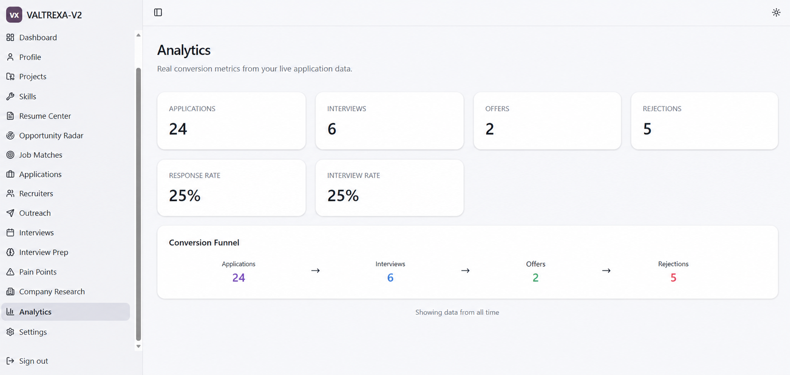
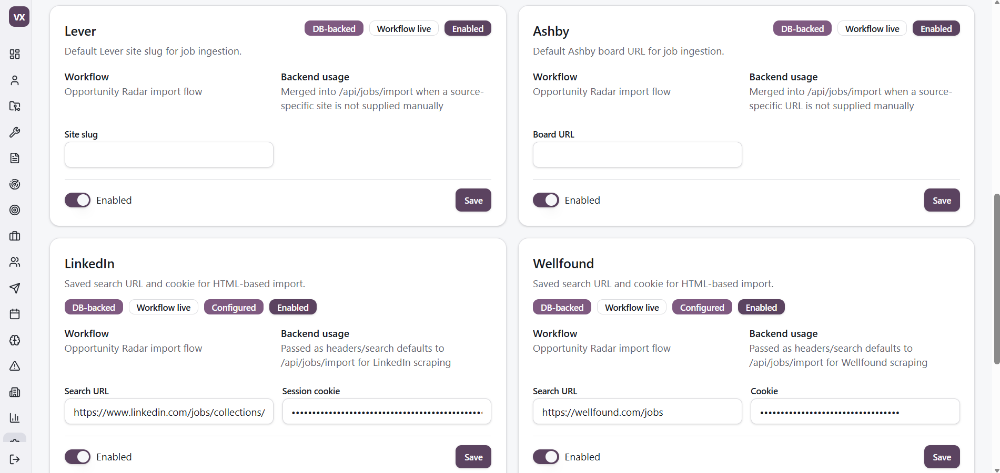
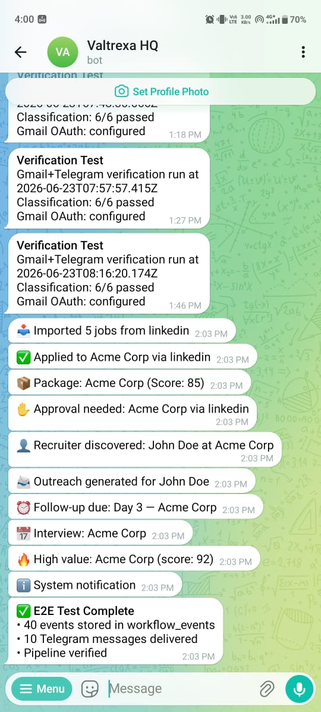
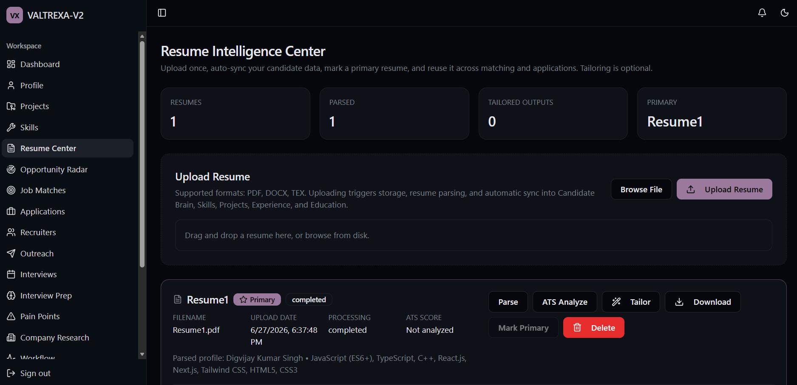
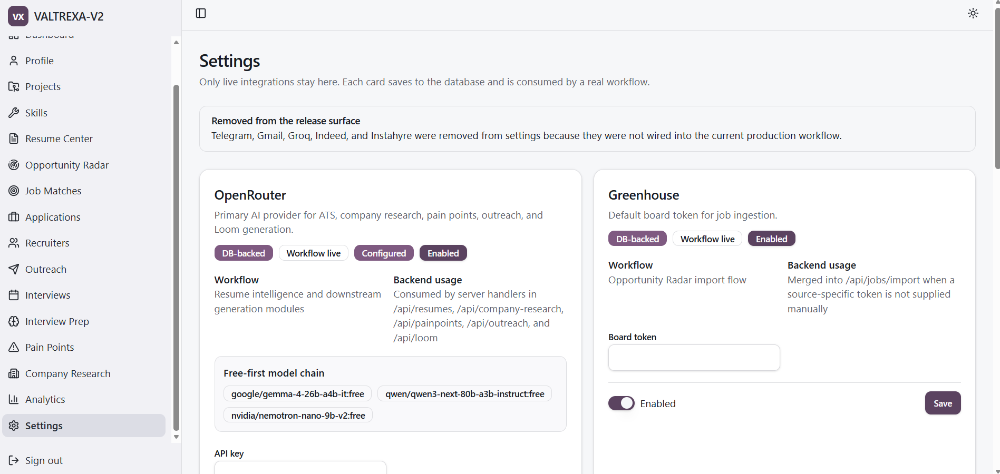

<div align="center">

# VALTREXA-V2

**AI-native software engineering career operating system**

<br>

[](https://www.typescriptlang.org/)
[](https://react.dev/)
[](https://tanstack.com/start)
[](https://vite.dev/)
[](https://supabase.com/)
[](https://www.postgresql.org/)

<br>

<a href="https://valtrexa-v2.vercel.app/" target="_blank">**Live Demo**</a>
<span>&nbsp;&nbsp;·&nbsp;&nbsp;</span>
<a href="https://github.com/chauhandigvijay1/Valtrexa-V2" target="_blank">**GitHub**</a>

</div>

---

## Overview

VALTREXA-V2 automates the end-to-end software engineering job search — from resume parsing and job discovery through automated applications and outreach orchestration. It integrates with nine job sources (LinkedIn, Indeed, Naukri, Wellfound, Instahyre, Greenhouse, Lever, Ashby, Workable), uses multi-provider AI for matching and discovery, runs Playwright-based browser automation for applications, and surfaces everything through a dashboard and Telegram bot.

## Architecture

The system is a **server-rendered React frontend** (TanStack Start + Vite) with a **Nitro-powered API layer** (file-based routing in `api/[...route].ts`), **Supabase PostgreSQL** for persistence (27 migrations, RLS on every table), **BullMQ/Redis** for optional background job queues with inline fallback, and **Telegram** for notifications and interactive operations. Browser automation uses **Playwright** with persistent cookie-based sessions stored encrypted (AES-256-GCM) in the `provider_cookies` table. A **workflow runner** orchestrates Pipeline A (auto-apply for matched jobs) and Pipeline B (high-value company research, recruiter discovery, outreach approval) through a persistent state machine.

See [docs/ARCHITECTURE.md](docs/ARCHITECTURE.md) for the full architecture.

---

## Quick Start

```bash
git clone https://github.com/chauhandigvijay1/Valtrexa-V2.git
cd Valtrexa-V2
npm.cmd install
cp .env.example .env
# Edit .env with your credentials (see docs/ENVIRONMENT.md)
npm.cmd run dev
```

Full setup: [docs/SETUP.md](docs/SETUP.md)

---

## Documentation

| Document | Description |
|---|---|
| [Architecture](docs/ARCHITECTURE.md) | System design, data flow, stack decisions |
| [Environment Variables](docs/ENVIRONMENT.md) | Complete env reference organized by category |
| [Cookie Guide](docs/COOKIE_GUIDE.md) | Cookie-based auth, encryption, extraction guides |
| [Provider Guide](docs/PROVIDER_GUIDE.md) | Provider integrations, auth methods, capabilities |
| [Workflow Guide](docs/WORKFLOW.md) | Pipeline A/B, state machine, recovery |
| [Deployment](docs/DEPLOYMENT.md) | Production deployment (Vercel) |
| [Admin Guide](docs/ADMIN.md) | Admin dashboard, user inspection, queue management |
| [Telegram Operations](docs/TELEGRAM_OPERATIONS.md) | Bot commands, notifications, approval workflow |
| [Setup Guide](docs/SETUP.md) | Local development setup |
| [Security](docs/SECURITY.md) | Auth, RLS, secrets management |
| [Contributing](CONTRIBUTING.md) | Development guide and conventions |
| [Changelog](CHANGELOG.md) | Release history |

---

## Tech Stack

| Layer | Technology |
|---|---|
| Frontend | TanStack Start (React 19), TanStack Router, TanStack Query, Tailwind CSS v4, shadcn/ui |
| API | Nitro SSR (Vite 7), file-based routing in `api/[...route].ts` (72+ endpoints) |
| Database | Supabase PostgreSQL with Row Level Security (27 migrations) |
| AI | OpenRouter gateway (GPT-4o, Claude 3.5 Sonnet, Gemini 2.5 Pro, DeepSeek V3), Groq |
| Automation | Playwright with self-healing selectors and persistent Edge profiles |
| Queues | BullMQ (Redis) with inline fallback |
| Notifications | In-app notification center + Telegram bot |
| Auth | Supabase Auth (email/password, Google OAuth) |
| Monitoring | Sentry (node + react), Pino structured logging |

---

## Key Features

- **Onboarding Wizard** — 10-step guided setup: resume upload, brain review, role/location preferences, provider configuration, Telegram binding
- **Resume Intelligence** — Parse, store, version resumes; extract skills, experience, goals; auto-detect gaps
- **Candidate Brain** — Dynamic profile memory; single source of truth for all modules (skills, experience, education, projects, preferences)
- **Job Import** — Import from 9 providers (LinkedIn, Indeed, Naukri, Wellfound, Instahyre, Greenhouse, Lever, Ashby, Workable)
- **AI-Powered Matching** — Multi-factor match scoring (skills, role, experience, location, salary, freshness) with configurable thresholds
- **Pipeline A** — Auto-apply for all matched jobs via Playwright browser automation with approval mode
- **Pipeline B** — High-value company research → recruiter discovery → outreach draft generation → approval flow
- **Batch Apply Engine** — Three strategies (conservative/balanced/aggressive) with configurable filters
- **Playwright Automation** — Self-healing selectors, cookie-based auth, approval mode, evidence capture
- **Cookie Management** — Encrypted cookie storage (AES-256-GCM), per-provider validation via real HTTP checks
- **Provider Controls** — Per-provider enable/disable/pause with health tracking and auto-disable on failures
- **Recruiter Discovery** — Multi-strategy contact discovery (Lusha, SignalHire, API, Google search)
- **Outreach Orchestration** — AI-generated personalized drafts, follow-up cadence (3/7/14 day), Telegram approval
- **Inbox Intelligence** — Gmail sync + message classification (interview, assessment, offer, rejection)
- **Telegram Bot** — Full operations interface: provider status, health checks, approval, jobs, analytics
- **Workflow Timeline** — Live stage tracking with progress bars, duration counters, start/pause/stop controls
- **Multi-User Isolation** — user_id scoping on all tables, RLS policies, `auth.uid()` checks
- **Event Bus** — Persisted workflow events with delivery tracking, follow-up scheduling
- **Admin Dashboard** — Multi-tab admin: user inspection, provider controls, queue monitoring, workflow state
- **Notification Center** — In-app notifications with filter tabs, severity icons, category badges

---

## Screenshots

<div align="center">
  <table>
    <tr>
      <td></td>
      <td></td>
    </tr>
    <tr>
      <td align="center"><em>Dashboard</em></td>
      <td align="center"><em>Application Pipeline</em></td>
    </tr>
    <tr>
      <td></td>
      <td></td>
    </tr>
    <tr>
      <td align="center"><em>Analytics & Insights</em></td>
      <td align="center"><em>Provider Controls</em></td>
    </tr>
    <tr>
      <td></td>
      <td></td>
    </tr>
    <tr>
      <td align="center"><em>Telegram Bot</em></td>
      <td align="center"><em>Resume Upload</em></td>
    </tr>
    <tr>
      <td></td>
      <td></td>
    </tr>
    <tr>
      <td align="center"><em>Recruiter Discovery</em></td>
      <td align="center"><em>Opportunity Radar</em></td>
    </tr>
    <tr>
      <td></td>
      <td></td>
    </tr>
    <tr>
      <td align="center"><em>Outreach Orchestration</em></td>
      <td align="center"><em>Settings</em></td>
    </tr>
  </table>
</div>

---

## Author

**Digvijay Kumar Singh**

[](https://www.linkedin.com/in/digvijaykumarsingh/)
[](https://dsc-portfolio-website.netlify.app/)
[](mailto:chauhandigvijay669@gmail.com)

---

<div align="center">

If this project helped you, consider giving it a star ⭐

</div>
