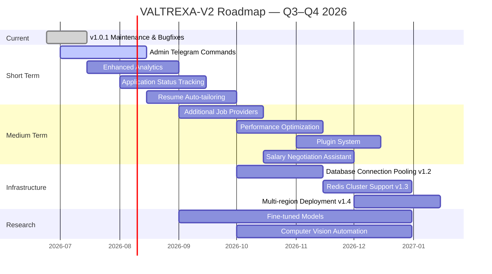

  <picture>
    <source media="(prefers-color-scheme: dark)" srcset="docs/assets/favicon.svg">
    
  </picture>

<h1 align="center">📄 Roadmap</h1>

  <strong>Version:</strong> v1.0.1 •
  <strong>Last Updated:</strong> 2026-07-05 •
  <strong>Category:</strong> Planning

**Description:** Current status, completed milestones, and future development plans for the VALTREXA-V2 platform.

---

## Table of Contents

- [Overview](#overview)
- [Strategic Vision](#strategic-vision)
- [Version History](#version-history)
- [Current Status](#current-status)
- [Completed Milestones](#completed-milestones)
- [Planned Features](#planned-features)
- [Technical Debt](#technical-debt)
- [Infrastructure Roadmap](#infrastructure-roadmap)
- [Research Areas](#research-areas)
- [Known Limitations](#known-limitations)
- [Community Goals](#community-goals)
- [Timeline Overview](#timeline-overview)
- [Best Practices](#best-practices)
- [Related Documents](#related-documents)

---

## Overview

VALTREXA-V2 is currently at **v1.0.1** with a stable, production-ready foundation. The core pipelines — auto-apply (Pipeline A) and high-value outreach (Pipeline B) — are operational across **8 workflow phases** with multi-user isolation, encrypted cookie storage, and comprehensive provider integrations spanning **9 job sources**.

The platform comprises **83+ API endpoints**, **59 backend modules**, **46 shadcn/ui components**, **21 authenticated routes**, **7 BullMQ queues**, and **70 database tables** across **28 migration files**.

> [!NOTE]
> This roadmap is a living document. Priorities and timelines may shift based on community feedback, technical constraints, and emerging opportunities.

---

## Strategic Vision

VALTREXA-V2 aims to become the **definitive career operating system for software engineers** — a single platform that manages the entire career lifecycle from job search through professional growth, network management, and career analytics.

### Core Principles

1. **Automation first** — Eliminate repetitive tasks, not decisions. The platform handles the mechanical aspects of job search (discovery, application, follow-up) while keeping the human in the loop for strategic decisions.

2. **AI-augmented, not AI-replaced** — Human judgment with AI assistance. AI generates drafts, scores matches, and optimizes timing; humans approve, customize, and decide.

3. **Privacy by design** — User data belongs to the user. All credentials are encrypted (AES-256-GCM), data is isolated per user (RLS), and the system is open-source for transparency.

4. **Open source** — Community-driven, transparent, extensible. Anyone can inspect the code, contribute providers, or extend functionality through the plugin system.

---

## Version History

| Version | Date | Highlights |
|---|---|---|
| v1.0.1 | 2026-06-29 | Multi-user isolation fixes, Telegram command cleanup, env-var fallback removal, 145+ write ops audited |
| v1.0.0 | 2026-06-24 | Initial release — all core features operational, TanStack Start SSR, 72+ API endpoints |

---

## Current Status

### Operational

- Resume parsing and candidate brain (skills extraction, experience mapping)
- Multi-provider job import (9 sources: LinkedIn, Indeed, Naukri, Wellfound, Instahyre, Greenhouse, Lever, Ashby, Workable)
- AI-powered match scoring (8 factors: skills 0.32, role 0.20, experience 0.16, location 0.10, salary 0.07, freshness 0.07, companyQuality 0.05, recruiter 0.03)
- Pipeline A: Playwright-based auto-apply (3 strategies, 2 concurrent workers)
- Pipeline B: High-value outreach with recruiter discovery (multi-strategy)
- Telegram bot with **32 commands** (start, help, menu, status, health, connect, disconnect, refresh_cookies, pause, resume, stats, and more)
- Gmail inbox sync and email classification (single-mailbox)
- Multi-user isolation with RLS on all 70 tables
- Encrypted cookie storage (AES-256-GCM, per-user encryption)
- Self-healing browser automation (3-tier fallback selectors)
- Admin dashboard with workflow controls
- Multi-provider AI fallback chain: Gemini → Groq → OpenRouter
- 7 BullMQ queues (job-import, apply, recruiter, outreach, followup, gmail, analytics)
- Workflow lifecycle management (4 lifecycle states: idle, running, paused, stopped; auto-cleanup >2h stale)

### In Progress

| Feature | Description |
|---|---|
| Admin Telegram commands | `/broadcast`, `/inspect`, `/admin-status` |
| Enhanced follow-up intelligence | Context-aware follow-up cadence |
| Performance optimization | Faster browser automation, reduced memory for large job volumes |

---

## Completed Milestones

### Foundation (v1.0.0)

- TanStack Start SSR framework (React 19, Vite 7, Tailwind CSS v4)
- Supabase database with 28 migrations (70 tables, RLS on all)
- Multi-provider AI abstraction (Gemini, Groq, OpenRouter)
- File-based API routing (72+ endpoints)
- Phase A/B handler pattern (8 workflow phases)
- Rate limiting and error handling (100 req/min per IP)
- 46 shadcn/ui components, 21 authenticated routes, 59 backend modules

### Automation Pipeline

- Playwright browser integration (Chromium)
- Self-healing selectors (3-tier fallback: primary → secondary → fuzzy)
- Cookie encryption and validation (AES-256-GCM)
- Batch apply with 3 strategies (batch, conservative, aggressive)
- Application evidence capture (screenshots, confirmation pages)

### Outreach Pipeline

- Company research and tier assignment (high-value scoring)
- Recruiter discovery (multi-strategy: LinkedIn search, email discovery)
- AI-generated personalized messaging (role-specific, company-aware)
- Gmail API integration (single-mailbox, offline access)
- Follow-up cadence (Day 3/7/14 with context awareness)

### Multi-Tenant (v1.0.1)

- Per-user cookie storage (no env-var fallback for security)
- Telegram binding-based user resolution (one-time token, 15-min expiry)
- Provider health monitoring per user (health check phase)
- RLS on all 70 tables (zero exceptions)
- 145+ write operations audited (zero unscoped service-role writes)
- Workflow state management (idle, running, paused, stopped; auto-cleanup >2h)

---

## Planned Features

### Short Term

| Feature | Priority | Description |
|---|---|---|
| Admin Telegram commands | Medium | `/broadcast`, `/inspect`, `/admin-status` |
| Enhanced analytics | Medium | Pipeline conversion funnel, per-provider metrics, success rate tracking |
| Interview preparation AI | Low | AI-generated interview questions based on job description match |
| Resume auto-tailoring | Medium | AI-generated resume tailoring per job description using match scoring factors |

### Technical Debt

| Item | Priority | Description |
|---|---|---|
| Migration consolidation | Medium | Reduce 28 migrations to a clean baseline schema |
| Test coverage expansion | High | Increase coverage for engine modules (currently 11 test files) |
| Error message standardization | Low | Consistent error format across all 83+ API endpoints |
| Documentation automation | Low | Auto-generate API docs from TypeScript types |

### Medium Term

| Feature | Priority | Description |
|---|---|---|
| Additional job providers | Medium | Extend to more regional and niche job boards |
| WhatsApp notifications | Low | Alternative notification channel to Telegram |
| Resume tailoring AI | Medium | Auto-tailor resume per job description using match scores |
| Application status tracking | High | Auto-detect application status from Gmail replies (rejection, interview, offer) |
| Salary negotiation assistant | Medium | Market rate analysis and negotiation scripts based on role, location, and experience |
| Performance optimization | Medium | Faster browser automation, reduced memory usage, optimized queue processing |
| Plugin system | Medium | Community-contributed provider integrations and extensions |

### Infrastructure Roadmap

| Item | Timeline | Description |
|---|---|---|
| Database connection pooling | v1.2 | Supabase connection pooling for reduced cold query latency |
| Redis cluster support | v1.3 | High-availability Redis for queue reliability |
| Multi-region deployment | v1.4 | Geographic distribution for reduced latency |

### Long Term

| Feature | Priority | Description |
|---|---|---|
| Mobile app | Low | Native mobile experience (React Native) |
| Team/collaboration features | Low | Shared pipelines for recruitment agencies |
| Marketplace | Low | Premium templates, AI models, outreach cadences |
| Public API | Low | REST API for third-party integration and custom tooling |

---

## Research Areas

### AI & Machine Learning

| Area | Description |
|---|---|
| **Fine-tuned models** | Custom fine-tuned models for resume parsing, job description analysis, and outreach generation |
| **Reinforcement learning** | Optimize application timing, targeting, and follow-up cadence based on historical success rates |
| **Natural language understanding** | Improved email classification, intent detection, and sentiment analysis for follow-up optimization |
| **Match score refinement** | Machine learning models to dynamically adjust the 8 weighting factors (skills, role, experience, etc.) based on success outcomes |

### Browser Automation

| Area | Description |
|---|---|
| **Computer vision** | Visual element detection using screenshot analysis for providers with dynamic/different layouts |
| **CAPTCHA solving** | Integration with CAPTCHA solving services as a last-resort fallback |
| **Headless optimization** | Reduced resource usage for concurrent browser sessions, improved profile persistence |
| **Form intelligence** | ML-based form field detection and auto-fill for non-standard application forms |

### User Experience

| Area | Description |
|---|---|
| **Progressive onboarding** | Adaptive onboarding flow that adjusts to user expertise level and career stage |
| **Smart defaults** | AI-configured settings (match thresholds, application strategies, follow-up cadence) based on user profile |
| **Dark patterns detection** | Identify and alert users to misleading or predatory job postings |
| **Career timeline visualization** | Interactive timeline showing applications, interviews, offers, and career progression |

---

## Known Limitations

| Limitation | Impact | Workaround |
|---|---|---|
| Single-mailbox Gmail | One shared Gmail account for all outreach | Configure the single account carefully; multi-account not supported |
| Cookie-dependent providers | Requires periodic manual cookie refresh (1-4 weeks per provider) | System alerts when cookies expire; re-extract from browser |
| Windows-only cookie extraction script | Linux/macOS users must paste cookies manually | Manual method works on all platforms via dashboard |
| In-memory rate limiting | Rate limit state lost on server restart | Acceptable for serverless deployments; resets after cold start |
| No built-in CAPTCHA solving | CAPTCHA blocks automation on some providers | Manual intervention required; reduce automation frequency |
| Single AI model per operation | Cannot ensemble multiple AI models for single task | Fallback chain handles failures; model selection per operation type |

---

## Community Goals

| Initiative | Description |
|---|---|
| Open source contributions | Encourage community PRs for new providers, features, bug fixes, and optimizations |
| Documentation contributions | Community-maintained guides, tutorials, and provider-specific setup instructions |
| Plugin marketplace | User-contributed provider integrations, automation extensions, and outreach templates |
| Bug bounty program | Rewards for security vulnerability reports and responsible disclosure |
| User community | Discord/Slack community for power users, contributors, and troubleshooting support |
| Provider maintenance group | Community volunteers to maintain and update provider integrations as websites change |

---

## Timeline Overview

---

## Best Practices

- **Track the version history**: Review the [Changelog](CHANGELOG.md) before upgrading to understand breaking changes and migration steps between versions.
- **Align contributions with the roadmap**: Check planned features and research areas before starting work to ensure your contribution aligns with the project's direction.
- **Report limitations early**: If you encounter a known limitation or a new one, file a GitHub issue so it can be documented and prioritized.
- **Engage with community goals**: Participate in discussions, join the provider maintenance group, or contribute to documentation to help the project grow.
- **Monitor "In Progress" items**: These features are actively being developed — avoid duplicating effort by checking current status before starting work.
- **Plan for infrastructure upgrades**: If you rely on VALTREXA-V2 in production, review the infrastructure roadmap to anticipate changes to connection pooling, Redis, and deployment topology.

---

## Related Documents

- [Changelog](CHANGELOG.md) — Detailed release history
- [Architecture](docs/ARCHITECTURE.md) — Current system design
- [FAQ](docs/FAQ.md) — Frequently asked questions
- [Tutorials](docs/TUTORIALS.md) — Step-by-step walkthroughs and strategy guides

---

 

  <strong>Next Reading:</strong> <a href="docs/QUICKSTART.md">Quickstart Flow →</a>

 

  <strong>Next Reading:</strong> <a href="docs/QUICKSTART.md">Quickstart Flow →</a>

