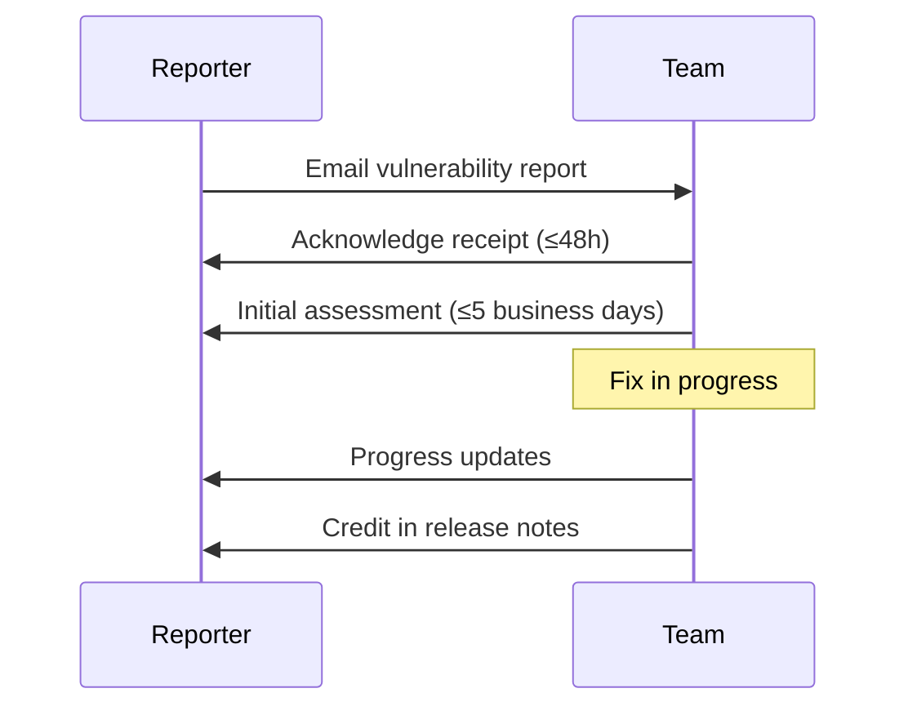

  <picture>
    <source media="(prefers-color-scheme: dark)" srcset="docs/assets/favicon.svg">
    
  </picture>

<h1 align="center">🔒 Security Policy</h1>

  <strong>Version:</strong> v1.0.1 •
  <strong>Last Updated:</strong> 2026-07-05 •
  <strong>Category:</strong> Security

**Description:** Vulnerability reporting guidelines and security architecture overview for VALTREXA-V2.

---

## Table of Contents

- [Supported Versions](#supported-versions)
- [Reporting a Vulnerability](#reporting-a-vulnerability)
- [What to Include](#what-to-include)
- [What to Expect](#what-to-expect)
- [Security Considerations](#security-considerations)
- [Key Security Features](#key-security-features)
- [Critical Secrets](#critical-secrets)
- [Related Documents](#related-documents)

---

## Supported Versions

| Version | Supported |
|---------|----------|
| 1.0.x | :white_check_mark: |
| < 1.0 | :x: |

> [!NOTE]
> Only the latest stable release (1.0.x) receives security patches. Older versions must upgrade to receive fixes.

## Reporting a Vulnerability

We take the security of VALTREXA-V2 seriously. If you believe you have found a security vulnerability, please report it to us as described below.

**Please do not report security vulnerabilities through public GitHub issues.**

Instead, report them via email to: **chauhandigvijay669@gmail.com**

You should receive a response within 48 hours. If you do not, please follow up to ensure we received your report.

### What to Include

- Type of vulnerability
- Steps to reproduce
- Potential impact
- Any suggested fix (if known)

### What to Expect

- We will acknowledge receipt within 48 hours
- We will provide an initial assessment within 5 business days
- We will keep you informed of progress toward a fix
- We will credit you in the release notes when the fix is published

## Security Considerations

For detailed information about the security architecture of VALTREXA-V2, including authentication, encryption, RLS policies, and secrets management, see [docs/SECURITY.md](docs/SECURITY.md).

> [!WARNING]
> The root-level SECURITY.md is for vulnerability reporting. For architecture-level security documentation, refer to [docs/SECURITY.md](docs/SECURITY.md).

## Key Security Features

- **AES-256-GCM encryption** for provider cookies at rest
- **Row Level Security (RLS)** on every user-scoped database table
- **Service role + code-level enforcement** — 145+ write operations audited, zero unscoped writes
- **Webhook secret verification** for Telegram bot
- **Rate limiting** — 100 req/60s per IP, 10 req/3s per Telegram chat
- **Input validation** with Zod schemas
- **CSRF protection** for Google OAuth flow
- **Per-user data isolation** with mandatory `user_id` scoping

> [!IMPORTANT]
> Rate limiting and RLS are your first lines of defense. Ensure these are configured correctly in production deployments.

## Critical Secrets

| Secret | Purpose |
|--------|---------|
| `SUPABASE_SERVICE_ROLE_KEY` | Full database access — protect as critical secret |
| `COOKIE_ENCRYPTION_KEY` | AES-256-GCM key derivation — changing invalidates all stored cookies |
| `SESSION_SECRET` | Server-side session signing |
| `TELEGRAM_BOT_TOKEN` | Bot authentication — rotate if compromised |
| `TELEGRAM_WEBHOOK_SECRET` | Webhook HMAC verification |

> [!WARNING]
| Never commit secrets to version control. Use environment variables or a secrets manager in production.

## Related Documents

- [Architecture Security](docs/SECURITY.md) — Detailed security architecture, encryption, RLS policies, and secrets management
- [Contributing Guide](CONTRIBUTING.md) — Development conventions and pull request process
- [README](README.md) — Project overview and getting started

---

 

  <strong>Next Reading:</strong> <a href="docs/SECURITY.md">Security Architecture →</a>

