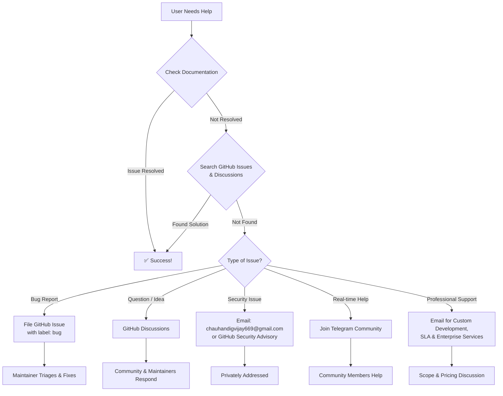

  <picture>
    <source media="(prefers-color-scheme: dark)" srcset="docs/assets/favicon.svg">
    
  </picture>

<h1 align="center">📄 Support</h1>

  <strong>Version:</strong> v1.0.1 •
  <strong>Last Updated:</strong> 2026-07-05 •
  <strong>Category:</strong> Support

**Description:** How to get help with VALTREXA-V2 — documentation, community channels, and professional support options

---

## Table of Contents

- [Overview](#overview)
- [Documentation First](#documentation-first)
- [GitHub Issues (Bug Reports)](#github-issues-bug-reports)
- [GitHub Discussions (Questions & Ideas)](#github-discussions-questions--ideas)
- [Telegram Community](#telegram-community)
- [Email Contact](#email-contact)
- [Stack Overflow](#stack-overflow)
- [Professional Support](#professional-support)
- [Before You Ask](#before-you-ask)
- [Support Flow Diagram](#support-flow-diagram)
- [Best Practices](#best-practices)
- [Related Documents](#related-documents)

---

## Overview

VALTREXA-V2 offers multiple support channels to help you get the most out of the platform. Whether you are troubleshooting an issue, asking a question, or seeking professional assistance, the following resources are available.

> [!TIP]
> Before opening a support request, check the [Documentation First](#documentation-first) section — most questions are answered in the official docs.

---

## Documentation First

Before reaching out, check the official documentation — most questions are answered here:

| Document | Purpose |
|---|---|
| [README](README.md) | Project overview, quick start, key features |
| [Setup Guide](docs/SETUP.md) | Local development setup and .env configuration |
| [Deployment Guide](docs/DEPLOYMENT.md) | Production deployment on Vercel + Railway |
| [Environment Variables](docs/ENVIRONMENT.md) | Complete env reference by category |
| [Troubleshooting](docs/TROUBLESHOOTING.md) | Common issues and step-by-step solutions |
| [FAQ](docs/FAQ.md) | Frequently asked questions |
| [Architecture](docs/ARCHITECTURE.md) | System design, data flow, stack decisions |
| [Workflow Guide](docs/WORKFLOW.md) | Pipeline A/B, state machine, recovery |
| [Provider Guide](docs/PROVIDER_GUIDE.md) | Provider integrations, auth, failure recovery |
| [Cookie Guide](docs/COOKIE_GUIDE.md) | Cookie extraction, encryption, validation |
| [Telegram Operations](docs/TELEGRAM_OPERATIONS.md) | Bot commands, notifications, approvals |
| [API Reference](docs/API_REFERENCE.md) | Complete endpoint documentation |
| [Glossary](docs/GLOSSARY.md) | Comprehensive terminology reference |
| [Tutorials](docs/TUTORIALS.md) | Step-by-step walkthroughs and strategy guides |

---

## GitHub Issues (Bug Reports)

Found a bug? File a GitHub Issue so the maintainers can track and fix it.

**Before opening an issue:**

1. Search [existing issues](https://github.com/chauhandigvijay1/Valtrexa-V2/issues) to avoid duplicates
2. Check the [Troubleshooting Guide](docs/TROUBLESHOOTING.md) for known solutions
3. Review the [FAQ](docs/FAQ.md)

**When filing a bug report, include:**

- **Description** — What happened vs. what you expected
- **Steps to reproduce** — Minimal, complete, verifiable steps
- **Environment** — OS, Node version, browser, deployment platform
- **Logs** — Relevant error output, Sentry event ID if available
- **Screenshots** — If applicable

> [!TIP]
> Use the `bug` label for confirmed bugs. Use the `question` label for usage questions.

---

## GitHub Discussions (Questions & Ideas)

Use [GitHub Discussions](https://github.com/chauhandigvijay1/Valtrexa-V2/discussions) for:

- **Q&A** — "How do I configure X?" or "What does Y do?"
- **Feature requests** — Propose new capabilities or improvements
- **Show and tell** — Share your workflow setup, tips, and configurations
- **General discussion** — Talk about the project with the community

Discussions are the best place for open-ended conversation. Maintainers and community members actively participate.

---

## Telegram Community

Join the community Telegram group for real-time discussion, help, and announcements.

| Channel | Purpose |
|---|---|
| **Community Chat** | Ask questions, share tips, get help from other users |
| **Announcements** | Release notes, downtime notifications, feature updates |

To get started with the VALTREXA-V2 Telegram bot:

1. Search for **@ValtrexaV2Bot** on Telegram
2. Send `/start` to begin
3. Use `/connect` to bind your account (generate token from Settings → Telegram Connection)
4. Explore the full command list: `/help`

For bot-specific issues, see the [Telegram Operations Guide](docs/TELEGRAM_OPERATIONS.md).

---

## Email Contact

For private inquiries, security reports, or professional support:

| Purpose | Email |
|---|---|
| Security vulnerabilities | **chauhandigvijay669@gmail.com** *(preferred: use GitHub Security Advisories)* |
| General inquiries | **chauhandigvijay669@gmail.com** |
| Professional / commercial support | **chauhandigvijay669@gmail.com** |

> [!NOTE]
> Response time: Typically within 48 hours for business inquiries. Security reports are prioritized.

---

## Stack Overflow

Ask questions on Stack Overflow using the tag **`valtrexa-v2`** (or **`valtrexa`** if the tag is not yet created).

Before posting:

1. Search Stack Overflow for existing answers
2. Include a minimal, reproducible example
3. Tag with relevant technologies (`reactjs`, `typescript`, `supabase`, `playwright`, `bullmq`)

---

## Professional Support

For organizations requiring:

- Custom feature development
- Dedicated deployment assistance
- SLA-guaranteed response times
- Training and onboarding sessions
- Enterprise security review

Contact the maintainer at **chauhandigvijay669@gmail.com** to discuss scope and pricing.

---

## Before You Ask

To get the fastest, most helpful response:

1. **Read the docs** — The [Troubleshooting Guide](docs/TROUBLESHOOTING.md) and [FAQ](docs/FAQ.md) cover 90% of common issues
2. **Search** — Check existing [Issues](https://github.com/chauhandigvijay1/Valtrexa-V2/issues) and [Discussions](https://github.com/chauhandigvijay1/Valtrexa-V2/discussions)
3. **Provide context** — Environment details, error messages, steps taken
4. **Be specific** — "I ran X, expected Y, got Z" is much easier to debug than "It doesn't work"

---

## Support Flow Diagram

---

## Best Practices

- **Read the docs first**: The [Troubleshooting Guide](docs/TROUBLESHOOTING.md) and [FAQ](docs/FAQ.md) cover 90% of common questions before you need to reach out.
- **Search before posting**: Check existing [Issues](https://github.com/chauhandigvijay1/Valtrexa-V2/issues) and [Discussions](https://github.com/chauhandigvijay1/Valtrexa-V2/discussions) to avoid duplicates and find immediate answers.
- **Provide complete context**: Include environment details, error messages, reproduction steps, and logs to help others diagnose your issue quickly.
- **Choose the right channel**: Use GitHub Issues for bugs, Discussions for questions, Telegram for real-time chat, and email for private or security matters.
- **Be specific and concise**: "I ran X, expected Y, but got Z" is far more actionable than "It doesn't work."
- **Respect response times**: Community channels rely on volunteers; security and professional support receive priority handling within 48 hours.

---

## Related Documents

- [Contributing Guide](CONTRIBUTING.md) — How to contribute code and documentation
- [Code of Conduct](CODE_OF_CONDUCT.md) — Community standards and expectations
- [Changelog](CHANGELOG.md) — Release history and version changes
- [Roadmap](docs/ROADMAP.md) — Planned features and strategic direction

---
