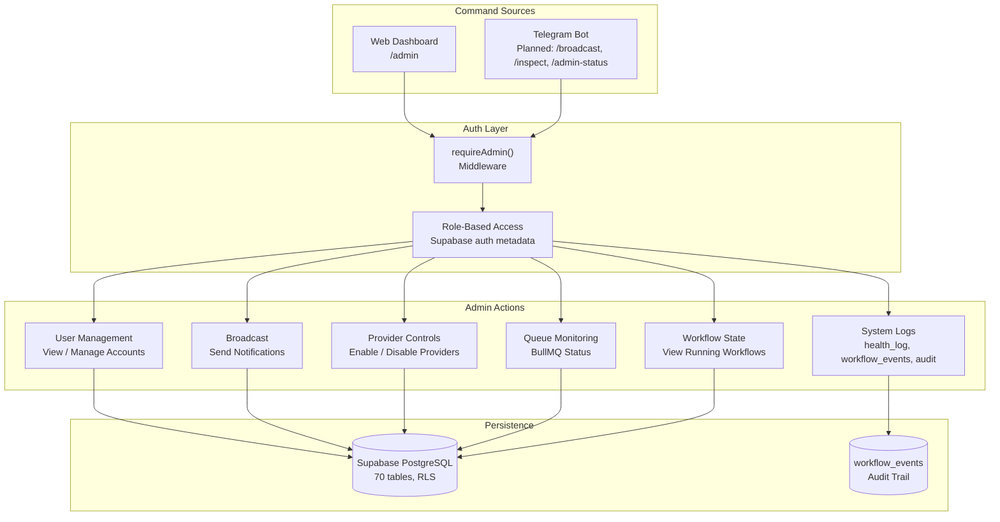

  <picture>
    <source media="(prefers-color-scheme: dark)" srcset="docs/assets/favicon.svg">
    
  </picture>

<h1 align="center">📄 Admin Guide — VALTREXA-V2</h1>

  <strong>Version:</strong> v1.0.0 •
  <strong>Last Updated:</strong> 2026-07-05 •
  <strong>Category:</strong> Administration

**Description:** Administrative dashboard, Telegram admin commands, and security guidelines for the VALTREXA-V2 platform.

---

## Table of Contents

- [Dashboard](#dashboard)
- [Telegram Admin Commands](#telegram-admin-commands)
- [Security Architecture](#security-architecture)
- [Best Practices](#best-practices)
- [Related Documents](#related-documents)

---

## Overview

The admin panel provides system management capabilities for authorized administrators. Access is restricted to authenticated sessions with admin privileges.

> [!IMPORTANT]
> Admin routes use `requireAdmin()` middleware. Privileges are role-based via Supabase auth metadata.

## Dashboard

The admin panel is at `/admin` (requires authenticated session with admin privileges).

### Tabs

1. **User Management** — View/manage user accounts
2. **Broadcast** — Send notifications to all users
3. **Provider Controls** — Global provider enable/disable
4. **Queue Management** — BullMQ queue monitoring
5. **Workflow State** — View all running workflows
6. **System Logs** — health_log, workflow_events, audit trail

## Telegram Admin Commands (Planned)

> [!WARNING]
> These admin commands are **not yet implemented** in the Telegram handler. They require adding command handlers + admin-role checks.

| Command                | Description                         | Status  |
| ---------------------- | ----------------------------------- | ------- |
| `/broadcast <message>` | Send message to all connected users | Planned |
| `/inspect <user_id>`   | View user details (admin only)      | Planned |
| `/admin-status`        | Full system health report           | Planned |

For now, use the web admin dashboard at `/admin` for user management and system monitoring.

### Admin Command Flow

The following diagram illustrates the admin command dispatch and processing lifecycle:

## Security Architecture

- Admin routes use `requireAdmin()` middleware
- Admin privileges are role-based (Supabase auth metadata)
- All admin actions are logged to `workflow_events`
- Service role client used for admin operations (bypasses RLS)

## Best Practices

- **Audit all admin actions**: Every admin operation should be logged to `workflow_events` with user context.
- **Role-based access**: Never hardcode admin checks — use Supabase auth metadata and the `requireAdmin()` middleware.
- **Least privilege**: Service role client should only be used for admin operations that legitimately need to bypass RLS.

---

## Related Documents

- [Architecture](ARCHITECTURE.md) — System design overview
- [Backend Architecture](BACKEND.md) — Backend structure and patterns
- [API Reference](API_REFERENCE.md) — Endpoint documentation

---

 

  <strong>Next Reading:</strong> <a href="QUICKSTART.md">Quickstart Flow →</a>

