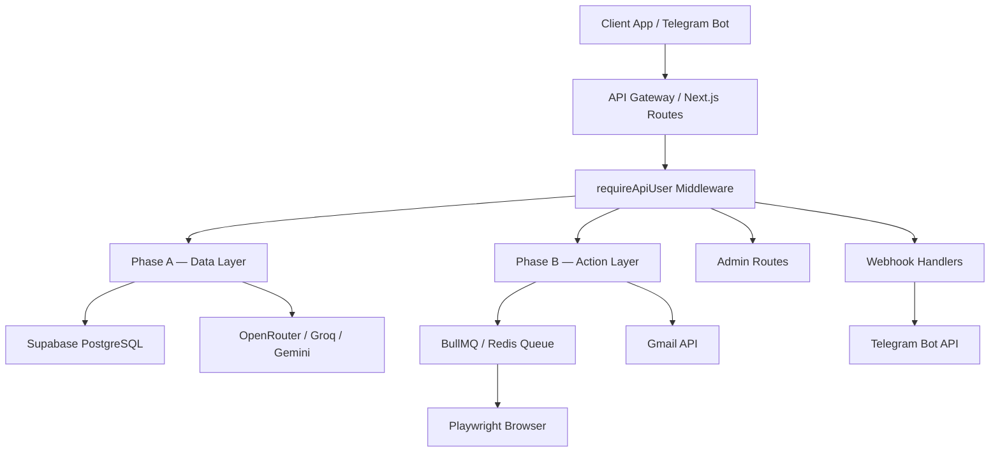

<p align="center">
  <picture>
    <source media="(prefers-color-scheme: dark)" srcset="assets/favicon.svg">
    
  </picture>
</p>

<h1 align="center">API Reference — VALTREXA-V2</h1>

<p align="center">
  <strong>Version:</strong> v1.0.0 &nbsp;•&nbsp;
  <strong>Last updated:</strong> 2026-06-29 &nbsp;•&nbsp;
  <strong>Base URL:</strong> <code>https://valtrexa-v2.vercel.app/api</code>
</p>

---

## Table of Contents

- [Authentication](#authentication)
- [Rate Limiting](#rate-limiting)
- [Phase A — Data Layer](#phase-a--data-layer)
- [Phase B — Action Layer](#phase-b--action-layer)
- [Auth](#auth)
- [Cookies](#cookies)
- [Provider Controls](#provider-controls)
- [Webhooks](#webhooks)
- [Admin](#admin)
- [Error Responses](#error-responses)
- [API Architecture](#api-architecture)
- [Best Practices](#best-practices)

---

## Authentication

> [!IMPORTANT]
> All API routes require authentication via `requireApiUser()` middleware.

- **Header:** `Authorization: Bearer <supabase_access_token>`
- Unauthenticated requests: `401 Unauthorized`
- Unconfirmed email (password users): `403 Forbidden`

> [!NOTE]
> Tokens are obtained via Supabase Auth. Tokens expire after 1 hour — refresh using the Supabase `refresh_token` grant.

## Rate Limiting

- 100 requests per 60s per IP (configurable via `RATE_LIMIT_WINDOW_MS` and `RATE_LIMIT_MAX_REQUESTS`)
- Returns `429 Too Many Requests` with `retry-after` header when exceeded

> [!TIP]
> If you hit rate limits, implement exponential backoff in your client. Retry after the duration specified in the `retry-after` header.

## Phase A — Data Layer

| Method | Endpoint               | Description                       |
| ------ | ---------------------- | --------------------------------- |
| GET    | `/api/provider-audit`  | Provider data audit               |
| POST   | `/api/import-jobs`     | Trigger job import from providers |
| GET    | `/api/job-matches`     | Match-scored job listings         |
| GET    | `/api/recruiters`      | Discovered recruiter list         |
| GET    | `/api/skills-gap`      | Skills gap analysis               |
| GET    | `/api/resume-parse`    | Parse resume content              |
| GET    | `/api/candidate-brain` | Full candidate brain data         |
| POST   | `/api/candidate-brain` | Update candidate brain            |

## Phase B — Action Layer

| Method | Endpoint                  | Description                           |
| ------ | ------------------------- | ------------------------------------- |
| POST   | `/api/submit-application` | Submit job application via Playwright |
| POST   | `/api/batch-apply`        | Batch application run                 |
| POST   `/api/outreach`           | Generate and send outreach            |
| POST   | `/api/followups`          | Process follow-up cadences            |
| POST   | `/api/inbox-sync`         | Sync Gmail inbox                      |

## Auth

| Method | Endpoint                   | Description                            |
| ------ | -------------------------- | -------------------------------------- |
| POST   | `/api/auth/create-profile` | Create user profile on signup          |
| POST   | `/api/auth/log-event`      | Log auth event (signup, login, logout) |

## Cookies

| Method | Endpoint                 | Description                 |
| ------ | ------------------------ | --------------------------- |
| GET    | `/api/cookies`           | List all cookies for user   |
| POST   | `/api/cookies/set`       | Set a cookie for a provider |
| POST   | `/api/cookies/validate`  | Validate a cookie           |
| DELETE | `/api/cookies/:provider` | Delete cookie for provider  |

## Provider Controls

| Method | Endpoint                 | Description                   |
| ------ | ------------------------ | ----------------------------- |
| GET    | `/api/providers`         | List provider statuses        |
| POST   | `/api/providers/:action` | Enable/disable/pause provider |
| GET    | `/api/providers/health`  | Provider health log           |

## Webhooks

| Method | Endpoint                | Description              |
| ------ | ----------------------- | ------------------------ |
| POST   | `/api/telegram/webhook` | Telegram bot updates     |
| POST   | `/api/telegram/binding` | Telegram account binding |

## Admin

| Method | Endpoint               | Description                    |
| ------ | ---------------------- | ------------------------------ |
| GET    | `/api/admin/users`     | List all users                 |
| POST   | `/api/admin/broadcast` | Send notification to all users |
| GET    | `/api/admin/queues`    | Queue status                   |
| GET    | `/api/admin/system`    | System health                  |

## Error Responses

```json
{ "error": "Description of what went wrong" }
```

**Common status codes:**

- `200` — Success
- `400` — Bad request (missing/invalid fields)
- `401` — Unauthorized (no token)
- `403` — Forbidden (unconfirmed email, insufficient role)
- `404` — Not found
- `429` — Rate limited
- `500` — Internal server error

## API Architecture



## Best Practices

> [!TIP]
> **Idempotency:** POST endpoints like `/api/submit-application` should be called with an idempotency key to prevent duplicate submissions.

> [!WARNING]
> **Error handling:** Always check for `429` responses and implement backoff. The system is tolerant but will not queue requests beyond the rate limit.

> [!NOTE]
> **Webhook security:** Telegram webhooks use HMAC verification via `TELEGRAM_WEBHOOK_SECRET`. Verify signatures on your end if consuming webhooks externally.

- Use the `Authorization: Bearer` token pattern consistently across all clients.
- Never expose `SUPABASE_SERVICE_ROLE_KEY` on the client — use anon key with RLS.
- Batch operations (`/api/batch-apply`) are asynchronous — poll `/api/workflow-state` for completion status.

---

<br/>
<div align="center">
  <strong>Next Reading:</strong> <a href="DATABASE.md">Database Schema →</a>
</div>
