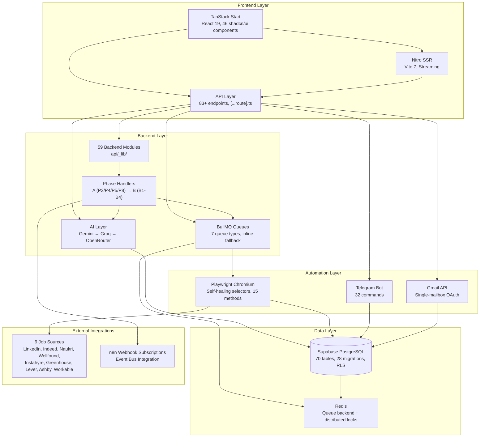

<p align="center">
  <picture>
    <source media="(prefers-color-scheme: dark)" srcset="docs/assets/favicon.svg">
    
  </picture>
</p>

<h1 align="center">📄 Architecture — VALTREXA-V2</h1>

<p align="center">
  <strong>Version:</strong> v1.0.1 •
  <strong>Last Updated:</strong> 2026-07-05 •
  <strong>Category:</strong> System Architecture
</p>

**Description:** System architecture overview, key design decisions, and technology stack for the VALTREXA-V2 job automation platform.

---

## Table of Contents

- [Architecture Flow](#architecture-flow)
- [Key Design Decisions](#key-design-decisions)
- [Technology Stack](#technology-stack)
- [Related Documents](#related-documents)

---

## Architecture Flow

```
┌─────────────────────────────────────────────────────────────────┐
│                      Vercel (SSR + API)                         │
│  ┌──────────┐  ┌──────────────┐  ┌───────────────────────────┐  │
│  │ Frontend │  │ API Routes   │  │ Server-Side Rendering     │  │
│  │ TanStack │  │ [...route].ts│  │ Nitro (TanStack Start)   │  │
│  │ Start    │  │              │  │                           │  │
│  └──────────┘  └──────┬───────┘  └───────────────────────────┘  │
└───────────────────────┼─────────────────────────────────────────┘
                        │
┌───────────────────────┼─────────────────────────────────────────┐
│              ┌────────┴────────┐                                │
│              │  Supabase       │    ┌──────────────────┐        │
│              │  (PostgreSQL)   │    │  Railway Worker  │        │
│              │  + Auth         │    │  (BullMQ + Redis)│        │
│              └─────────────────┘    └────────┬─────────┘        │
│                                              │                  │
│  ┌───────────┐ ┌──────────┐ ┌─────────────┐ │                  │
│  │ Telegram  │ │ Gmail    │ │ OpenRouter  │ │                  │
│  │ Bot API   │ │ API      │ │ AI          │ │                  │
│  └───────────┘ └──────────┘ └─────────────┘ │                  │
└──────────────────────────────────────────────┼──────────────────┘
                                               │
                          ┌────────────────────┘
                          ▼
              ┌──────────────────────┐
              │  Job Boards          │
              │  (LinkedIn, Indeed,  │
              │   Naukri, Wellfound, │
              │   Instahyre)         │
              └──────────────────────┘
```

> [!NOTE]
> The platform uses a dual-pipeline architecture: auto-apply (Playwright) and high-value outreach (AI + Gmail), running on Vercel with optional Railway background workers.

### System Module Dependency Graph

The following diagram visualizes module dependencies across the VALTREXA-V2 platform:



## Key Design Decisions

### 1. Cookie-Based Provider Authentication

Job portals use session cookies, not API tokens. VALTREXA-V2 stores encrypted cookies per-user:

- Encrypted with AES-256-GCM (`COOKIE_ENCRYPTION_KEY`)
- Stored in `provider_cookies` table with per-user RLS
- Decrypted at runtime for Playwright automation
- HTTP-based cookie validation (not heuristic page parsing)

### 2. Service Role + RLS

All server code uses `supabaseAdmin` (service role key) which bypasses RLS. User isolation is enforced in code via `.eq("user_id", userId)` on every query. 145+ write operations audited — zero unscoped writes.

### 3. Dual Pipeline Architecture

**Pipeline A (Auto-Apply):**

- 5 job boards, 3 strategies (conservative, balanced, aggressive)
- Playwright browser automation for form filling
- Screenshot + HTML evidence capture
- Resume upload via temp file download

**Pipeline B (High-Value Outreach):**

- Recruiter discovery + email finding
- AI-generated personalized outreach (OpenRouter)
- Gmail API for sending + inbox classification
- Follow-up cadence (Day 3/7/14)

### 4. Multi-User Isolation

- All tables have RLS policies: `user_id = auth.uid()`
- Service role queries always include `.eq("user_id", userId)`
- `provider_controls` migrated from global to per-user (`UNIQUE(user_id, provider)`)
- `provider_health_log` has `user_id` column with index
- Telegram bindings: `UNIQUE(user_id)`, `UNIQUE(chat_id)`
- **Telegram inbound is purely binding-based** — `resolveUserIdFromTelegramChat` looks up `telegram_bindings.chat_id` → `user_id`. Removed legacy `TELEGRAM_USER_ID` env-var fallback. Unbound chats get a "not connected" prompt.
- **Outbound notifications** use `getChatIdForUser(userId)` → `telegram_bindings.chat_id` per-user. Admin alerts use global `TELEGRAM_CHAT_ID` env var.

> [!WARNING]
> All service-role write operations must include `.eq("user_id", userId)` to enforce user isolation. Zero unscoped writes is the non-negotiable standard.

## Technology Stack

| Layer    | Technology               | Version |
| -------- | ------------------------ | ------- |
| Frontend | TanStack Start + React   | 19.x    |
| SSR      | Nitro (Vite)             | 7.x     |
| Database | Supabase (PostgreSQL)    | 15.x    |
| Auth     | Supabase Auth            | —       |
| AI       | OpenRouter (GPT-4o-mini) | —       |
| Bot      | Telegram Bot API         | —       |
| Email    | Gmail API                | —       |
| Queue    | BullMQ + Redis           | —       |
| Browser  | Playwright (Chromium)    | latest  |
| Hosting  | Vercel + Railway         | —       |

## Best Practices

- **User isolation first**: Every query must include `.eq("user_id", userId)` — never trust RLS alone for service-role operations.
- **Audit all writes**: 145+ write operations audited; zero unscoped writes enforced through code review and automated checks.
- **Encrypt sensitive data**: All provider cookies encrypted with AES-256-GCM before storage.
- **Graceful degradation**: When Redis is unreachable, queue operations fall back to inline execution.

---

## Related Documents

- [Backend Architecture](BACKEND.md) — Backend structure and API patterns
- [Frontend Architecture](FRONTEND.md) — Frontend counterpart
- [AI Architecture](AI.md) — Multi-provider AI system
- [API Reference](API_REFERENCE.md) — Endpoint documentation
- [Workflow Guide](WORKFLOW.md) — 8-phase pipeline details

---

<br/>
<div align="center">
  <strong>Next Reading:</strong> <a href="BACKEND.md">Backend Architecture →</a>
</div>
