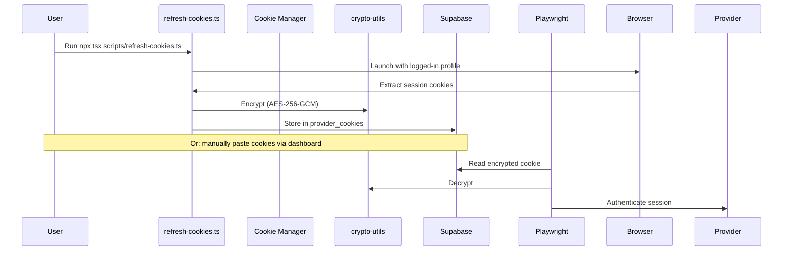
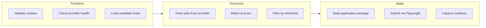
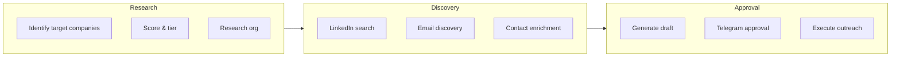
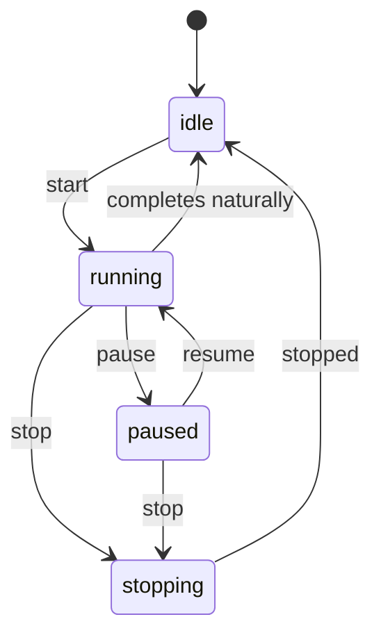
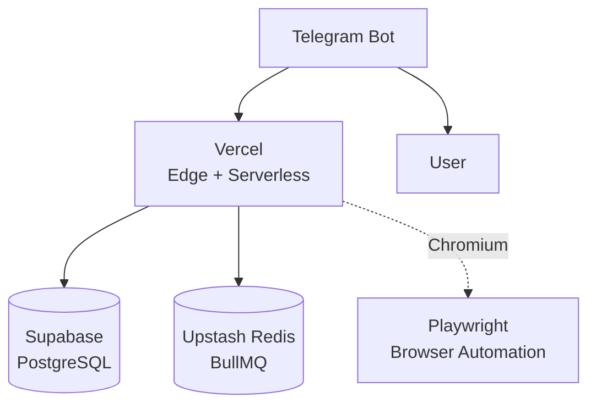

# Architecture

> **Last Updated:** 2026-06-28

## System Diagram

```mermaid
flowchart TB
    subgraph Client["Client Layer"]
        D[TanStack Start\nReact 19 SPA]
        TB[Telegram Bot\nInteractive Ops]
    end

    subgraph Edge["Edge / SSR"]
        N[Nitro SSR\nVite 7]
        API[API Routes\napi/[...route].ts]
    end

    subgraph Core["Core Layer"]
        WF[Workflow Runner\nPipeline A+B]
        ME[Match Engine\nMulti-weight scoring]
        AE[Apply Engine\nPlaywright Automation]
        BE[Batch Apply Engine\nStrategy-based bulk]
        OE[Outreach Engine\nAI draft gen]
        RD[Recruiter Discovery\nMulti-strategy]
        II[Inbox Intelligence\nGmail sync/classify]
        CB[Candidate Brain\nProfile memory]
        RP[Resume Parser\nPDF->structured data]
    end

    subgraph AI["AI Layer"]
        OR[OpenRouter Gateway\nGPT-4o / Claude 3.5 / Gemini 2.5 / DeepSeek V3]
        GQ[Groq\nFast inference]
    end

    subgraph Automation["Browser Automation"]
        PW[Playwright\nEdge Persistent Contexts]
        SC[Self-healing Selectors]
        CK[Cookie Manager\nAES-256-GCM encrypted]
    end

    subgraph Storage["Persistence"]
        PG[(Supabase PostgreSQL\n27+ tables, RLS)]
        R[(Redis / BullMQ\nOptional background queues)]
    end

    Client --> Edge
    Edge --> Core
    Edge --> AI
    Core --> Automation
    Core --> Storage
    Automation --> Storage
    TB -- webhook --> API
    TB -- notifications --> User
```

## Data Flow

### Cookie-Based Auth (Playwright Sessions)



### Pipeline A (Auto-Apply Flow)



### Pipeline B (High-Value Outreach)



## Cookie Architecture

- **Storage:** `provider_cookies` table with columns `id, user_id, provider, cookie_name, cookie_value, domain, expires_at, is_active, last_validated_at`
- **Encryption:** AES-256-GCM via `crypto-utils.ts`; key derived from `COOKIE_ENCRYPTION_KEY` env var
- **Validation:** `validateCookie()` hits the real provider endpoint (e.g. `https://linkedin.com/feed`) to verify the session is alive
- **Multi-User:** Every cookie row is scoped to a `user_id`; all API routes use `requireApiUser()` middleware
- **Env Fallback:** Individual providers can fall back to hardcoded cookies from env vars (e.g. `LINKEDIN_COOKIE`)

## Multi-User Isolation

| Mechanism | Implementation |
|---|---|
| Row-Level Security | Every table has `USING (user_id = auth.uid())` policy for authenticated role |
| API Middleware | `requireApiUser()` / `requireAdmin()` in `api/[...route].ts` |
| Service Role | `supabaseAdmin()` client bypasses RLS for admin/bot operations |
| Queue Isolation | Workflow events and batch runs scoped by `user_id` |

## Workflow State Machine



- Defined in `workflow-state.ts` — status values: `running`, `paused`, `stopped`
- Phase-level granularity: each stage (precheck, discover, apply, outreach, research) tracks `status, progress_pct, started_at, completed_at, error_message`

## Match Engine

8 weighted factors scored 0–100:

| Factor | Weight | Description |
|---|---|---|
| Skills Match | 30% | Jaccard similarity on required skills |
| Role Match | 20% | Semantic similarity to target role |
| Experience | 15% | Years match (1–3 range tolerance) |
| Location | 10% | Remote-friendly scoring |
| Salary | 10% | Range overlap |
| Company Tier | 5% | High-value company bonus |
| Freshness | 5% | Recency decay |
| Culture | 5% | Benefits & culture keyword match |

Default threshold: 70%. Stored in `DEFAULT_MATCH_WEIGHTS` in `match-engine.ts`.

## Deployment Architecture



## Tech Stack Versions

| Dependency | Version |
|---|---|
| Node.js | >= 18 (runtime) |
| TypeScript | 5.6 |
| React | 19.x |
| TanStack Start | latest |
| TanStack Router | latest |
| TanStack Query | latest |
| Tailwind CSS | 4.x |
| Vite | 7.x |
| Nitro | 2.x |
| Vinxi | latest |
| Supabase JS | latest |
| Playwright | latest |
| BullMQ | latest |
| Sentry | latest |
| Pino | latest |
| OpenRouter API | REST (multi-model) |
| Groq API | REST (fast inference) |

## Project Structure

```
src/                          # Frontend (TanStack Start)
  routes/                     # File-based routing
    _authenticated/           # Protected routes (dashboard, admin, etc.)
    index.tsx                 # Landing page
  components/                 # Shared UI components
  lib/                        # Frontend utilities

api/                          # Nitro API layer
  _lib/                       # Shared libraries (engines, helpers)
  [...route].ts               # Catch-all API handler

supabase/
  migrations/                 # SQL migration snapshots (27)
  current_schema.sql          # Full current schema dump

workers/                      # Background workers (BullMQ)
docs/                         # Documentation
```

## Key Files

| File | Purpose |
|---|---|
| `api/_lib/crypto-utils.ts` | AES-256-GCM encrypt/decrypt |
| `api/_lib/provider-cookies.ts` | Cookie CRUD, validation, expiry |
| `api/_lib/cookie-manager.ts` | High-level cookie orchestration |
| `api/_lib/providers.ts` | Provider interfaces, capabilities, factory |
| `api/_lib/provider-controls.ts` | Provider enable/disable/health |
| `api/_lib/workflow-state.ts` | Workflow status state machine |
| `api/_lib/workflow-config.ts` | Default workflow configuration |
| `api/_lib/workflow-runner.ts` | Pipeline A + B orchestration |
| `api/_lib/workflow-timeline.ts` | Stage tracking with progress |
| `api/_lib/apply-engine.ts` | Single-apply submission |
| `api/_lib/batch-apply-engine.ts` | Batch apply with strategies |
| `api/_lib/outreach-engine.ts` | AI outreach draft generation |
| `api/_lib/match-engine.ts` | Multi-weight job scoring |
| `api/_lib/notification-center.ts` | In-app + Telegram notifications |
| `api/_lib/telegram.ts` | Telegram bot command handlers |
| `api/_lib/telegram-init.ts` | Bot setup, webhook, commands |
| `api/_lib/env.ts` | Environment variable loading |
| `api/_lib/playwright-platform.ts` | Playwright browser config |
| `api/_lib/candidate-brain.ts` | User profile aggregation |
| `api/_lib/resume-parser.ts` | Resume file parsing |
