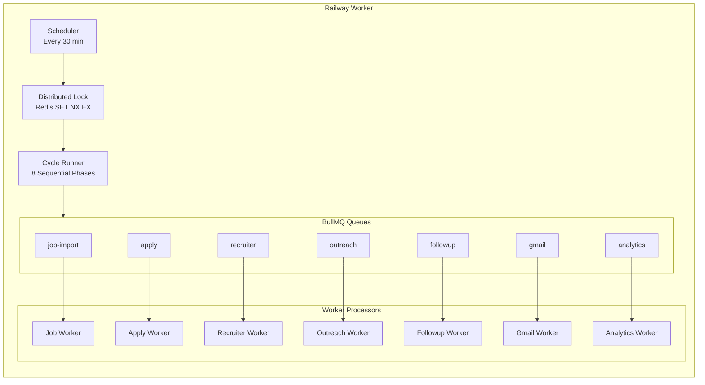

<p align="center">
  <picture>
    <source media="(prefers-color-scheme: dark)" srcset="docs/assets/favicon.svg">
    
  </picture>
</p>

<h1 align="center">📄 Backend Architecture — VALTREXA-V2</h1>

<p align="center">
  <strong>Version:</strong> v1.0.1 •
  <strong>Last Updated:</strong> 2026-07-05 •
  <strong>Category:</strong> Backend Architecture
</p>

**Description:** Backend structure, API routing, shared library (59+ modules), worker architecture (7 queues), and engine module catalog.

---

## Table of Contents

- [Overview](#overview)
- [Project Structure](#project-structure)
- [API Layer](#api-layer)
- [Phase Handler Pattern](#phase-handler-pattern)
- [Worker Architecture](#worker-architecture)
- [Engine Modules](#engine-modules)
- [Best Practices](#best-practices)
- [Related Documents](#related-documents)

---

## Overview

The backend uses **Nitro SSR** (Vite-based server engine) with file-based API routing. All API requests pass through a single catch-all handler at `api/[...route].ts` that dispatches to Phase A (data) or Phase B (action) handlers. Shared business logic lives in `api/_lib/` across **59+ modules**. Background processing uses **BullMQ with 7 queue types**, running optionally on Railway with inline execution fallback when Redis is unavailable.

## Backend Module Dependency

```mermaid
graph TD
    subgraph Entry["Entry Points"]
        ROUTER["api/[...route].ts<br/>Catch-all Dispatcher"]
        WORKER_ENTRY["api/worker.ts<br/>Railway Worker Entry"]
        SSR_ENTRY["api/ssr.ts<br/>Vercel SSR Entry"]
    end
    subgraph Middleware["Middleware Layer"]
        AUTH["auth.ts<br/>requireApiUser"]
        SUPABASE["supabase.ts<br/>Admin Client Singleton"]
        ENV["env.ts<br/>Env Validation"]
        HTTP["http.ts<br/>Response Helpers"]
        LOGGER["logger.ts<br/>Pino Structured Logging"]
        SENTRY["sentry.ts<br/>Error Reporting"]
        RATE_LIMIT["rate-limiter.ts<br/>100 req/60s per IP"]
        RETRY["retry.ts<br/>Exponential Backoff"]
    end
    subgraph Providers["Provider System"]
        PROV_REG["providers.ts<br/>9 Provider Types"]
        PROV_CTRL["provider-controls.ts<br/>Lifecycle Management"]
        PROV_COOKIE["provider-cookies.ts<br/>Cookie Storage"]
        COOKIE_MGR["cookie-manager.ts<br/>AES-256-GCM Encryption"]
        CRYPTO["crypto-utils.ts<br/>Encryption Utilities"]
        JOB_SRC["job-sources.ts<br/>Job Importers"]
        JOB_RES["job-resolver.ts<br/>Source Resolution"]
        WORKABLE["workable-source.ts<br/>Workable Importer"]
    end
    subgraph AI["AI Layer"]
        AI_PROV["ai-provider.ts<br/>Abstract Interface"]
        AI_FALL["ai-fallbacks.ts<br/>Gemini → Groq → OpenRouter"]
        OR_CLIENT["openrouter.ts<br/>Free Model Chain"]
    end
    subgraph Matching["Matching & Scoring"]
        MATCH_ENG["match-engine.ts<br/>8-Factor Weighted Scoring"]
        HV_ENG["high-value-engine.ts<br/>Strategic Scoring"]
        SKILL_GAP["skill-gap.ts<br/>Skills Gap Analysis"]
        ROLE_TAX["role-taxonomy.ts<br/>Role Classification"]
        TITLE_NORM["title-normalization.ts<br/>Title Normalization"]
        SALARY_PARSE["salary-parser.ts<br/>Salary Parsing"]
    end
    subgraph Automation["Playwright Automation"]
        PW_PLAT["playwright-platform.ts<br/>Browser Profile Mgmt"]
        PW_APPLY["playwright-apply.ts<br/>Form Filling"]
        SELF_HEAL["self-healing.ts<br/>15 Resilience Methods"]
        FAIL_DET["failure-detection.ts<br/>Failure Pattern Detection"]
        DPM["dynamic-profile-memory.ts<br/>AI Form Fill Memory"]
    end
    subgraph Workflow["Workflow Engine"]
        WF_RUNNER["workflow-runner.ts<br/>1174-line Orchestrator"]
        WF_STATE["workflow-state.ts<br/>State Machine"]
        WF_CONFIG["workflow-config.ts<br/>Cycle Configuration"]
        WF_PRECHECK["workflow-precheck.ts<br/>Pre-execution Validation"]
        WF_TIMELINE["workflow-timeline.ts<br/>Stage Tracking"]
        WF_EVENTS["workflow-events.ts<br/>Event Emission"]
    end
    subgraph Apply["Apply System"]
        APPLY_ENG["apply-engine.ts<br/>Single Submission"]
        BATCH_APPLY["batch-apply-engine.ts<br/>7 Filter Parameters"]
    end
    subgraph Outreach["Outreach & Recruiter"]
        REC_DISC["recruiter-discovery.ts<br/>Multi-strategy Discovery"]
        EMAIL_DISC["email-discovery.ts<br/>Email Verification"]
        OUT_ENG["outreach-engine.ts<br/>Message Generation"]
        OUT_SEND["outreach-sender.ts<br/>Gmail API Sending"]
    end
    subgraph Comm["Communication"]
        TG["telegram.ts<br/>32 Commands"]
        TG_INIT["telegram-init.ts<br/>Webhook Registration"]
        TG_BIND["telegram-bindings.ts<br/>Chat-to-User Binding"]
        INBOX["inbox-intelligence.ts<br/>Gmail Sync & Classification"]
        FOLLOWUP["followup-engine.ts<br/>Day 3/7/14 Cadence"]
        NOTIF["notification-center.ts<br/>In-app Notifications"]
        ALERT["alerting.ts<br/>Admin Alerting"]
    end
    subgraph Queue["Queue System"]
        EVT_BUS["event-bus.ts<br/>Webhook/Event Delivery"]
        QUEUE_MGR["queue.ts<br/>BullMQ 7 Queues"]
    end
    subgraph Workers["Background Workers"]
        JW["workers/job-worker.ts"]
        AW["workers/apply-worker.ts"]
        RW["workers/recruiter-worker.ts"]
        OW["workers/outreach-worker.ts"]
        FW["workers/followup-worker.ts"]
        GW["workers/gmail-worker.ts"]
        ANW["workers/analytics-worker.ts"]
        JMETA["workers/job-metadata.ts"]
    end
    subgraph Scripts["Build & Utility Scripts"]
        PREP_VERCEL["scripts/prepare-vercel-ssr.mjs"]
        REFRESH_COOKIE["scripts/refresh-cookies.ts"]
        SET_BOT["scripts/set-bot-profile.mjs"]
    end
    ROUTER --> Middleware
    ROUTER --> Providers
    ROUTER --> AI
    ROUTER --> Matching
    ROUTER --> Automation
    ROUTER --> Workflow
    ROUTER --> Apply
    ROUTER --> Outreach
    ROUTER --> Comm
    ROUTER --> Queue
    Middleware --> AUTH
    Middleware --> SUPABASE
    WORKER_ENTRY --> Queue
    Queue --> QUEUE_MGR
    Queue --> EVT_BUS
    QUEUE_MGR --> Workers
    Workers --> JW
    Workers --> AW
    Workers --> RW
    Workers --> OW
    Workers --> FW
    Workers --> GW
    Workers --> ANW
    Workers --> JMETA
```



---

## Project Structure

```
api/
├── [...route].ts               # Catch-all API route handler (dispatch)
├── phase-handlers.ts           # Phase A (data) + Phase B (action) handlers
├── ssr.ts                      # Vercel SSR entry point
├── ssr.d.ts                    # SSR type declarations
├── worker.ts                   # Railway background worker
├── _dist/                      # Build output (Vercel serverless functions)
├── _lib/                       # Shared backend modules (59+ modules)
│   ├── ai-fallbacks.ts         # AI fallback chain (Gemini → Groq → OpenRouter)
│   ├── ai-provider.ts          # Multi-provider AI abstraction interface
│   ├── openrouter.ts           # OpenRouter API client (free model chain)
│   ├── auth.ts                 # Authentication middleware (requireApiUser)
│   ├── supabase.ts             # Supabase admin client singleton
│   ├── env.ts                  # Environment variable loading + validation
│   ├── http.ts                 # Response helpers (json, methodNotAllowed, readJson)
│   ├── logger.ts               # Structured logging (Pino)
│   ├── sentry.ts               # Sentry error reporting
│   ├── rate-limiter.ts         # In-memory rate limiting
│   ├── auto-migrate.ts         # Database schema migrations
│   ├── compat.ts               # Backward compatibility layer
│   ├── retry.ts                # Retry utility with exponential backoff
│   ├── providers.ts            # Provider registry + type definitions (9 providers)
│   ├── provider-controls.ts    # Provider enable/disable/pause lifecycle
│   ├── provider-cookies.ts     # Cookie storage operations
│   ├── cookie-manager.ts       # Cookie encryption + validation
│   ├── crypto-utils.ts         # AES-256-GCM encryption utilities
│   ├── job-sources.ts          # Individual job source importers
│   ├── job-resolver.ts         # Job source resolution
│   ├── workable-source.ts      # Workable-specific importer
│   ├── match-engine.ts         # 8-factor resume-to-job matching algorithm
│   ├── high-value-engine.ts    # Strategic value scoring for target companies
│   ├── candidate-brain.ts      # Candidate profile management
│   ├── resume-parser.ts        # Resume parsing
│   ├── resume-optimizer.ts     # Resume optimization
│   ├── application-store.ts    # Application state management
│   ├── application-score.ts    # Application scoring
│   ├── recruiter-discovery.ts  # Multi-strategy recruiter discovery
│   ├── email-discovery.ts      # Email verification and discovery
│   ├── outreach-engine.ts      # AI-generated personalized outreach
│   ├── outreach-sender.ts      # Gmail API sending with tracking
│   ├── skill-gap.ts            # Skills gap analysis
│   ├── role-taxonomy.ts        # Role classification taxonomy
│   ├── title-normalization.ts  # Job title normalization
│   ├── salary-parser.ts        # Salary range parsing
│   ├── playwright-platform.ts  # Browser profile and session management
│   ├── playwright-apply.ts     # Automated form filling
│   ├── self-healing.ts         # 15 resilience methods
│   ├── failure-detection.ts    # Provider-specific failure detection
│   ├── dynamic-profile-memory.ts # AI memory for form auto-fill
│   ├── workflow-runner.ts      # 1174-line pipeline orchestrator
│   ├── workflow-state.ts       # Persistent state machine
│   ├── workflow-config.ts      # Workflow configuration
│   ├── workflow-precheck.ts    # Pre-execution validation
│   ├── workflow-timeline.ts    # Stage tracking
│   ├── workflow-events.ts      # Event emission + audit logging
│   ├── apply-engine.ts         # Single application submission
│   ├── batch-apply-engine.ts   # Batch orchestration
│   ├── telegram.ts             # Telegram bot operations (32 commands)
│   ├── telegram-init.ts        # Webhook registration
│   ├── telegram-bindings.ts    # Chat-to-user binding
│   ├── inbox-intelligence.ts   # Gmail inbox sync & classification
│   ├── followup-engine.ts      # Day 3/7/14 follow-up cadence
│   ├── notification-center.ts  # In-app notification system
│   ├── alerting.ts             # Admin alerting
│   ├── event-bus.ts            # Webhook/event delivery system
│   ├── queue.ts                # BullMQ queue management (7 queues)
│   └── ...                     # Additional modules
├── scripts/
│   ├── prepare-vercel-ssr.mjs  # Vercel build preparation
│   ├── refresh-cookies.ts      # Cookie refresh utility
│   └── set-bot-profile.mjs     # Telegram bot profile setup
└── workers/
    ├── worker.ts               # Standalone worker entry point
    ├── job-worker.ts           # Job import worker
    ├── apply-worker.ts         # Application submission worker
    ├── recruiter-worker.ts     # Recruiter discovery worker
    ├── outreach-worker.ts      # Outreach generation worker
    ├── followup-worker.ts      # Follow-up processing worker
    ├── gmail-worker.ts         # Gmail sync worker
    ├── analytics-worker.ts     # Analytics computation worker
    └── job-metadata.ts          # Job metadata enrichment
```

> [!NOTE]
> Previously located at `api/_lib/scripts/`, scripts are now in `api/scripts/`.

---

## API Layer

### Request Flow

```mermaid
graph TD
    A[HTTP Request] --> B[vercel.json Rewrite]
    B --> C[api/[...route].ts]
    C --> D{Path Match}
    D --> |Phase A| E[Phase A Handlers<br/>Data-centric]
    D --> |Phase B| F[Phase B Handlers<br/>Action-centric]
    D --> |Auth| G[Auth Handlers]
    D --> |Cookies| H[Cookie Handlers]
    D --> |Providers| I[Provider Control Handlers]
    D --> |Webhooks| J[Webhook Handlers]
    D --> |Admin| K[Admin Handlers]
    E --> L[requireApiUser<br/>Middleware]
    F --> L
    G --> L
    H --> L
    I --> L
    K --> L
    L --> M[Execute Handler]
    M --> N[JSON Response]
```

### Phase A / B Pattern

- **Phase A** handlers are data-centric: analyze, score, discover, and prepare
- **Phase B** handlers are action-centric: apply, submit, send, and execute

Both are defined in `api/phase-handlers.ts` and wired in `api/[...route].ts`.

### Phase Handler Modules

| Label    | Module                  | Type    | Description                                      |
| -------- | ----------------------- | ------- | ------------------------------------------------ |
| B1       | Playwright Platform     | Phase B | Browser profile and session management           |
| B2/B3    | Queue Operations        | Phase B | BullMQ queue management and monitoring           |
| B4       | Event Bus               | Phase B | Webhook and event delivery system                |
| P3       | Recruiter Discovery V3  | Phase A | Multi-strategy recruiter contact discovery       |
| P4       | Email Discovery         | Phase A | Email verification and discovery pipeline        |
| P5       | High Value Engine V3    | Phase A | Strategic value scoring and outreach pipeline    |
| P8       | Approval Status         | Phase A | Approval workflow for generated outreach content |

## Phase Handler Pattern

Handlers follow a consistent 5-step pattern: authenticate, guard the HTTP method, parse and validate the body, execute business logic, and return a JSON response.

```typescript
export async function handleSomeAction(request: Request) {
  // 1. Authenticate
  const user = await requireApiUser(request);

  // 2. HTTP method guard
  if (request.method !== "POST") return methodNotAllowed(["POST"]);

  // 3. Parse and validate body
  const body = await readJson<{ someField: string }>(request);
  if (!body.someField)
    return json({ error: "someField required" }, { status: 400 });

  // 4. Execute business logic
  const result = await someEngine(user.id, body.someField);

  // 5. Return JSON response
  return json(result);
}
```

Handlers are labeled with a **type prefix** and a **numeric identifier**: `P` for Phase A (data-centric, e.g. P3, P4, P5, P8) and `B` for Phase B (action-centric, e.g. B1, B2/B3, B4). These labels are used consistently across phase-handlers.ts, the route dispatcher, and the frontend to map API endpoints to their handler functions.

---

## Worker Architecture

### Queue Workers

The background worker (optional, runs on Railway) processes 7 BullMQ queues:

| Queue         | Worker Module                 | Description                                    |
| ------------- | ----------------------------- | ---------------------------------------------- |
| `job-import`  | `workers/job-worker.ts`       | Import jobs from providers via Playwright      |
| `apply`       | `workers/apply-worker.ts`     | Playwright application submission with self-healing |
| `recruiter`   | `workers/recruiter-worker.ts` | Recruiter discovery across multiple strategies  |
| `outreach`    | `workers/outreach-worker.ts`  | Outreach generation and sending                |
| `followup`    | `workers/followup-worker.ts`  | Follow-up processing (Day 3/7/14 cadence)      |
| `gmail`       | `workers/gmail-worker.ts`     | Gmail inbox sync and classification            |
| `analytics`   | `workers/analytics-worker.ts` | Analytics computation and reporting            |

### Standalone Worker Entry Point (`workers/worker.ts`)

Separate from the Railway worker (`api/worker.ts`), a standalone worker entry point at `workers/worker.ts` can start any subset of the 7 queue workers independently:

```bash
# Start all queues
npx tsx workers/worker.ts

# Start specific queues only
npx tsx workers/worker.ts job-import apply recruiter
```

**Features:**

- Starts BullMQ `Worker` instances for specified queue names
- Default concurrency: 4 per queue
- Loads `.env` and `.env.local` for configuration
- Gracefully errors if Redis is unavailable
- Useful for local development, debugging, or custom deployment topologies

```typescript
// Programmatic usage
import { startWorkers } from "../workers/worker.js";
const workers = await startWorkers(["job-import", "apply"]);
```

The worker also runs a **30-minute scheduled cycle** for workflow automation (8 sequential phases), with distributed locking via Redis to prevent duplicate execution across replicas.



> [!IMPORTANT]
> When Redis is unreachable, all queues degrade gracefully with **inline execution fallback**. This ensures the API remains functional in serverless deployments without Redis.

---

## Engine Modules

### AI Layer

- **`ai-provider.ts`** — Abstract `AiProvider` interface for multi-provider AI
- **`openrouter.ts`** — OpenRouter API client with free model chain (`google/gemma-4-26b-a4b-it:free`, `qwen/qwen3-next-80b-a3b-instruct:free`, `nvidia/nemotron-nano-9b-v2:free`) and `OPENROUTER_MODEL_PREFERRED` support
- **`ai-fallbacks.ts`** — Fallback chain: **Gemini → Groq → OpenRouter** (keyword-based fallback for resume analysis, company research, and outreach generation)

### Matching & Scoring

- **`match-engine.ts`** — 8-factor weighted matching: skills (0.32), role (0.20), experience (0.16), location (0.10), salary (0.07), freshness (0.07), companyQuality (0.05), recruiter (0.03)
- **`high-value-engine.ts`** — Strategic company value scoring (hiring signals, funding, tech stack, culture)
- **`skill-gap.ts`** — Skills gap analysis against target roles
- **`role-taxonomy.ts`** — Role classification taxonomy
- **`title-normalization.ts`** — Job title normalization for consistent matching
- **`salary-parser.ts`** — Salary range parsing utility

### Automation

- **`playwright-platform.ts`** — Browser profile and session management (launch, persist, restore browser contexts per provider)
- **`playwright-apply.ts`** — Automated form filling with self-healing selectors
- **`self-healing.ts`** — 15 resilience methods: `findElementWithFallback`, `findElementByText`, `findElementByAriaLabel`, `findElementFuzzy`, `retryOperation`, `retryNavigation`, `retryUpload`, `retryClick`, `smartSelectorHeal`, `autoHeal`
- **`failure-detection.ts`** — Provider-specific failure pattern detection
- **`dynamic-profile-memory.ts`** — AI memory for form auto-fill

### Provider System

- **`providers.ts`** — Provider registry with 9 provider types
- **`provider-controls.ts`** — Enable/disable/pause/resume lifecycle
- **`provider-cookies.ts`** — Cookie storage operations
- **`cookie-manager.ts`** — AES-256-GCM encryption + HTTP-based validation
- **`crypto-utils.ts`** — AES-256-GCM encryption utilities
- **`job-sources.ts`** — Individual job source importers
- **`job-resolver.ts`** — Job source resolution
- **`workable-source.ts`** — Workable-specific job importer

### Workflow

- **`workflow-runner.ts`** — 1174-line pipeline orchestrator running 8 sequential phases
- **`workflow-state.ts`** — Persistent state machine (idle/running/paused/stopped)
- **`workflow-config.ts`** — Workflow configuration (cycle interval, batch size, rate limits)
- **`workflow-precheck.ts`** — Pre-execution validation (cookies, provider health, brain completeness)
- **`workflow-timeline.ts`** — Stage tracking with progress bars and timestamps
- **`workflow-events.ts`** — Event emission + audit logging

### Apply & Batch

- **`apply-engine.ts`** — Single application submission pipeline
- **`batch-apply-engine.ts`** — Batch orchestration with 7 filter parameters (minScore, tier, source, workMode, freshness, easyApplyOnly, companySize)

### Outreach & Recruiter

- **`recruiter-discovery.ts`** — Multi-strategy contact discovery (Lusha, SignalHire, API, Google search)
- **`email-discovery.ts`** — Email verification and discovery
- **`outreach-engine.ts`** — AI-generated personalized outreach messaging
- **`outreach-sender.ts`** — Gmail API message sending with tracking

### Communication

- **`telegram.ts`** — Telegram bot operations with 32 registered commands
- **`telegram-init.ts`** — Webhook registration and BotFather command setup
- **`telegram-bindings.ts`** — Chat-to-user binding for multi-user support
- **`inbox-intelligence.ts`** — Gmail inbox sync, classification (interview/assessment/offer/rejection/recruiter_reply/other)
- **`followup-engine.ts`** — 3-cadence follow-up scheduling (Day 3/7/14)
- **`notification-center.ts`** — In-app notification system
- **`alerting.ts`** — Admin alerting for system issues

### n8n Integration

- **`event-bus.ts`** — Webhook/event delivery system that pushes events to n8n webhooks for custom workflow automation. Manages webhook subscriptions (`n8n_webhook_subscriptions` table), event emission with delivery tracking, and event replay. Supports event types: applications, jobs, outreach, workflow lifecycle, and health checks. Provides API endpoints for subscribe/unsubscribe (POST `/api/integrations/n8n/subscribe`, POST `/api/integrations/n8n/unsubscribe`) and a database-backed subscription model with per-user secret validation.

### Learning Loop

- **`learning_loop` table** — Feedback-driven skill improvement tracking system. Records user skill development, learning goals, and progress over time. Captures insights from AI interactions (edits, corrections, preferences) and feeds them back into resume updates, skill gap analysis, and matching improvement. Each entry tracks source, insight, action taken, and whether it has been applied.

### Notification Queue

- **`notification_queue` table** — Queued notification records for reliable multi-channel dispatch. Supports categories (workflow, application, outreach, system) and channels (in-app, email, telegram). Trigger-based population from `workflow_events` ensures every significant workflow event enqueues a notification based on the user's alert preferences. The `notification-center.ts` module drains this queue for in-app display.

### Activity Logging

- **`activity_logs` table** — General user activity audit trail. Every significant operation (login, application submission, outreach send, workflow state change, setting update) is logged with timestamp, user context, action, entity type, entity ID, and metadata payload. Used for debugging, compliance, and usage analytics.

### Infrastructure

- **`queue.ts`** — BullMQ queue management (7 queues)
- **`event-bus.ts`** — Webhook/event delivery system with database-backed subscriptions, delivery tracking, and event replay. Supports n8n webhook integration for custom workflow automation and triggers.
- **`auth.ts`** — Authentication middleware (`requireApiUser`)
- **`supabase.ts`** — Supabase admin client singleton (145+ audited writes)
- **`env.ts`** — Environment variable loading + validation
- **`http.ts`** — Response helpers (json, methodNotAllowed, readJson)
- **`logger.ts`** — Pino structured logging
- **`sentry.ts`** — Sentry error reporting
- **`rate-limiter.ts`** — In-memory rate limiting (100 req/60s per IP)
- **`auto-migrate.ts`** — Database schema migrations
- **`compat.ts`** — Backward compatibility layer
- **`retry.ts`** — Generic retry utility with exponential backoff

### Worker Modules

- **`workers/job-worker.ts`** — Job import worker (inline + queue)
- **`workers/apply-worker.ts`** — Application submission worker
- **`workers/recruiter-worker.ts`** — Recruiter discovery worker
- **`workers/outreach-worker.ts`** — Outreach generation worker
- **`workers/followup-worker.ts`** — Follow-up processing worker
- **`workers/gmail-worker.ts`** — Gmail sync worker
- **`workers/analytics-worker.ts`** — Analytics computation worker
- **`workers/job-metadata.ts`** — Job metadata enrichment utility

---

## Best Practices

- **Follow the 5-step handler pattern consistently**: Authenticate → guard HTTP method → parse/validate body → execute business logic → return JSON response. This ensures every endpoint is secure, predictable, and easy to debug.
- **Isolate phase handlers by type prefix**: Label Phase A handlers with `P` (data-centric) and Phase B with `B` (action-centric). This consistent labeling maps endpoints to handler functions across the route dispatcher, phase-handlers.ts, and frontend.
- **Degrade gracefully when Redis is unavailable**: BullMQ queues should fall back to inline execution so the API remains functional in serverless deployments. Never create a hard dependency on the optional Railway worker.
- **Audit every write operation**: All 145+ service-role write operations must include `.eq("user_id", userId)` to enforce user isolation. Zero unscoped writes is the non-negotiable standard.
- **Use distributed locking for scheduled cycles**: Prevent duplicate workflow execution across replicas with Redis `SET NX EX` locks. The 30-minute cycle scheduler must acquire a distributed lock before running.
- **Utilize the standalone worker entry point for debugging**: Use `npx tsx workers/worker.ts [queue-names]` to start specific queues independently for local development and targeted debugging without running the full Railway worker.

---

## Related Documents

- [API Reference](API_REFERENCE.md) — Endpoint documentation
- [Architecture](ARCHITECTURE.md) — System design overview
- [Frontend Architecture](FRONTEND.md) — Frontend counterpart
- [AI Architecture](AI.md) — Multi-provider AI system
- [Workflow Guide](WORKFLOW.md) — 8-phase pipeline details

---

<br/>
<div align="center">
  <strong>Next Reading:</strong> <a href="FRONTEND.md">Frontend Architecture →</a>
</div>
