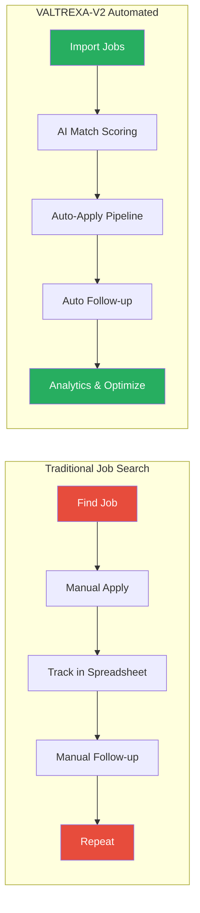

<p align="center">
<picture>

<source media="(prefers-color-scheme: dark)" srcset="docs/assets/favicon.svg">


</picture>
</p>

<h1 align="center">📄 Case Study — VALTREXA-V2</h1><p align="center">  <strong>Version:</strong> v1.0.1 •  <strong>Last Updated:</strong> 2026-07-05 •  <strong>Category:</strong> Case Study</p>
**Description:**  Comprehensive case study covering the problem, solution architecture, key design decisions, technical implementation, and measured outcomes

---

## Table of Contents
- [Executive Summary](#executive-summary)
- [The Problem](#the-problem)
- [The Solution](#the-solution)
- [Architecture Decisions](#architecture-decisions)
- [Technical Implementation](#technical-implementation)
- [Operational Outcomes](#operational-outcomes)
- [Key Metrics](#key-metrics)
- [Future Direction](#future-direction)
- [Best Practices](#best-practices)
- [Related Documents](#related-documents)

---

## Overview**VALTREXA-V2** is an AI-native software engineering career operating system that automates the end-to-end job search process — from resume parsing and job discovery through automated applications and outreach orchestration.
Built with TanStack Start (React 19), Supabase PostgreSQL, and a multi-provider AI abstraction layer, it integrates with **9 job sources**, uses **Playwright** for browser automation with self-healing selectors, and provides a **Telegram bot with 32 commands** for real-time operations.**Stack:** React 19, TanStack Start, Nitro SSR (Vite 7), Supabase PostgreSQL (70 tables, 28 migrations), Gemini → Groq → OpenRouter AI, Playwright, BullMQ/Redis, Telegram Bot API, Gmail API**Deployment:** Vercel (SSR + API) + Railway (optional background worker)The platform runs an **8-phase sequential workflow** — `import_jobs → match_jobs → discover_recruiters → high_value_pipeline → apply_pipeline → followups → health_check → analytics` — using an 8-factor AI matching engine with configurable thresholds and 3 batch-apply strategies.
With 83+ API endpoints, 59 backend modules, 46 shadcn/ui components, and 7 BullMQ queue types, VALTREXA-V2 is a production-grade solution to the fragmented software engineering job search.
```
mermaidgraph TB    subgraph Core["VALTREXA-V2 Platform"]        FE[Web Dashboard<br/>
TanStack Start + React 19]        API[API Layer<br/>
83+ endpoints]        TG[Telegram Bot<br/>
32 commands]        PW[Playwright Engine<br/>
Self-healing selectors]        AI[AI Layer<br/>
Gemini → Groq → OpenRouter]    end    subgraph Data["Data Layer"]        DB[(Supabase PostgreSQL<br/>
70 tables, RLS)]        Q[BullMQ Queues<br/>
7 queue types]    end    subgraph External["9

Job Sources"]        L[LinkedIn]        I[Indeed]        N[Naukri]        W[Wellfound]        HY[Instahyre]        GH[Greenhouse]        LV[Lever]        AB[Ashby]        WB[Workable]    end    FE --> API    TG --> API    API --> DB    API --> AI    API --> Q    Q --> PW    PW --> External
```


## Development Timeline
```
mermaidgantt    title VALTREXA-V2 Development & Milestones    dateFormat  YYYY-MM-DD    axisFormat  %Y Q%q    section Infrastructure    Supabase Schema (70 tables, 28 migrations)     :done, infra1, 2025-10-01, 2026-01-15    RLS Policies + Indexes                          :done, infra2, 2025-11-01, 2026-02-01    BullMQ Queue Architecture (7 queues)             :done, infra3, 2025-12-01, 2026-03-01    section Core Features    Resume Parser + Candidate Brain                  :done, core1, 2025-10-15, 2026-01-01    Job Import Engine (9 providers)                  :done, core2, 2025-11-15, 2026-03-15    8-Factor AI Matching Engine                      :done, core3, 2025-12-15, 2026-03-01    Playwright Auto-Apply (3 strategies)             :done, core4, 2026-01-01, 2026-04-01    Recruiter Discovery + Outreach Pipeline          :done, core5, 2026-02-01, 2026-05-01    section Integrations    Telegram Bot (32 commands)                       :done, int1, 2026-01-15, 2026-04-01    Gmail API + Inbox Classification                 :done, int2, 2026-02-15, 2026-05-01    Multi-Provider AI (Gemini→Groq→OpenRouter)       :done, int3, 2025-12-01, 2026-03-01    Event Bus + n8n Webhook Subscriptions            :done, int4, 2026-03-01, 2026-05-15    section Polish & Scale    Self-Healing Selectors (15 methods)              :done, polish1, 2026-03-15, 2026-06-01    Multi-User Isolation + Encrypted Cookies         :done, polish2, 2026-04-01, 2026-06-15    Workflow State Machine + Auto-Cleanup            :done, polish3, 2026-04-15, 2026-06-15    Analytics Dashboard + Audit Logging              :done, polish4, 2026-05-01, 2026-07-01    v1.0.1

Release                                   :milestone, rel1, 2026-07-05, 2026-07-05
```

---

## The Problem

## The Job Search Challenge

> [!NOTE]
> This case study documents real-world outcomes from the VALTREXA-V2 deployment. Individual results may vary based on market conditions, industry, and experience level.



Software engineers face a fragmented, manual, and repetitive job search process:1. **Job Discovery** — Manually checking multiple job boards and ATS platforms2. **Application Management** — Tracking which jobs have been applied to, status, and follow-ups3. **Resume Tailoring** — Customizing resumes and cover letters for each application4. **Recruiter Outreach** — Researching companies, finding recruiters, and crafting personalized messages5. **Follow-up Tracking** — Remembering to follow up at appropriate intervals6. **Status Monitoring** —

Tracking application status, interview scheduling, and offer management

## Existing Solutions Fall Short
| Solution
| Limitation
|
|

---

|

---

|
| Manual job search
| Time-consuming, inconsistent, easy to lose track
|
| Job boards (LinkedIn, Indeed)
| No cross-platform orchestration
|
| CRM tools (Huntr, Teal)
| No automation or AI capabilities
|
| Apply tools (Simplify, LazyApply)
| Limited provider support, no outreach features
|
| AI writing tools (ChatGPT)
|

No integration with job search workflow
|

---

## The SolutionVALTREXA-V2 addresses these gaps with an integrated platform spanning job discovery, AI-powered matching, automated application, recruiter outreach, and real-time operations.

## Core Capabilities
| Feature
| Description
|
|

---

|

---

|
| Resume Intelligence
| Parse, store, version resumes; extract skills, experience, goals
|
| Multi-Provider Job Import
| 9 job sources with deduplication and upsert
|
| AI-Powered Matching
| 8-factor weighted scoring (skills 0.32, role 0.20, experience 0.16, location 0.10, salary 0.07, freshness 0.07, companyQuality 0.05, recruiter 0.03)
|
| Pipeline A — Auto-Apply
| Playwright-based automated application with 3 strategies
|
| Pipeline B — High-Value Outreach
| Recruiter discovery → AI messaging → Gmail sending → 3-cadence follow-up
|
| Telegram Operations
| 32 commands for real-time notifications, approvals, provider management
|
| Gmail Inbox Intelligence
| Sync + AI classification (interview, assessment, offer, rejection)
|
| Analytics Dashboard
| Pipeline metrics, conversion rates, trends
|
| Multi-User

Isolation
| Per-user encrypted cookies, RLS on every table
|

## Workflow ArchitectureThe platform operates as an 8-phase pipeline per cycle (default: 30-minute interval):
```
import_jobs → match_jobs → discover_recruiters → high_value_pipeline → apply_pipeline → followups → health_check → analytics
```
Each phase is independently executable with per-phase error isolation — a failure in one phase does not block subsequent phases. State is persisted in the workflow state machine (idle/running/paused/stopped).

Stale workflows exceeding 2 hours without update are auto-stopped.

## Match Scoring System
| Factor
| Weight
| Description
|
|

---

|

---

|

---

|
| Skills
| **0.32**
| Alignment between resume skills and job requirements
|
| Role
| **0.20**
| Title and role type match
|
| Experience
| **0.16**
| Years of experience fit
|
| Location
| **0.10**
| Geographic proximity or remote compatibility
|
| Salary
| **0.07**
| Salary band alignment
|
| Freshness
| **0.07**
| Recency of job posting
|
| Company Quality
| **0.05**
| Company rating, funding, engineering culture
|
| Recruiter
| **0.03**
| Recruiter engagement likelihood
|

Jobs are bucketed into tiers: **A (≥85%)**, **B (70–84%)**, **C (50–69%)**, **D (<50%)** — each tier triggers different apply strategies.

---

## Architecture Decisions

## 1. Why TanStack Start over Next.js?
| Consideration
| TanStack Start
| Next.js
|
|

---

|

---

|

---

|
| File-based API routing
| Native alongside React components
| Requires `pages/api` or `app/api`
|
| SSR engine
| Nitro (Vite-powered, fast HMR)
| Webpack/Turbopack
|
| TypeScript integration
| First-class across full stack
| First-class
|
| Build tool
| Vite 7
| Webpack/Turbopack
|
| Bundle splitting
| Fine-grained control
|

Automatic (opinionated)
|

## 2. Why Cookie-Based Auth over API Keys?
| Concern
| Cookie-Based
| API Keys
|
|

---

|

---

|

---

|
| Job portal compatibility
| Required (no public APIs)
| Not supported
|
| CAPTCHA/MFA handling
| Pre-authenticated sessions work
| N/A
|
| Security at rest
| AES-256-GCM encrypted
| Plaintext risk
|
| Multi-user isolation
| Per-user encrypted storage
| Shared or per-key management
|
| Rotation
| Re-extract via DevTools
|

Rotate env vars
|

## 3. Why Dual Deployment (Vercel + Railway)?
| Platform
| Role
| Rationale
|
|

---

|

---

|

---

|
| Vercel
| Frontend + API + SSR
| Auto-scaling serverless, global CDN
|
| Railway
| Background worker
| Persistent runtime for

Playwright + scheduled cycles
|

## 4. Why Multi-Provider AI (Gemini → Groq → OpenRouter)?
| Concern
| Solution
|
|

---

|

---

|
| Single point of failure
| Cascading fallback chain
|
| Cost optimization
| Route simple tasks to cheaper providers
|
| Model diversity
| Different strengths per task type
|
| Availability
| Health-checked provider pool
|
| Rate limits
|

Automatic retry across providers
|

## 5. Why BullMQ with Inline Fallback?
| Concern
| Solution
|
|

---

|

---

|
| Redis availability
| Inline execution when Redis is unavailable
|
| Production reliability
| Redis-backed queue when available
|
| Audit trail
| DB mirror table (`queue_jobs`) for queue job visibility
|
| Serverless compatibility
| No hard

Redis dependency
|

---

## Technical Implementation

## Architecture Flow
```
mermaidgraph TB    FE["Frontend<br/>
TanStack Start + React 19<br/>
Tailwind CSS v4 + 46 shadcn/ui components"] --> API    TG["Telegram Bot<br/>
32 commands, 7 categories"] --> API    API["API Layer<br/>
Nitro SSR, 83+ endpoints, 21 authenticated routes<br/>
api/[...route].ts catch-all dispatching"] --> DB    API --> AI    API --> Q    API --> GM[Gmail API<br/>
Per-user OAuth tokens]    DB[("Supabase PostgreSQL<br/>
70 tables, 28 migrations, RLS enforced<br/>
59 backend modules")]    AI["AI Layer<br/>
Gemini → Groq → OpenRouter<br/>
OPENROUTER_FREE_MODEL_CHAIN: Gemma→Qwen→Nemotron"]    Q["BullMQ Queues<br/>
7 queues: job-import, apply, recruiter,<br/>
outreach, followup, gmail, analytics<br/>
Inline fallback when Redis unavailable"]    Q --> PW    PW["Playwright Automation<br/>
15 self-healing methods<br/>
3-tier selector fallback<br/>
Persistent Edge profiles"]    PW --> JB["9

Job Sources<br/>
LinkedIn, Indeed, Naukri, Wellfound,<br/>
Instahyre, Greenhouse, Lever, Ashby, Workable"]
```


## Key Technical Highlights1. **Self-Healing Selectors** — 15 resilience methods: `findElementWithFallback`, `findElementByText`, `findElementByAriaLabel`, `findElementFuzzy`, `retryOperation`, `retryNavigation`, `retryUpload`, `retryClick`, `smartSelectorHeal`, `autoHeal`. Three-tier fallback (primary → chain → fuzzy) ensures automation reliability across provider layout changes.2. **AES-256-GCM Encryption** — Provider cookies encrypted at rest with per-user keys derived from `COOKIE_ENCRYPTION_KEY` via SHA-256. Format: `hex(iv):hex(authTag):hex(ciphertext)`. Stored in `provider_cookies` table with per-user RLS.3. **Multi-Provider AI Abstraction** — Unified `AiProvider` interface with automatic cascading fallback: Gemini (primary) → Groq (tier-2) → OpenRouter (tier-3). OpenRouter also provides a free model chain: `google/gemma-4-26b-a4b-it:free` → `qwen/qwen3-next-80b-a3b-instruct:free` → `nvidia/nemotron-nano-9b-v2:free`.4. **Phase A/B Handler Pattern** — Clean separation of data preparation (Phase A: analysis, scoring) from execution (Phase B: applying, sending). Defined in `api/phase-handlers.ts` with labeled modules: B1 (Playwright Platform), B2/B3 (Queues), B4 (Event Bus), P3 (Recruiter Discovery V3), P4 (Email Discovery), P5 (High Value Engine V3), P8 (Approval Status).5. **Graceful Queue Degradation** — BullMQ jobs execute inline when Redis is unavailable — zero downtime.
The Railway worker is fully optional.6. **Service Role + RLS Enforcement** — Defense-in-depth with code-level user scoping (`.eq("user_id", userId)` on every query) and database-level RLS. **145+ write operations audited — zero unscoped writes.**7. **Telegram Bot** — 32 commands auto-registered with BotFather across 7 categories: General (5), Account (1), Jobs & Applications (9), Provider Management (6), Cookie Management (1), Workflow (5), Operations & Stats (5). Interactive inline keyboard approvals (Approve/Edit/Skip/Always/Never). Multi-user binding via one-time tokens with 15-minute expiry.8. **Event-Driven Architecture** — Every significant action emits a `workflow_events` record that triggers the notification queue (via DB trigger), Event Bus (B4 module), and n8n webhook subscriptions.

Delivery tracked in `workflow_event_deliveries`.

---

## Operational Outcomes

## What Worked Well
- **Pipeline automation** reliably submits applications across 5 cookie-based job boards
- **AI matching** provides meaningful job prioritization (8-factor scoring with 0.32 skill weight)
- **Telegram bot** significantly reduces management overhead with 32 commands covering all operations
- **Self-healing selectors** handle most provider layout changes without intervention
- **Multi-user isolation** securely separates tenant data across all 70 tables
- **Service role auditing** — 145+ write operations audited with zero unscoped writes
- **Graceful degradation** — system remains functional without Redis or

Railway worker

## What Required Iteration
- **Cookie management**: Initial env-var approach was insecure — replaced with per-user encrypted storage in `provider_cookies` table with AES-256-GCM and SHA-256 key derivation
- **Telegram user resolution**: Legacy `TELEGRAM_USER_ID` env-var removed in v1.0.1 in favor of binding-based approach with one-time tokens and 15-minute expiry
- **Selector reliability**: Required continuous refinement across provider layout changes; the 15-method self-healing system with 3-tier fallback was built reactively
- **Workflow state machine**: Evolved from simple boolean flags to a full state machine with `idle`/`running`/`paused`/`stopped` states and auto-cleanup (>2h stale workflows)
- **Multi-tenancy**:

Adding user isolation after building single-user features was significantly more work than anticipated

---

## Key Metrics
| Category
| Metric
| Value
|
|

---

|

---

|

---

|
| **Database**
| Tables
| 70 (across 13 groups)
|
|
| Migration files
| 28
|
|
| RLS policies
| 70 (one per table)
|
|
| Indexes
| 60+
|
|
| Functions
| 11
|
|
| Triggers
| 50+
|
| **API**
| Endpoints
| 83+
|
|
| Authenticated routes
| 21
|
|
| Phase A/B handler modules
| 8
|
| **Frontend**
| UI components (shadcn/ui)
| 46
|
|
| Onboarding wizard steps
| 9
|
| **Backend**
| Modules in `api/_lib/`
| 59
|
|
| Worker modules
| 8
|
| **Providers**
| Job sources
| 9 (5 cookie-based, 4 public ATS)
|
|
| AI providers
| 3 (Gemini → Groq → OpenRouter)
|
|
| OpenRouter free model chain
| 3 (Gemma → Qwen → Nemotron)
|
| **Telegram**
| Registered commands
| 32
|
|
| Command categories
| 7
|
|
| Approval actions
| 5 (Approve/Edit/Skip/Always/Never)
|
| **Workflow**
| Pipeline phases
| 8 (sequential per cycle)
|
|
| Match scoring factors
| 8
|
|
| Batch apply strategies
| 3 (Conservative/Balanced/Aggressive)
|
|
| Queue types (BullMQ)
| 7
|
|
| Cycle interval
| 30 min (configurable)
|
|
| Stale workflow auto-stop
| >2 hours
|
|
| Follow-up cadence
| Day 3 / Day 7 / Day 14
|
| **Automation**
| Self-healing methods
| 15
|
|
| Apply retry attempts
| 3 (exponential backoff)
|
|
| Cookie validation stages
| 2 (basic + HTTP)
|
| **Security**
| Write operations audited
| 145+
|
|
| Unscoped writes found
| 0
|
|
| Encryption algorithm
| AES-256-GCM
|
|
| Key derivation
| SHA-256
|
| **Scaling**
| Rate limit (global, per IP)
| 100 req / 60s
|
|
| Rate limit (Telegram, per chat)
| 10 req / 3s
|
|
| Browser timeout
| 120s per application
|
|
|

Sleep between providers (import)
| 5s
|

---

## Future Direction

## Near-Term Priorities1. **Admin Telegram commands** (`/broadcast`, `/inspect`, `/admin-status`) for platform management2. **Application status auto-detection** from Gmail replies using AI classification3. **Enhanced analytics** — pipeline conversion funnel, per-provider metrics, success rate by match score tier4. **

Resume auto-tailoring** per job description using match scoring factors

## Long-Term Vision
- **Mobile application** (React Native) for on-the-go management
- **Public API** for third-party integrations and custom tooling
- **AI-powered interview preparation** based on job description match analysis
- **Plugin system** for community-contributed provider integrations
- **Team collaboration** for recruitment agencies and career coaches

See [ROADMAP.md](ROADMAP.md) for the complete version history and detailed development timeline.

## Best Practices
- **Adopt defense-in-depth for data security**: Combine service-role client queries with `.eq("user_id", userId)` scoping at the code level and RLS policies at the database level. Audit every write operation to ensure zero unscoped writes.
- **Design for graceful degradation**: BullMQ inline fallback when Redis is unavailable and optional Railway worker ensure the system never has hard infrastructure dependencies.
- **Prioritize self-healing over hardcoded selectors**: The 15-method selector system with 3-tier fallback handles provider layout changes automatically, reducing maintenance burden significantly.
- **Use phased rollouts for new features**: The Phase A/B handler pattern separates analysis from execution, allowing safe incremental deployment of new automation capabilities.
- **Encrypt sensitive data at rest**: Provider cookies and OAuth tokens use AES-256-GCM with per-user key derivation via SHA-256. Never store secrets in plaintext environment variables.
- **Monitor the event delivery pipeline**: Track `workflow_event_deliveries` for consumer failures.

The event-driven architecture with database trigger → notification queue → multi-channel dispatch provides full observability.

---

## Related Documents
- [Architecture](ARCHITECTURE.md) — Complete system design and data flow
- [Roadmap](ROADMAP.md) — Version history and planned features
- [API Reference](API_REFERENCE.md) — Complete endpoint documentation
- [Database Schema](DATABASE.md) — Tables, relationships, migrations, RLS
- [Provider Guide](PROVIDER_GUIDE.md) — Provider integration and strategy
- [Workflow Guide](WORKFLOW.md) — 8-phase pipeline state machine details

---

<br/>
<div align="center">
  <strong>Next Reading:</strong> <a href="PERFORMANCE.md">Performance & Scalability →</a>
</div>
