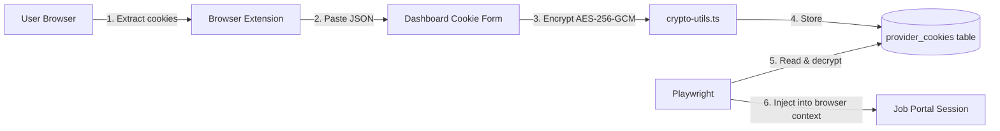

# Cookie Guide

> **Last Updated:** 2026-06-26

## Why Cookie-Based Auth?

Instead of storing passwords for job portals, VALTREXA-V2 stores **encrypted session cookies** extracted from your authenticated browser. This design:

- Avoids credential storage and password rotation
- Works around login CAPTCHAs and MFA that automated logins cannot handle
- Leverages existing authenticated sessions without repeated logins
- Allows the system to operate as "you" on job portals

## How It Works



## Encryption

- **Algorithm:** AES-256-GCM (authenticated encryption)
- **Key source:** `COOKIE_ENCRYPTION_KEY` env var (64 hex chars = 32 bytes)
- **Per-value IV:** Each encryption generates a unique 16-byte initialization vector
- **Auth tag:** GCM appends a 16-byte authentication tag to detect tampering

Implementation in `api/_lib/crypto-utils.ts`:

```
encryptCookie(plaintext: string) -> { encrypted: base64, iv: base64 }
decryptCookie(encrypted: base64, iv: base64) -> string
```

## Database Schema

Table: `provider_cookies` (scoped by `user_id`)

| Column | Type | Description |
|---|---|---|
| id | uuid PK | Auto-generated |
| user_id | uuid FK | Owner (auth.users) |
| provider | text | e.g., `linkedin`, `indeed`, `naukri` |
| cookie_name | text | e.g., `li_at`, `JSESSIONID` |
| cookie_value | text | **Encrypted** cookie value |
| domain | text | e.g., `.linkedin.com` |
| expires_at | timestamptz | Cookie expiry (auto-detected) |
| is_active | boolean | Soft enable/disable |
| last_validated_at | timestamptz | Last successful validation |
| created_at | timestamptz | Creation timestamp |
| updated_at | timestamptz | Last update timestamp |

## Extraction Guide

### LinkedIn

1. Log into LinkedIn in your browser
2. Open DevTools → Application → Cookies → `https://www.linkedin.com`
3. Find `li_at` — copy its **value** (long base64 string)
4. Also extract `JSESSIONID` (csrf token, starts with `"ajax:"`)
5. Paste both into the Cookie Management dashboard

### Indeed

1. Log into Indeed
2. Open DevTools → Application → Cookies → `https://www.indeed.com`
3. Extract `CTK` (the main session cookie) and optionally `SESSIONID`
4. Paste into dashboard

### Naukri

1. Log into Naukri
2. DevTools → Application → Cookies → `https://www.naukri.com`
3. Extract `NAUKRI_SESSION` or `ntoken`
4. Paste into dashboard

### Wellfound (AngelList)

1. Log into Wellfound
2. DevTools → Application → Cookies → `https://wellfound.com`
3. Extract any session cookies (varies)
4. Paste into dashboard

### Instahyre

1. Log into Instahyre
2. DevTools → Application → Cookies → `https://www.instahyre.com`
3. Extract session cookies
4. Paste into dashboard

## Validation

The system validates cookies by making real HTTP requests to the provider:

```
GET https://linkedin.com/feed          → 200 = valid, 302/401 = expired
GET https://www.indeed.com/            → 200 = valid
GET https://www.naukri.com/mnjuser/homepage → 200 = valid
```

Validation is triggered:
- Automatically when a cookie is added/updated
- Periodically during workflow precheck phase
- On demand via `/validate` in the dashboard or Telegram `/check` command

Expired cookies are marked `is_active = false`. The workflow precheck will fail and pause if critical cookies are invalid.

## Troubleshooting

| Symptom | Likely Cause | Fix |
|---|---|---|
| "Cookie expired" | Session logged out | Re-extract and re-upload |
| "Invalid cookie" | Wrong cookie name/value | Check DevTools for correct key |
| "Encryption failed" | Missing/invalid `COOKIE_ENCRYPTION_KEY` | Verify env var is 64 hex chars |
| "Provider unreachable" | Network/blocked | Check if provider is accessible from your Vercel region |
| "CSRF token missing" | Linkedin `JSESSIONID` not provided | Extract and add `JSESSIONID` cookie |
