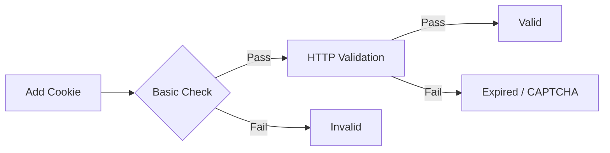

<p align="center">
  <picture>
    <source media="(prefers-color-scheme: dark)" srcset="docs/assets/favicon.svg">
    
  </picture>
</p>

<h1 align="center">🍪 Cookie Guide</h1>

<p align="center">
  <strong>Version:</strong> v1.0.0 •
  <strong>Last Updated:</strong> 2026-06-29 •
  <strong>Category:</strong> Operations
</p>

**Description:** VALTREXA-V2 — Session Cookie Management for Automated Job Applications

---

## Table of Contents

- [Overview](#overview)
- [Why Cookie-Based Auth](#why-cookie-based-auth)
- [Encryption](#encryption)
- [Database Schema](#database-schema)
- [Extracting Cookies](#extracting-cookies)
- [Validation](#validation)
- [Expiry & Auto-Disable](#expiry--auto-disable)
- [Troubleshooting](#troubleshooting)
- [Best Practices](#best-practices)
- [Related Documents](#related-documents)

---

## Overview

> [!IMPORTANT]
> **v1.0.1+**: Provider cookies are **per-user only**. The legacy env-var fallbacks (`LINKEDIN_COOKIE`, `INDEED_COOKIE`, etc.) have been removed. Each user must configure their own cookies.

Job portals (LinkedIn, Indeed, Naukri, etc.) use cookie-based sessions rather than API tokens. VALTREXA-V2 automates applications by storing encrypted session cookies for each provider.

**Benefits:**

- No credentials stored on the server
- Works with CAPTCHA/MFA (session is pre-authenticated)
- Per-user isolation (each user stores their own cookies)

---

## Why Cookie-Based Auth

Job portals (LinkedIn, Indeed, Naukri, etc.) use cookie-based sessions rather than API tokens. VALTREXA-V2 automates applications by storing encrypted session cookies for each provider.

> [!IMPORTANT]
> **v1.0.1+**: Provider cookies are **per-user only**. The legacy env-var fallbacks (`LINKEDIN_COOKIE`, `INDEED_COOKIE`, etc.) have been removed. Each user must configure their own cookies.

**Benefits:**

- No credentials stored on the server
- Works with CAPTCHA/MFA (session is pre-authenticated)
- Per-user isolation (each user stores their own cookies)

---

## Encryption

| Property       | Value                                      |
| -------------- | ------------------------------------------ |
| Algorithm      | AES-256-GCM                                |
| Key Derivation | SHA-256(`COOKIE_ENCRYPTION_KEY`)           |
| IV             | Random 16 bytes per encryption             |
| Storage Format | `hex(iv):hex(authTag):hex(ciphertext)`     |
| Column         | `provider_cookies.cookie_value`            |

---

## Database Schema

```sql
provider_cookies (
  id              uuid PRIMARY KEY,
  user_id         uuid NOT NULL REFERENCES auth.users(id),
  provider        text NOT NULL,
  cookie_value    text NOT NULL,           -- encrypted blob
  status          text CHECK (valid, invalid, expired, pending, ...),
  health_data     jsonb,                   -- validation results
  UNIQUE(user_id, provider)
);
```

> [!NOTE]
> Row-Level Security (RLS) ensures users can only access their own cookies.

---

## Extracting Cookies

### Method 1: Automated Script (Local Machine)

```bash
npx.cmd tsx scripts/refresh-cookies.ts --provider linkedin --user-id <YOUR_USER_ID>
```

**Prerequisites:**

- Microsoft Edge installed
- Logged into the provider in Edge
- `EDGE_USER_DATA_DIR` set (path to Edge profile directory)
- `COOKIE_ENCRYPTION_KEY` set in `.env`

### Method 2: Manual Paste (Any Machine)

1. Log into the provider in your browser
2. Open DevTools → Application → Cookies
3. Copy the relevant cookie values
4. Paste in VALTREXA-V2 dashboard → Settings → Cookies

### Cookie Names by Provider

| Provider  | Key Cookies              |
| --------- | ------------------------ |
| LinkedIn  | `li_at`                  |
| Indeed    | `CTK`                    |
| Naukri    | `nauk_sid`               |
| Wellfound | `_wellfound_session`     |
| Instahyre | `sessionid`, `csrftoken` |

---

## Validation

When you add or refresh a cookie, the system:

1. **Basic validation** — length ≥ 10, no expired/signin/login keywords, not JSON
2. **HTTP validation** — fetches the provider homepage with the cookie, checks for login page indicators
3. **Status update** — `valid`, `expired`, `captcha_required`, or `invalid`



---

## Expiry & Auto-Disable

- Cookies expire naturally (provider session timeout)
- On validation failure → provider is **paused**
- On consecutive failures → provider is **disabled** (auto)
- User must re-extract and re-paste fresh cookies

---

## Troubleshooting

| Issue                           | Fix                                                         |
| ------------------------------- | ----------------------------------------------------------- |
| Cookie shows "expired"          | Re-login to provider, re-extract fresh cookie               |
| Cookie shows "captcha_required" | Login manually in browser, solve CAPTCHA, re-extract        |
| "No cookie configured"          | Add cookie via dashboard or Telegram                        |
| "Invalid secret token"          | Verify `TELEGRAM_WEBHOOK_SECRET` matches                    |
| Encryption key changed          | All stored cookies become unrecoverable — must re-paste all |

---

## Best Practices

> [!TIP]
> - Set a strong `COOKIE_ENCRYPTION_KEY` — never use the default empty value
> - Re-extract cookies every 2–3 weeks to prevent expiry
> - Use the automated Edge script for consistent extraction
> - Monitor provider health via Telegram `/provider_status`
> - Rotate encryption key only when necessary (invalidates all stored cookies)

---

## Related Documents

- [Provider Guide](PROVIDER_GUIDE.md) — Supported job board provider configuration
- [Deployment Guide](DEPLOYMENT.md) — Production deployment instructions
- [Setup Guide](SETUP.md) — Local development & production setup

---

<br/>
<div align="center">
  <strong>Next Reading:</strong> <a href="PROVIDER_GUIDE.md">Provider Integrations →</a>
</div>
