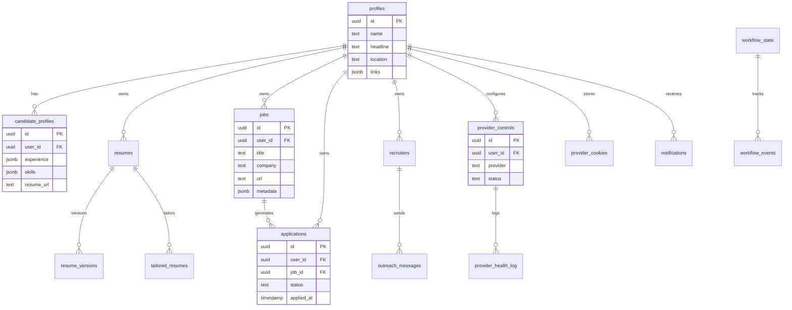

<p align="center">
  <picture>
    <source media="(prefers-color-scheme: dark)" srcset="assets/favicon.svg">
    
  </picture>
</p>

<h1 align="center">Database — VALTREXA-V2</h1>

<p align="center">
  <strong>Version:</strong> v1.0.0 &nbsp;•&nbsp;
  <strong>Last updated:</strong> 2026-06-29 &nbsp;•&nbsp;
  <strong>Provider:</strong> Supabase (PostgreSQL 15.x)
</p>

---

## Table of Contents

- [Table Groups](#table-groups)
  - [User & Profile](#user--profile)
  - [Resume & Skills](#resume--skills)
  - [Jobs & Applications](#jobs--applications)
  - [Recruiters & Outreach](#recruiters--outreach)
  - [Provider Controls](#provider-controls)
  - [Infrastructure](#infrastructure)
- [Entity Relationship Diagram](#entity-relationship-diagram)
- [Migration Strategy](#migration-strategy)
- [Best Practices](#best-practices)

---

## Table Groups

### User & Profile

| Table                | Purpose                                              | RLS                    |
| -------------------- | ---------------------------------------------------- | ---------------------- |
| `profiles`           | User profiles (name, headline, location, links)      | `id = auth.uid()`      |
| `candidate_profiles` | Extended candidate data (experience, skills, resume) | `user_id = auth.uid()` |
| `candidate_memory`   | AI memory for form auto-fill                         | `user_id = auth.uid()` |

### Resume & Skills

| Table              | Purpose                               | RLS                    |
| ------------------ | ------------------------------------- | ---------------------- |
| `resumes`          | Resume records (title, is_primary)    | `user_id = auth.uid()` |
| `resume_versions`  | File URL + parsed content per version | `user_id = auth.uid()` |
| `tailored_resumes` | Job-specific tailored resume versions | `user_id = auth.uid()` |
| `skills`           | Skills with category and level        | `user_id = auth.uid()` |

### Jobs & Applications

| Table          | Purpose                         | RLS                    |
| -------------- | ------------------------------- | ---------------------- |
| `jobs`         | Imported job listings           | `user_id = auth.uid()` |
| `applications` | Application records with status | `user_id = auth.uid()` |

### Recruiters & Outreach

| Table                 | Purpose                       | RLS                    |
| --------------------- | ----------------------------- | ---------------------- |
| `recruiters`          | Discovered recruiter profiles | `user_id = auth.uid()` |
| `outreach_messages`   | Generated outreach drafts     | `user_id = auth.uid()` |
| `email_verifications` | Verified email addresses      | `user_id = auth.uid()` |

### Provider Controls

| Table                 | Purpose                          | RLS                    |
| --------------------- | -------------------------------- | ---------------------- |
| `provider_controls`   | Per-user provider enable/disable | `user_id = auth.uid()` |
| `provider_cookies`    | Encrypted session cookies        | `user_id = auth.uid()` |
| `provider_health_log` | Health events per provider       | `user_id = auth.uid()` |

### Infrastructure

| Table             | Purpose                  | RLS                    |
| ----------------- | ------------------------ | ---------------------- |
| `workflow_state`  | Workflow state machine   | `user_id = auth.uid()` |
| `workflow_events` | Event audit log          | `user_id = auth.uid()` |
| `notifications`   | User notification center | `user_id = auth.uid()` |

## Entity Relationship Diagram



## Migration Strategy

> [!IMPORTANT]
> 27 migration files in `supabase/migrations/`, numbered by timestamp. Apply in alphanumeric order via Supabase SQL Editor.

```sql
NOTIFY pgrst, 'reload schema';
```

> [!WARNING]
> Always back up your database before applying migrations. Never skip the `NOTIFY pgrst` step — the API schema cache will not reload without it.

## Best Practices

> [!TIP]
> **RLS policies:** Every table has Row-Level Security scoped to `auth.uid()`. When querying via the service role (admin operations), always include `.eq("user_id", userId)` filters.

> [!NOTE]
> **Indexes:** Ensure `user_id` columns are indexed on all tables that are queried by user. The migration `20260625000003_multi_user.sql` adds `idx_provider_health_log_user_id` as a reference pattern.

- All timestamps should use `timestamptz` (TIMESTAMP WITH TIME ZONE) for consistency across time zones.
- Use `uuid` as primary key type — Supabase Auth uses UUIDs natively.
- Prefer `jsonb` over `json` for JSON columns — it supports indexing and more operators.
- Migrations must be idempotent: use `IF NOT EXISTS` and `IF EXISTS` guards on all DDL statements.

---

<br/>
<div align="center">
  <strong>Next Reading:</strong> <a href="ENVIRONMENT.md">Environment Configuration →</a>
</div>
