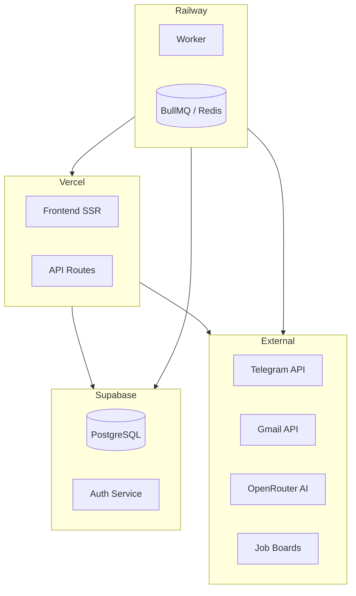

<p align="center">
  <picture>
    <source media="(prefers-color-scheme: dark)" srcset="docs/assets/favicon.svg">
    
  </picture>
</p>

<h1 align="center">🚀 Deployment Guide</h1>

<p align="center">
  <strong>Version:</strong> v1.0.1 •
  <strong>Last Updated:</strong> 2026-06-30 •
  <strong>Category:</strong> DevOps
</p>

**Description:** VALTREXA-V2 — Production Deployment Instructions

---

## Table of Contents

- [Overview](#overview)
- [Architecture](#architecture)
- [Step 1: Supabase](#step-1-supabase-database--auth)
- [Step 2: Google Cloud](#step-2-google-cloud-console)
- [Step 3: Vercel](#step-3-vercel-deployment)
- [Step 4: Telegram Bot](#step-4-telegram-bot)
- [Step 5: Redis & Queue](#step-5-redis--queue-optional-for-worker)
- [Step 6: Verification](#step-6-post-deployment-verification)
- [Rollback & Backup](#rollback-procedure)
- [Best Practices](#best-practices)
- [Related Documents](#related-documents)

---

## Overview

> [!NOTE]
> This deployment guide covers the production-grade infrastructure setup. Development environments can use simplified configurations.

**Production URL:** https://valtrexa-v2.vercel.app

Full deployment walkthrough covering Supabase, Google Cloud, Vercel, Telegram Bot, and Redis/Queue infrastructure.

---

## Architecture



---

## Step 1: Supabase (Database + Auth)

1. **Create project** at [supabase.com](https://supabase.com)
2. **Run migrations** — all 28 migrations from `supabase/migrations/` **in order**:

   ```bash
   npx supabase migration up --include-all --db-url "postgresql://postgres:<password>@<project>.supabase.co:5432/postgres"
   ```

   Or use SQL Editor to run each `.sql` file sequentially.

3. **After all migrations:** `NOTIFY pgrst, 'reload schema';`
4. **Verify all migrations applied:**

   ```sql
   SELECT * FROM supabase_migrations.schema_migrations ORDER BY version;
   ```

5. **Configure Auth:**
   - Settings → URL Configuration
   - **Site URL:** `https://valtrexa-v2.vercel.app`
   - **Redirect URLs:** `https://valtrexa-v2.vercel.app/auth/callback`

6. **Enable Google OAuth:**
   - Authentication → Providers → Google
   - Enter Client ID + Secret from Google Cloud Console

---

## Step 2: Google Cloud Console

1. Create project → Enable **Gmail API**
2. APIs & Services → Credentials → Create OAuth 2.0 Client ID
3. **Application type:** Desktop app
4. **Authorized JavaScript origins:** `https://valtrexa-v2.vercel.app`
5. **Authorized redirect URIs:**
   - `https://valtrexa-v2.vercel.app/auth/callback`
   - `https://<project>.supabase.co/auth/v1/callback`
6. Copy `GMAIL_CLIENT_ID` and `GMAIL_CLIENT_SECRET`
7. Obtain refresh token via offline OAuth flow

---

## Step 3: Vercel Deployment

1. Push code to GitHub
2. Import repository in Vercel
3. **Build Command:** `npm.cmd run build`
4. **Output Directory:** `dist/client`
5. Set all environment variables from [ENVIRONMENT.md](./ENVIRONMENT.md)
6. Deploy

**vercel.json** handles:

- API route rewrites → `api/[...route].ts`
- SSR rewrites → Nitro server handler
- Static asset serving

---

## Step 4: Telegram Bot

1. Message [@BotFather](https://t.me/BotFather)
2. Create bot: `/newbot` → name it `ValtrexaV2Bot`
3. Set `TELEGRAM_BOT_TOKEN` in Vercel
4. Set `TELEGRAM_WEBHOOK_SECRET` (random string)
5. Set `PUBLIC_URL=https://valtrexa-v2.vercel.app`
6. The bot registers its webhook automatically on first request

**Webhook endpoint:** `https://valtrexa-v2.vercel.app/api/telegram/webhook`

---

## Step 5: Redis + Queue (Optional for Worker)

If using the background worker (Railway or standalone):

1. Provision Redis (Upstash, Railway Redis, or self-hosted)
2. Set `REDIS_URL` in Railway environment
3. Deploy worker: `railway up` with start command `npm.cmd run worker`

---

## Step 6: Post-Deployment Verification

| Check                  | What to Verify                                      |
| ---------------------- | --------------------------------------------------- |
| ✅ Health check        | Visit `https://valtrexa-v2.vercel.app`              |
| ✅ Signup flow         | Create account → confirm email → land on onboarding |
| ✅ Login flow          | Login with email/password → dashboard               |
| ✅ Google OAuth        | Login with Google → callback → dashboard            |
| ✅ Resume upload       | Upload PDF → verify in profile                      |
| ✅ Cookie management   | Add LinkedIn cookie → validate → check status       |
| ✅ Telegram connection | `/start` → bind account → `/status`                 |
| ✅ AI generation       | Verify OpenRouter key is working                    |
| ✅ Gmail sync          | Trigger inbox sync → check classified messages      |

---

## Rollback Procedure

1. **Vercel:** Go to Deployment → three dots → **Promote to Production** (previous version)
2. **Database:** Run the **inverse** of the last migration
3. Notify users of the rollback and estimated fix time

## Backup Procedure

> [!CAUTION]
> - **Database:** Use Supabase daily backups (Pro plan+)
> - **Encryption keys:** Store `COOKIE_ENCRYPTION_KEY` and `SESSION_SECRET` in a password manager
> - **OAuth tokens:** Re-obtain `GMAIL_REFRESH_TOKEN` if lost

---

## Best Practices

> [!TIP]
> - Always test migrations in a staging environment first
> - Use Vercel Preview Deployments for feature branches
> - Monitor Supabase logs for slow queries
> - Set up Uptime monitoring on the production URL
> - Keep `COOKIE_ENCRYPTION_KEY` backed up in a secure vault

---

## Related Documents

- [Setup Guide](SETUP.md) — Local development & production setup
- [Environment Reference](ENVIRONMENT.md) — Complete environment variable reference
- [Security Guide](SECURITY.md) — Security architecture & hardening

---

<br/>
<div align="center">
  <strong>Next Reading:</strong> <a href="MIGRATION_GUIDE.md">Migration Guide →</a>
</div>
