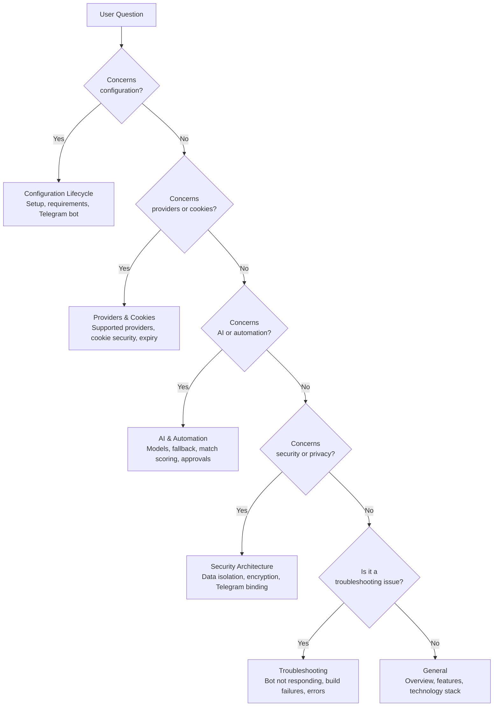

<picture>

<source media="(prefers-color-scheme: dark)" srcset="docs/assets/favicon.svg">

</picture>

<h1 align="center">📄 FAQ</h1>
  <strong>Version:</strong> v1.0.1 •  <strong>Last Updated:</strong> 2026-07-05 •  <strong>Category:</strong> Reference

**Description:**  Frequently asked questions about VALTREXA-V2 — the AI-native software engineering career operating system.

---

## Table of Contents
- [Overview](#overview)
- [General](#general)
- [Configuration Lifecycle](#configuration-lifecycle)
- [Providers & Cookies](#providers--cookies)
- [AI & Automation](#ai--automation)
- [Security Architecture](#security-architecture)
- [Troubleshooting](#troubleshooting)
- [Best Practices](#best-practices)
- [Related Documents](#related-documents)

---

## Overview
> [!NOTE]
> This FAQ covers the most common questions about VALTREXA-V2, organized by category for quick reference.
> [!TIP]
>
>
> If you don't find what you're looking for here, check the [Troubleshooting](TROUBLESHOOTING.md) guide or the [Glossary](GLOSSARY.md) for terminology definitions.

### Question Categorization Flow

The decision tree below routes user questions to the appropriate FAQ category:

---

## General

## What is VALTREXA-V2?

VALTREXA-V2 is an AI-native software engineering career operating system that automates the end-to-end job search process — from resume parsing and job discovery through automated applications, recruiter outreach, and follow-up orchestration.

It operates across **8 workflow phases**: `import_jobs` → `match_jobs` → `discover_recruiters` → `high_value_pipeline` → `apply_pipeline` → `followups` → `health_check` → `analytics`.

## Who is it for?

Software engineers looking to automate and optimize their job search.

The system integrates with **9 job sources** (LinkedIn, Indeed, Naukri, Wellfound, Instahyre, Greenhouse, Lever, Ashby, Workable), uses **multi-provider AI** (Gemini, Groq, OpenRouter) for matching and content generation, and runs Playwright-based browser automation for applications.

## What makes it different from other job search tools?
- **End-to-end automation**: Resume → matching (8-factor scoring) → apply → outreach → follow-up
- **Multi-provider AI fallback**: Gemini → Groq → OpenRouter (automatic on failure)
- **Per-user isolation**: Multi-tenant with encrypted cookies (AES-256-GCM) and RLS on all 70 tables
- **Self-healing automation**: 3-tier fallback selectors, fuzzy matching, auto-retry with exponential backoff
- **7 BullMQ queues**: Background processing with inline fallback when

Redis is unavailable

## What are the core technologies?
- **Frontend**: TanStack Start, React 19, Vite 7, Tailwind CSS v4, shadcn/ui (46 components)
- **Backend**: 59 backend modules, 83+ API endpoints, 21 authenticated routes
- **Database**: Supabase (PostgreSQL), 70 tables, 28 migration files
- **Automation**: Playwright Chromium, 7 BullMQ queues
- **AI**: Gemini, Groq, OpenRouter with automatic fallback chain

---

## Configuration Lifecycle

## What are the minimum requirements?

Node.js 22+, npm 10+, a Supabase project (free tier), and at least one AI provider key. Redis 7+ and Playwright

Chromium are optional but recommended for full functionality.

## Can I run it without Redis?

Yes.
The queue system degrades gracefully — jobs execute inline if Redis is unreachable.

The **7 BullMQ queues** (`job-import`, `apply`, `recruiter`, `outreach`, `followup`, `gmail`, `analytics`) fall back to synchronous execution.

## Do I need a Railway account?

No. Railway is optional for background worker processing.
The application runs fully on Vercel without a worker, though browser automation will be limited without the persistent Playwright context that

Railway provides.

## How do I set up the Telegram bot?

Message [@BotFather](https://t.me/BotFather) → `/newbot` → `ValtrexaV2Bot` → save the token → set `TELEGRAM_BOT_TOKEN` in your environment.
The bot auto-registers **32 commands** on startup.
Each user must bind their

Telegram chat via `/connect <token>`.

## What are the workflow states?

Workflows operate in 4 states: `idle`, `running`, `paused`, `stopped`.

Workflows stale for >2 hours without updates are auto-stopped.

## How many API endpoints does the platform have?

The platform has **83+ API endpoints**, **59 backend modules**, **46 shadcn/ui components**, and **21 authenticated routes**.

---

## Providers & Cookies

## Which job providers are supported?**Nine providers**: LinkedIn, Indeed, Naukri, Wellfound, Instahyre (cookie-based), and Greenhouse, Lever, Ashby,

Workable (public board access).

## Why cookies instead of API keys?

Job portals use session cookies, not developer API tokens. Cookie-based auth works with CAPTCHA/MFA since the session is pre-authenticated.

Cookies are encrypted with AES-256-GCM at rest.

## Are my cookies safe?

Yes. Cookies are encrypted with AES-256-GCM at rest using `COOKIE_ENCRYPTION_KEY`. They are decrypted only at runtime for Playwright automation. Changing the encryption key renders all stored cookies unrecoverable.
> [!WARNING]
> Changing your `COOKIE_ENCRYPTION_KEY` will render all stored cookies permanently unrecoverable.

You must re-paste all provider cookies after changing this key.

## Why does my cookie show "expired"?

Provider sessions expire naturally. Re-login to the provider in your browser, re-extract the cookie, and paste it again in the dashboard.

## Can I share cookies between users?

No. Cookies are per-user encrypted in the `provider_cookies` table.

Each user must configure their own cookies.

---

## AI & Automation

## Which AI models are used?

The default is OpenAI's GPT-4o-mini via OpenRouter.
The system also supports Claude 3.5 Sonnet (via OpenRouter), Gemini 2.5 Pro, DeepSeek V3 (via OpenRouter), and

Llama 3 (via Groq).

## What happens if the AI provider fails?

The system automatically falls back through the provider chain: **Gemini → Groq → OpenRouter**.

If all providers fail, an error is logged and the operation is retried with exponential backoff.

## How does the match scoring work?

Match scoring uses **8 weighted factors**:
| Factor
| Weight
| Description
|
|

---

|

---

|

---

|
| Skills
| 0.32
| Keyword and skill match between resume and job
|
| Role
| 0.20
| Title and role alignment
|
| Experience
| 0.16
| Years of experience match
|
| Location
| 0.10
| Geographic proximity
|
| Salary
| 0.07
| Salary range overlap
|
| Freshness
| 0.07
| Recency of job posting
|
| Company quality
| 0.05
| Company rating and reputation
|
| Recruiter
| 0.03
|

Recruiter engagement signal
|

## How often does the workflow run?

Every 30 minutes by default.

All 8 phases execute in each cycle: import_jobs → match_jobs → discover_recruiters → high_value_pipeline → apply_pipeline → followups → health_check → analytics.

## Can I approve applications before they're submitted?

Yes. Enable `ENABLE_TELEGRAM_APPROVALS=true` to require

Telegram approval before each application submission.

## What happens when my workflow stays inactive for too long?

Workflows that are **stale for >2 hours without updates** are auto-stopped.

Restart from the dashboard when ready.

---

## Security Architecture

## How is my data isolated from other users?

Every database table enforces Row Level Security with `user_id = auth.uid()`.

The service role key (server-only) always includes `.eq("user_id", userId)` filters across all **145+ write operations** — the codebase has **zero unscoped writes**.

## What happens if I lose my encryption key?

All stored cookies become unrecoverable. You must re-paste all provider cookies after setting a new `COOKIE_ENCRYPTION_KEY`.
> [!IMPORTANT]
> Backup your `COOKIE_ENCRYPTION_KEY` in a secure location.

Loss of this key means all encrypted provider cookies must be re-extracted and re-pasted.

## Is my Gmail data stored?

Classified inbox messages are stored in the `inbox_messages` table with your `user_id` scope.

Raw email content is processed for classification but not stored indefinitely.

## How is the Telegram binding secured?

Each user generates a one-time connection token (expires in 15 minutes) from the dashboard.
The token is sent to the bot via `/connect <token>`.

There is no env-var fallback for inbound routing — users without a binding see "not connected".

## Is Gmail multi-account supported?

No. Gmail integration is **single-mailbox only**.
All outreach and follow-up communications use one configured

Gmail account.

---

## Troubleshooting

## The bot doesn't respond to my commandsCheck that `TELEGRAM_BOT_TOKEN` is correct and the webhook is registered. Verify the bot is connected: use `/start` and ensure you've bound your account via `/connect`.

The bot has **32 commands** — verify all are registered.

## Build fails with module errorsRun `npm install` to ensure all dependencies are installed.
On Windows, use `npm.cmd` instead of `npm`.

If issues persist, delete `node_modules` and `package-lock.json` and run `npm install` again.

## "Not connected" on TelegramYou need to bind your Telegram chat to your account. Go to Settings → Telegram Connection → Generate Connection

Token → send `/connect <token>` to the bot within 15 minutes.

## Applications aren't being submittedCheck:1. Provider cookies are valid2. Provider is enabled3. Match score meets the minimum threshold4. Workflow is running (not paused/stopped)5.

Workflow hasn't been auto-stopped (>2h inactivity)

## AI generation failsVerify API keys are set.
The system falls back **Gemini → Groq → OpenRouter**.

Check `LOG_LEVEL=debug` for detailed error logs.

---

## Best Practices
- **Use a dedicated Gmail account**: Configure a single dedicated Gmail account for outreach and follow-up communications to avoid mixing personal and automated correspondence.
- **Set a strong encryption key**: Always use a strong, randomly generated `COOKIE_ENCRYPTION_KEY` — never rely on the default empty-string fallback in production.
- **Monitor provider health regularly**: Check the dashboard for provider status changes. Providers that fail 3 consecutive validations are auto-disabled and require manual re-enablement.
- **Start with Conservative strategy**: Begin with the Conservative batch strategy (Tier A, easy-apply only, 85% min score) and gradually increase aggressiveness as you validate provider behavior.
- **Keep session fresh**: Restart workflows that have been idle for over 2 hours to avoid auto-stop. Regular cycle execution keeps cookies validated and automation running smoothly.
- **Extract cookies on your main browser**:

Use your everyday authenticated browser for cookie extraction to avoid triggering CAPTCHA challenges on fresh login sessions.

---

## Related Documents
- [Setup Guide](SETUP.md) — Getting started
- [Troubleshooting](TROUBLESHOOTING.md) — Common issues and solutions
- [Cookie Guide](COOKIE_GUIDE.md) — Cookie management
- [Provider Guide](PROVIDER_GUIDE.md) — Provider configuration
- [Deployment Guide](DEPLOYMENT.md) — Production deployment
- [Glossary](GLOSSARY.md) — Terminology reference

---

 

  <strong>Next Reading:</strong> <a href="GLOSSARY.md">Glossary →</a>

