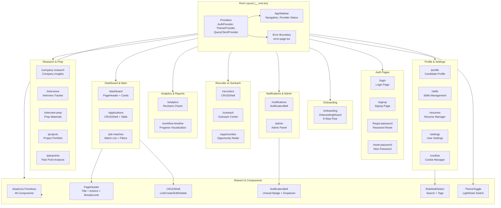

<p align="center">
  <picture>
    <source media="(prefers-color-scheme: dark)" srcset="docs/assets/favicon.svg">
    
  </picture>
</p>

<h1 align="center">📄 Frontend Architecture — VALTREXA-V2</h1>

<p align="center">
  <strong>Version:</strong> v1.0.1 •
  <strong>Last Updated:</strong> 2026-07-05 •
  <strong>Category:</strong> Frontend Architecture
</p>

**Description:** Frontend architecture, component library (46 shadcn/ui components), routing (21+ authenticated pages), state management, and design system.

---

## Table of Contents

- [Overview](#overview)
- [Tech Stack](#tech-stack)
- [Project Structure](#project-structure)
- [Routing](#routing)
- [State Management](#state-management)
- [Component Library](#component-library)
- [Design System](#design-system)
- [API Client](#api-client)
- [Hooks](#hooks)
- [Best Practices](#best-practices)
- [Related Documents](#related-documents)

---

## Overview

The frontend is built with **TanStack Start** (React 19), providing server-rendered pages with client-side hydration. It uses file-based routing via TanStack Router, a shadcn/ui component library (46 components) with Radix UI primitives, and Tailwind CSS v4 for styling. State is managed through TanStack Query (server state) and React Context (client state).

## Component Hierarchy



---

## Tech Stack

| Technology        | Version | Purpose                                   |
| ----------------- | ------- | ----------------------------------------- |
| React             | 19.x    | UI framework                              |
| TanStack Start    | 1.x     | SSR framework with file-based routing     |
| TanStack Router   | 1.x     | Client-side routing (file-based)          |
| TanStack Query    | 5.x     | Server state management (cache, mutations)|
| Tailwind CSS      | 4.x     | Utility-first CSS with `@theme inline`    |
| shadcn/ui         | latest  | Component library (New York style, slate) |
| Radix UI          | latest  | Accessible UI primitives (46 components)  |
| Lucide React      | 0.575+  | Icon library                              |
| Recharts          | 2.x     | Charts and analytics dashboards           |
| React Hook Form   | 7.x     | Form handling with validation             |
| Zod               | 3.x     | Schema validation                         |
| Sonner            | 2.x     | Toast notifications                       |
| Vaul              | 1.x     | Drawer component                          |
| Embla Carousel    | 8.x     | Carousel component                        |

---

## Project Structure

```
src/
├── components/               # Reusable UI components
│   ├── ui/                   # shadcn/ui primitives (46 components)
│   ├── app-sidebar.tsx
│   ├── crud-shell.tsx
│   ├── notification-bell.tsx
│   ├── onboarding-wizard.tsx
│   ├── page-header.tsx
│   ├── role-multi-select.tsx
│   └── theme-toggle.tsx
├── hooks/                    # Custom React hooks
│   ├── use-auth.tsx          # Authentication context + methods
│   ├── use-crud.ts           # Generic CRUD operations hook
│   ├── use-mobile.tsx        # Mobile detection
│   └── use-theme.tsx         # Theme management
├── integrations/             # External service integrations
│   └── supabase/             # Supabase client configuration
│       ├── client.ts                    # Browser-side Supabase client
│       ├── client.server.ts             # Server-side Supabase client
│       ├── types.ts                     # Generated Database type definitions
│       ├── auth-attacher.ts             # SSR auth session attacher
│       └── auth-middleware.server.ts     # SSR auth middleware
├── lib/                      # Shared utilities
│   ├── api-client.ts         # API request helpers (auth headers)
│   ├── api/                  # API type definitions
│   │   └── example.functions.ts
│   ├── auth-callback.ts      # OAuth callback handler
│   ├── config.server.ts      # Server configuration
│   ├── error-capture.ts      # Error boundary
│   ├── error-page.ts         # Error page renderer
│   ├── role-taxonomy.ts      # Role classification
│   ├── utils.ts              # General utilities (cn, etc.)
│   └── workflow-intelligence.ts
├── routes/                   # File-based route pages
│   ├── __root.tsx            # Root layout, providers, 404/error
│   ├── index.tsx              # Landing page
│   ├── login.tsx              # Login page
│   ├── signup.tsx             # Signup page
│   ├── _authenticated/       # Authenticated routes (21+ pages)
│   ├── auth/                 # Auth-related routes
│   ├── forgot-password.tsx
│   └── reset-password.tsx
├── router.tsx                # Router configuration
├── routeTree.gen.ts          # Auto-generated route tree
├── server.ts                 # SSR error wrapper
├── styles.css                # Tailwind v4 theme
└── config.ts                 # App configuration
```

---

## Routing

Uses **TanStack Router** with file-based routing:

| Route                  | Page                       | Auth Required      |
| ---------------------- | -------------------------- | ------------------ |
| `/`                    | Landing page               | No                 |
| `/login`               | Login                      | No                 |
| `/signup`              | Signup                     | No                 |
| `/forgot-password`     | Password reset             | No                 |
| `/reset-password`      | New password               | No                 |
| `/auth/callback`       | OAuth callback             | No                 |
| `/auth/confirm-email`  | Email confirmation         | No                 |
| `/dashboard`           | Main dashboard             | Yes                |
| `/applications`        | Application list with status | Yes              |
| `/job-matches`         | Match-scored job listings  | Yes                |
| `/recruiters`          | Recruiter CRM              | Yes                |
| `/outreach`            | Outreach center            | Yes                |
| `/analytics`           | Analytics dashboard (charts) | Yes              |
| `/interviews`          | Interview tracker          | Yes                |
| `/interview-prep`      | Interview preparation      | Yes                |
| `/resumes`             | Resume management          | Yes                |
| `/skills`              | Skills management          | Yes                |
| `/profile`             | Candidate profile          | Yes                |
| `/settings`            | User settings              | Yes                |
| `/cookies`             | Cookie management          | Yes                |
| `/opportunities`       | Opportunity radar          | Yes                |
| `/company-research`    | Company research           | Yes                |
| `/projects`            | Project portfolio          | Yes                |
| `/painpoints`          | Pain point analysis        | Yes                |
| `/workflow-timeline`   | Workflow status timeline   | Yes                |
| `/notifications`       | Notification center        | Yes                |
| `/admin`               | Admin panel                | Yes (admin role)   |
| `/onboarding`          | Onboarding wizard (9 steps)| Yes                |

> [!NOTE]
> All authenticated routes are wrapped in the `_authenticated` layout which handles auth checks, redirects, and sidebar rendering.

---

## State Management

### Server State (TanStack Query)

All server data is fetched and cached via TanStack Query:

```typescript
import { useQuery, useMutation } from "@tanstack/react-query";
import { apiGet, apiPost } from "@/lib/api-client";

// Fetch data with automatic caching
const { data, isLoading } = useQuery({
  queryKey: ["job-matches"],
  queryFn: () => apiGet<JobMatch[]>("/api/job-matches"),
});

// Mutate data with cache invalidation
const mutation = useMutation({
  mutationFn: (body: SubmitPayload) =>
    apiPost("/api/submit-application", body),
  onSuccess: () => queryClient.invalidateQueries({ queryKey: ["applications"] }),
});
```

> [!TIP]
> Query keys follow the pattern `["resource", ...params]` for granular cache control.

### Client State (React Context)

- **Auth state**: `useAuth` hook via `AuthProvider` context (user object, login/logout/signup)
- **Theme state**: `useTheme` hook via `ThemeProvider` context (light/dark toggle)

---

## Component Library

### shadcn/ui Components (46)

The project includes the full set of shadcn/ui components in New York style with slate base:

Accordion, Alert, AlertDialog, AspectRatio, Avatar, Badge, Breadcrumb, Button, Calendar, Card, Carousel, Chart, Checkbox, Collapsible, Command, ContextMenu, Dialog, Drawer, DropdownMenu, Form, HoverCard, Input, InputOTP, Label, Menubar, NavigationMenu, Pagination, Popover, Progress, RadioGroup, Resizable, ScrollArea, Select, Separator, Sheet, Sidebar, Skeleton, Slider, Sonner, Switch, Table, Tabs, Textarea, Toggle, ToggleGroup, Tooltip

### Custom Components

| Component              | Description                                                      |
| ---------------------- | ---------------------------------------------------------------- |
| **AppSidebar**         | Main navigation sidebar with collapsible sections, active route highlighting, and provider status indicators |
| **CRUDShell**          | Reusable CRUD page layout with table/form pattern including list, create, edit, delete modes with integrated search and pagination |
| **NotificationBell**   | Notification indicator with dropdown menu, unread count badge, and real-time polling for new notifications |
| **OnboardingWizard**   | 9-step guided onboarding flow covering profile setup, skills selection, cookie configuration, provider connection, and first workflow creation |
| **PageHeader**         | Consistent page header with title, description, action buttons, and optional breadcrumb navigation |
| **RoleMultiSelect**    | Multi-select component for job role preferences with search filtering and tag-based selection |
| **ThemeToggle**        | Light/dark mode toggle with sun/moon icons, system preference detection, and persistent storage |

---

## Design System

### Color Palette

Professional purple/mauve accent system on neutral enterprise surfaces using oklch for perceptual uniformity.

```css
@theme inline {
  --color-primary: var(--primary);       /* Purple accent */
  --color-background: var(--background);  /* Dark/light surface */
  --color-card: var(--card);
  --color-muted-foreground: var(--muted-foreground);
}
```

Full token set includes: `background`, `foreground`, `card`, `popover`, `primary`, `secondary`, `accent`, `muted`, `destructive`, `success`, `warning`, `border`, `input`, `ring`, plus sidebar variants (`sidebar`, `sidebar-foreground`, `sidebar-primary`, `sidebar-accent`, `sidebar-border`, `sidebar-ring`) and chart palette (`chart-1` through `chart-5`).

### Typography

- **Font stack:** System UI font stack via Tailwind v4 defaults (Inter/system sans-serif)
- **Scale:** Uses Tailwind v4 default type scale with `text-xs` through `text-4xl`
- **Headings:** Inherit `--color-foreground` via Tailwind prose utilities
- **Body:** `text-base` (1rem) with relaxed leading for readability

### Spacing & Border Radius

- **Base radius:** `0.625rem` (10px) stored as `--radius` CSS variable
- **Derived radii:** `--radius-sm` (`calc(var(--radius) - 4px)`), `--radius-md` (`-2px`), `--radius-lg` (`var(--radius)`), `--radius-xl` (`+4px`), `--radius-2xl` (`+8px`), `--radius-3xl` (`+12px`), `--radius-4xl` (`+16px`)
- **Spacing:** Tailwind v4 default spacing scale with `@theme inline` overrides for component-specific gaps

### Shadows

Shadows are provided by the `tw-animate-css` import and Tailwind v4 defaults. Custom shadow tokens are not defined; the project relies on the standard `shadow-sm`, `shadow-md`, `shadow-lg` utility classes with Radix UI elevation primitives where needed.

### Status & Tier Tokens

Semantic tokens for application statuses and company tier badges:

| Token                                                               | Usage                           |
| ------------------------------------------------------------------- | ------------------------------- |
| `--status-applied`, `--status-screening`, `--status-interview`, `--status-offer`, `--status-accepted` | Application lifecycle badges    |
| `--tier-a` (green), `--tier-b` (blue), `--tier-c` (yellow), `--tier-d` (red) | Company tier indicators         |
| `--accent-purple`                                                   | Standalone purple utility for CTAs and highlights |

Animations are provided by the `tw-animate-css` package for enter/exit transitions, skeleton loading, and hover effects.

### Theme Support

- **Light mode** (`:root`): Standard light palette with neutral surfaces
- **Dark mode** (`.dark`): Dark surface with adjusted contrast and muted tones
- Toggled via `ThemeProvider` + `ThemeToggle` component with system preference detection

### Progressive Web App (PWA)

The application includes a PWA manifest (`public/manifest.json`) enabling standalone installation:

| Property      | Value                                        |
| ------------- | -------------------------------------------- |
| `name`        | VALTREXA-V2                                  |
| `short_name`  | VALTREXA                                     |
| `display`     | `standalone`                                 |
| `theme_color` | `#8b5cf6` (purple accent)                    |
| Icons         | SVG favicon (`favicon.svg`) — maskable, any size |

### Configuration

- `components.json` — shadcn/ui configuration (New York style, slate base, lucide icons)
- `styles.css` — Tailwind v4 `@theme inline` with CSS variables, shadcn dark mode `@custom-variant`

---

## API Client

```typescript
import { apiGet, apiPost } from "@/lib/api-client";

// GET with automatic auth header
const data = await apiGet<ResponseType>("/api/job-matches");

// POST with automatic auth header and JSON body
const result = await apiPost<ResponseType>("/api/submit-application", {
  jobId: "uuid-here",
});
```

The client automatically:

1. Retrieves the Supabase session token from the current session
2. Attaches `Authorization: Bearer <token>` header
3. Parses JSON responses
4. Throws on non-OK responses with the error message

> [!IMPORTANT]
> The `apiGet` and `apiPost` helpers are the preferred way to call all API endpoints. They handle token refresh and error normalization automatically.

---

## Hooks

| Hook         | Purpose                                                                                                                       |
| ------------ | ----------------------------------------------------------------------------------------------------------------------------- |
| `useAuth`    | Authentication context providing `user` object, `login` (email/password), `signup`, `logout`, `resetPassword`, session loading state, and auth error handling. Wraps Supabase Auth with React context for route-level protection. |
| `useCRUD`    | Generic CRUD hook for list/detail pages. Provides `items`, `selectedItem`, `isLoading`, `error`, and methods for `fetch`, `create`, `update`, `delete`. Supports pagination, sorting, and optimistic updates. Accepts a Supabase table name or custom query function. |
| `useMobile`  | Responsive mobile detection hook. Returns `isMobile` boolean based on a configurable breakpoint (default 768px). Used by `AppSidebar` for collapsible behavior and responsive layout adjustments. |
| `useTheme`   | Theme management hook providing `theme` state (`"light"` \| `"dark"` \| `"system"`), `setTheme` toggle function, and system preference detection via `window.matchMedia`. Persists choice to `localStorage` and applies `.dark` class to `<html>`. |

---

## Best Practices

- **Follow the `["resource", ...params]` query key pattern**: Use granular query keys for TanStack Query to enable precise cache invalidation. Mutations should always invalidate related queries on success.
- **Use `apiGet` and `apiPost` for all API calls**: These helpers handle token refresh, auth header attachment, JSON parsing, and error normalization automatically. Never call `fetch` directly.
- **Leverage the CRUDShell component for data pages**: The generic CRUD page layout handles list/create/edit/delete/search/pagination patterns consistently across applications, recruiters, and similar data pages.
- **Keep custom components focused**: Each custom component (AppSidebar, PageHeader, etc.) should own a single concern. Use shadcn/ui primitives as building blocks and compose them into page-specific layouts.
- **Design for dark mode from the start**: Use CSS variables with `@theme inline` and the shadcn dark mode `@custom-variant`. All colors should have both light and dark variants defined in the token system.
- **Validate forms with Zod + React Hook Form**: Use Zod schemas for form validation and React Hook Form for form state management. This ensures type-safe form handling with consistent error messages.

---

## Related Documents

- [Architecture](ARCHITECTURE.md) — System design and data flow
- [API Reference](API_REFERENCE.md) — API endpoint documentation
- [Backend Architecture](BACKEND.md) — Backend structure and patterns
- [AI Architecture](AI.md) — Multi-provider AI system

---

<br/>
<div align="center">
  <strong>Next Reading:</strong> <a href="API_REFERENCE.md">API Reference →</a>
</div>
