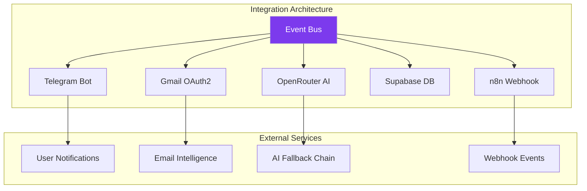

<p align="center">
<picture>

<source media="(prefers-color-scheme: dark)" srcset="docs/assets/favicon.svg">


</picture>
</p>

<h1 align="center">📄 Integration Guide — VALTREXA-V2</h1><p align="center">  <strong>Version:</strong> v1.0.1 •  <strong>Last Updated:</strong> 2026-07-05 •  <strong>Category:</strong> Integration & Deployment</p>
**Description:**  Comprehensive guide for integrating VALTREXA-V2 with external services — n8n, Google Cloud, Telegram, OpenRouter, Supabase, and custom webhooks

---

## Table of Contents
- [Overview](#overview)
- [n8n Webhook Subscriptions](#n8n-webhook-subscriptions)
- [Google Cloud / Gmail API Integration](#google-cloud--gmail-api-integration)
- [Telegram Bot Integration](#telegram-bot-integration)
- [OpenRouter / AI Provider Integration](#openrouter--ai-provider-integration)
- [Supabase Integration](#supabase-integration)
- [Custom Webhook Events and Payloads](#custom-webhook-events-and-payloads)
- [Best Practices](#best-practices)
- [Related Documents](#related-documents)

---

## Overview

> [!NOTE]
> The integration architecture follows an event-driven pattern. All external service communication flows through the central event bus for consistency, observability, and error handling.



VALTREXA-V2 integrates with external services through a consistent event bus architecture.
Every integration is managed through environment variables, webhook subscriptions, and API endpoints.
The following diagram shows the overall integration landscape:
```
mermaidgraph TB    subgraph VALTREXA["VALTREXA-V2 Core"]        EB["Event Bus"]        API["API Layer"]        WH["Webhook Dispatcher"]    end    subgraph External["External Integrations"]        N8N["n8n Workflow Automation"]        GCP["Google Cloud / Gmail API"]        TG["Telegram Bot API"]        OR["OpenRouter / AI Providers"]        SB["Supabase"]    end    subgraph Events["Event Types"]        APP["application.created<br/>
application.submitted"]        JOB["job.imported<br/>
job.matched"]        OUT["outreach.sent<br/>
outreach.replied"]        WKF["workflow.started<br/>
workflow.completed"]        HC["health_check.passed<br/>
health_check.failed"]    end    EB --> WH    WH --> N8N    API --> GCP    API --> TG    API --> OR    API --> SB    EB -->

Events    N8N -.->
|"webhook"
| WH
```


## Integration Flow Diagram
```
mermaidsequenceDiagram    participant Dev as Developer    participant API as VALTREXA-V2 API    participant EB as Event Bus    participant N8N as n8n Webhook    participant GCP as Google Cloud    participant TG as Telegram    participant OR as OpenRouter    participant SB as Supabase    Dev->>API: Authenticate (JWT)    API-->>Dev: Access token    Dev->>API: POST /api/integrations/n8n/subscribe    API->>N8N: Register webhook endpoint    N8N-->>API: Subscription confirmed    Dev->>API: Initiate Gmail OAuth flow    API->>GCP: Redirect to OAuth consent screen    GCP-->>API: Authorization code    API->>GCP: Exchange code for tokens    GCP-->>API: Access + refresh tokens    API-->>Dev: Gmail connected    Dev->>API: Configure Telegram webhook    API->>TG: POST setWebhook    TG-->>API: Webhook registered    Dev->>API: Set OpenRouter key    API->>OR: Health check    OR-->>API: Provider ready    Dev->>API: Configure Supabase    API->>SB: Create client (service role)    SB-->>API: Connected    Dev->>EB: Emit workflow event    EB->>N8N: POST to webhook URL (HMAC signed)    EB->>TG: Send notification via bot    EB->>SB:

Record in workflow_events
```

## n8n Webhook SubscriptionsVALTREXA-V2 exposes an event bus that can push events to n8n webhooks for custom workflow automation.

This enables you to create automated sequences triggered by application, job, outreach, workflow, and health check events.

## Subscription Management

Webhook subscriptions are managed via the `n8n_webhook_subscriptions` table and API endpoints.#

## Database Schema
```
sqlCREATE TABLE public.n8n_webhook_subscriptions (  id uuid PRIMARY KEY DEFAULT gen_random_uuid(),  user_id uuid NOT NULL REFERENCES auth.users(id) ON DELETE CASCADE,  event_type text NOT NULL,  webhook_url text NOT NULL,  secret_token text,  is_active boolean DEFAULT true,  created_at timestamptz DEFAULT now(),  updated_at timestamptz DEFAULT now());
```

## Adding a Subscription via API
```
httpPOST /api/integrations/n8n/subscribeContent-Type: application/jsonAuthorization:

Bearer <jwt-token>{  "event_type": "application.submitted",  "webhook_url": "https://your-n8n-instance.com/webhook/valtrexa-applications",  "secret_token": "your-custom-secret"}
```

## Removing a Subscription
```
httpPOST /api/integrations/n8n/unsubscribeContent-Type: application/jsonAuthorization:

Bearer <jwt-token>{  "subscription_id": "uuid-here"}
```


## Supported Event Types
| Event Type
| Triggered When
| Payload Includes
|
|

---

|

---

|

---

|
| `application.created`
| Application record created
| job, provider, score, tier
|
| `application.submitted`
| Application successfully submitted
| application_id, provider, evidence_url
|
| `application.failed`
| Application submission failed
| application_id, provider, error_message
|
| `job.imported`
| New jobs imported from provider
| job_ids[], provider, count
|
| `job.matched`
| Jobs scored and matched
| job_ids[], scores[], tiers[]
|
| `outreach.sent`
| Outreach message sent
| recipient, provider, message_id
|
| `outreach.replied`
| Recruiter replied to outreach
| conversation_id, sentiment
|
| `workflow.started`
| Workflow cycle started
| workflow_id, phases[]
|
| `workflow.completed`
| Workflow cycle completed
| workflow_id, phase_results[]
|
| `workflow.error`
| Workflow cycle error
| workflow_id, phase, error
|
| `health_check.passed`
| Provider health check ok
| provider, status
|
| `health_check.failed`
|

Provider health check failed
| provider, status, error
|

## Example n8n Workflow1. **Trigger**: Webhook node receiving `application.submitted` events2. **Action**: Send Slack notification with application details3. **Action**: Log to Google Sheets for tracking4. **Action**: If score ≥ 90%, trigger email notification
```
json// Example webhook payload (application.submitted){  "event": "application.submitted",  "timestamp": "2026-07-05T10:30:00Z",  "data": {    "application_id": "abc-123-def",    "job_id": "job-456",    "provider": "linkedin",    "job_title": "Senior Software Engineer",    "company": "

Acme Corp",    "match_score": 92,    "tier": "A",    "evidence_url": "https://valtrexa-v2.vercel.app/api/evidence/abc-123"  }}
```


## Webhook Delivery
- **Retry policy**: 3 attempts with exponential backoff (5s, 15s, 45s)
- **Timeout**: 10 seconds per delivery attempt
- **Security**: Optional `secret_token` sent as `x-webhook-secret` header
- **Logging**:

All delivery attempts logged in `workflow_event_deliveries`

---

## Google Cloud /

Gmail API Integration

## Prerequisites1. **Google Cloud Project** with Gmail API enabled2. **OAuth 2.0 credentials** (Client ID + Client Secret)3. **Single

Gmail account** for all application-related email operations

## Setup Steps#

## 1. Google Cloud Console Configuration
| Setting
| Value
|
|

---

|

---

|
| Enabled API
| Gmail API
|
| OAuth consent screen
| External (if not using Google Workspace)
|
| Application type
| Web application
|
| Authorized redirect URI
| `http://localhost:4173/api/auth/gmail/callback` (dev)
|
|

Authorized redirect URI
| `https://your-domain.com/api/auth/gmail/callback` (prod)
|#

## 2.

Environment Variables
```
bash# RequiredGMAIL_CLIENT_ID="your-client-id.apps.googleusercontent.com"GMAIL_CLIENT_SECRET="your-client-secret"GMAIL_REFRESH_TOKEN="obtained-via-oauth-flow"GMAIL_REDIRECT_URI="https://valtrexa-v2.vercel.app/api/auth/gmail/callback"
```

## 3. Obtaining the Refresh Token
```
bash# Step 1: Generate auth URLhttps://accounts.google.com/o/oauth2/v2/auth?  client_id=YOUR_CLIENT_ID&  redirect_uri=YOUR_REDIRECT_URI&  response_type=code&  scope=https://www.googleapis.com/auth/gmail.modify&  access_type=offline&  prompt=consent# Step 2:

Exchange authorization code for tokensPOST https://oauth2.googleapis.com/tokenContent-Type: application/x-www-form-urlencodedclient_id=YOUR_CLIENT_ID&client_secret=YOUR_CLIENT_SECRET&code=AUTHORIZATION_CODE&grant_type=authorization_code&redirect_uri=YOUR_REDIRECT_URI
```


## Gmail API Capabilities
| Feature
| Description
| API Scope
|
|

---

|

---

|

---

|
| Inbox sync
| Fetch and store messages
| `gmail.users.messages.list`
|
| Message classification
| AI-powered inbox categorization
| `gmail.users.messages.get`
|
| Outreach sending
| Send personalized emails
| `gmail.users.messages.send`
|
| Follow-up sending
|

Send cadence-based follow-ups
| `gmail.users.messages.send`
|

## Message Classification
```
typescripttype InboxClassification =
| "interview"       // Interview invitation
| "assessment"      // Technical assessment received
| "offer"           // Job offer received
| "rejection"       // Application rejected
| "recruiter_reply" //

Recruiter response to outreach
| "other";          // Unclassified
```


## OAuth Token StorageTokens are stored in `gmail_tokens` table with per-user RLS:
| Column
| Type
| Description
|
|

---

|

---

|

---

|
| `user_id`
| uuid
| User identifier
|
| `access_token`
| text
| OAuth access token (encrypted)
|
| `refresh_token`
| text
| OAuth refresh token (encrypted)
|
| `expires_at`
| timestamptz
|

Token expiry timestamp
|

---

## Telegram

Bot Integration

## Bot Setup1. **Create a bot** via [@BotFather](https://t.me/BotFather) on Telegram2. **Set bot username** (default: `ValtrexaV2Bot`)3. **

Configure webhook** to point to your VALTREXA-V2 instance

## Environment Configuration
```
bashTELEGRAM_BOT_TOKEN="789012:ABC-DEF1234ghIkl-zyx57W2v1u123ew11"TELEGRAM_WEBHOOK_SECRET="random-32-char-string"TELEGRAM_BOT_USERNAME="ValtrexaV2Bot"
```


## Webhook Registration
```
httpPOST https://api.telegram.org/bot<TELEGRAM_BOT_TOKEN>/setWebhookContent-Type: application/json{  "url": "https://valtrexa-v2.vercel.app/api/telegram/webhook",  "secret_token": "your-webhook-secret",  "allowed_updates": ["message", "callback_query"]}
```


## Command RegistrationThe system registers 32 commands automatically on startup via `telegram-init.ts`:
```
bash# Manual command registration (if needed)POST https://api.telegram.org/bot<TELEGRAM_BOT_TOKEN>/setMyCommandsContent-Type: application/json{  "commands": [    { "command": "start", "description": "Start the bot" },    { "command": "help", "description": "Show all commands" },    { "command": "connect", "description": "Connect your account" },    { "command": "providers", "description": "List provider statuses" },    { "command": "workflow_status", "description": "

Check workflow state" }  ]}
```


## Multi-User BindingTelegram binds users via the `telegram_bindings` table:
```
mermaidsequenceDiagram    participant U as User    participant TG as Telegram Bot    participant API as VALTREXA-V2 API    participant DB as Database    U->>API: Generate binding token (Settings → Telegram)    API->>DB: Store token in telegram_binding_tokens    U-->>TG: Send /connect <token>    TG->>API: POST webhook with /connect <token>    API->>DB: Verify token, create binding    API-->>TG: "Connected successfully!"    TG-->>U: ✅

Bound to [email]
```


## Webhook Security
| Header
| Description
|
|

---

|

---

|
| `x-telegram-bot-api-secret-token`
|

Must match `TELEGRAM_WEBHOOK_SECRET`
|

---

## OpenRouter / AI

Provider Integration

## Provider ConfigurationVALTREXA-V2 supports three AI providers with automatic fallback: **Gemini →

Groq → OpenRouter**.#

## Environment Variables
```
bash# OpenRouter (Primary / Fallback 2)OPENROUTER_API_KEY="sk-or-v1-..."OPENROUTER_MODEL="openai/gpt-4o-mini"OPENROUTER_MODEL_PREFERRED="openai/gpt-4o"# Groq (Fallback 1)GROQ_API_KEY="gsk-..."GROQ_MODEL="llama-3.3-70b-versatile"

Gemini (Primary)GEMINI_API_KEY="your-gemini-api-key"GEMINI_MODEL="gemini-2.5-pro"
```


## Provider Priority
| Priority
| Provider
| Model
| Use Case
|
|

---

|

---

|

---

|

---

|
| 1 (Primary)
| Gemini
| `gemini-2.5-pro`
| Complex reasoning, structured JSON
|
| 2 (Fallback 1)
| Groq
| `llama-3.3-70b-versatile`
| High-speed inference
|
| 3 (Fallback 2)
| OpenRouter
| `openai/gpt-4o-mini`
|

General purpose, free-tier
|

## OpenRouter Free Model Chain

When using cost-free operation, the system cycles through:1. `google/gemma-4-26b-a4b-it:free`2. `qwen/qwen3-next-80b-a3b-instruct:free`3. `nvidia/nemotron-nano-9b-v2:free`

## AI Provider Abstraction Interface
```
typescriptinterface Ai

Provider {  readonly name: string;  generateText(messages, opts?): Promise<AiTextResult>;  generateJson<T>(messages, schemaName, schema, opts?): Promise<AiJsonResult<T>>;  healthCheck(): Promise<boolean>;  getMetrics(): ProviderMetrics;  resetMetrics(): void;}
```


## Adding a Custom AI Provider1. Implement the `AiProvider` interface2. Add to the provider chain in `AiProviderChain.createDefault()`3.

Configure via environment variables

---

## Supabase Integration

## Database Connection
```
bash# Backend (service role)SUPABASE_URL="https://your-project.supabase.co"SUPABASE_SERVICE_ROLE_KEY="your-service-role-key"

Frontend (anon key)VITE_SUPABASE_URL="https://your-project.supabase.co"VITE_SUPABASE_PUBLISHABLE_KEY="your-anon-key"
```


## Key Integration Points
| Feature
| Method
| Notes
|
|

---

|

---

|

---

|
| Auth
| `supabase.auth.signUp()` / `signIn()`
| Email/password + Google OAuth
|
| Database
| `supabaseAdmin.from(table)`
| Service role client (bypasses RLS)
|
| Realtime
| Supabase Realtime
| Live workflow state updates
|
| Storage
| Supabase Storage
|

Resume file uploads
|

## RLS Integration

All user-scoped tables enforce the same policy pattern:
```
sqlCREATE POLICY "user owns their data" ON public.<table>  FOR ALL TO authenticated  USING (user_id = auth.uid())  WITH CHECK (user_id = auth.uid());
```


## Admin Client Pattern
```
typescriptimport { createClient } from "@supabase/supabase-js";const supabaseAdmin = createClient(  process.env.SUPABASE_URL!,  process.env.SUPABASE_SERVICE_ROLE_KEY!,  { auth: { autoRefreshToken: false, persistSession: false } });// All queries must scope to userconst data = await supabase

Admin  .from("applications")  .select("*")  .eq("user_id", userId);
```


## Migration IntegrationApply migrations via

Supabase CLI:
```
bashnpx supabase migration up --include-all --db-url "postgresql://..."
```
Verify:
```
sqlSELECT * FROM supabase_migrations.schema_migrations ORDER BY version;
```

---

## Custom Webhook

Events and Payloads

## Event Bus ArchitectureThe event bus (`event-bus.ts`) provides a pub/sub system for custom webhook delivery:
```
typescript//

Emitting a custom eventawait eventBus.emit({  type: "custom.event",  userId: "user-uuid",  data: { key: "value" },  source: "custom-module",  severity: "info",});
```


## Custom Event RegistrationRegister custom webhook subscriptions via the API:
```
httpPOST /api/integrations/webhook/subscribeContent-Type: application/jsonAuthorization:

Bearer <jwt-token>{  "event_type": "custom.event",  "webhook_url": "https://your-service.com/webhook",  "secret_token": "optional-secret",  "headers": {    "X-Custom-Header": "value"  }}
```


## Webhook Payload FormatAll webhook events follow a consistent payload structure:
```
json{  "event": "application.submitted",  "id": "evt_abc123",  "timestamp": "2026-07-05T10:30:00.000Z",  "userId": "user_uuid",  "data": {},  "source": "apply-engine",  "severity": "info",  "version": "1.0"}
```

| Field
| Type
| Description
|
|

---

|

---

|

---

|
| `event`
| string
| Event type identifier
|
| `id`
| string
| Unique event ID
|
| `timestamp`
| string
| ISO 8601 timestamp
|
| `userId`
| string
| Scoped user identifier
|
| `data`
| object
| Event-specific payload
|
| `source`
| string
| Module that emitted the event
|
| `severity`
| string
| `info`, `warning`, `error`, `critical`
|
| `version`
| string
|

Payload schema version
|

## Event Delivery Tracking
| Feature
| Detail
|
|

---

|

---

|
| Retry
| 3 attempts with exponential backoff (5s, 15s, 45s)
|
| Timeout
| 10 seconds per delivery
|
| Logging
| `workflow_event_deliveries` table
|
|

Verification
| HTTP 200/201 = success; all others = failure
|

## Best Practices
- **Always use the secret_token for webhook verification**: The `x-webhook-secret` header lets your n8n workflow verify that the payload genuinely came from VALTREXA-V2.
- **Set up monitoring for delivery failures**: Configure n8n error workflows to alert you when webhook delivery fails after all 3 retry attempts.
- **Isolate Gmail accounts per user**: Each user should connect their own Gmail account.
The per-user OAuth token storage with RLS ensures data isolation.
- **Test with the conservative batch strategy first**: Before enabling aggressive automation, use n8n to log and inspect incoming events to validate payload structure.
- **Rotate environment secrets regularly**: Periodically regenerate `TELEGRAM_WEBHOOK_SECRET`, `GMAIL_CLIENT_SECRET`, and `OPENROUTER_API_KEY` for security hygiene.
- **Use Supabase Realtime for live dashboards**: Combine webhook events with Supabase

Realtime subscriptions to build live-updating dashboards and status monitors.

---

## Related Documents
- [Environment Variables](ENVIRONMENT.md) — Complete env reference
- [API Reference](API_REFERENCE.md) — API endpoint documentation
- [Security](SECURITY.md) — Webhook security and secrets management
- [Telegram Operations](TELEGRAM_OPERATIONS.md) — Bot commands and setup
- [Deployment Guide](DEPLOYMENT.md) — Google Cloud OAuth and Supabase setup
- [AI Architecture](AI.md) — AI provider abstraction details

---

<br/>
<div align="center">
  <strong>Next Reading:</strong> <a href="WEBHOOK_EVENTS.md">Webhook Events →</a>
</div>
