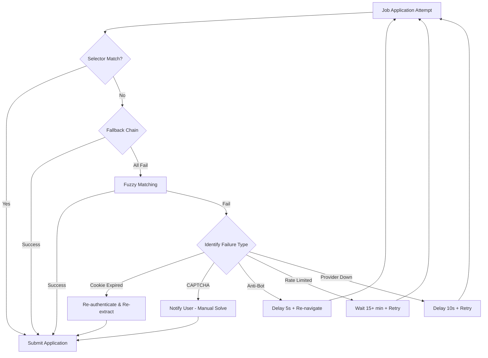

  <picture>
    <source media="(prefers-color-scheme: dark)" srcset="assets/favicon.svg">
    
  </picture>

<h1 align="center">📄 Provider Failure Registry</h1>

  <strong>Version:</strong> v1.0.0 •
  <strong>Last Updated:</strong> 2026-06-29 •
  <strong>Category:</strong> Operations / Failure Management

**Description:** Registry of known failure modes per job provider, including detection signals and recovery procedures.

---

## Table of Contents

- [Overview](#overview)
- [LinkedIn](#linkedin)
- [Indeed](#indeed)
- [Naukri](#naukri)
- [Wellfound](#wellfound)
- [Instahyre](#instahyre)
- [Self-Healing System](#self-healing-system)
- [Failure Recovery Workflow](#failure-recovery-workflow)
- [Best Practices](#best-practices)
- [Related Documents](#related-documents)

---

## Overview

This registry catalogs every known failure mode across supported job providers. Each entry defines the **detection signal** (how the system identifies the failure) and the **recovery action** (how the system resolves it). The self-healing system tiers provide automated fallback when selectors or flows change.

> [!NOTE]
> Failures marked as requiring manual intervention (e.g., CAPTCHA, anti-bot challenges) are escalated to the user via Telegram notifications or dashboard alerts.

> [!IMPORTANT]
> Always keep cookies fresh. Expired cookies are the most common failure mode across all providers. See [Cookie Refresh Workflow](PROVIDER_OPERATIONS.md#cookie-refresh-workflow) for details.

## LinkedIn

| Failure | Detection | Recovery |
|---|---|---|
| Cookie expired | HTTP validation → `expired` | Re-authenticate, re-extract `li_at` |
| Anti-bot page | URL contains `challenge` | Manual login in browser, wait, re-extract |
| Account restricted | Page text "restricted" | Check email, verify account |
| Easy Apply changed | Selector timeout | Self-healing selector fallback |
| Rate limited | HTTP 429 | Wait 15+ minutes, system retries |

## Indeed

| Failure | Detection | Recovery |
|---|---|---|
| JWT expired | Response body "expired" | Re-extract `CTK` cookie |
| Layout changed | Selector failure | Self-healing fuzzy matching |
| Anti-bot | CAPTCHA detected | Manual solve, re-extract |

## Naukri

| Failure | Detection | Recovery |
|---|---|---|
| Session expired | Redirect to login | Re-extract `nauk_sid` |
| CAPTCHA | Page contains "captcha" | Manual solve in browser |

## Wellfound

| Failure | Detection | Recovery |
|---|---|---|
| Session expired | Redirect to login | Re-extract `_wellfound_session` |
| External redirect | URL changes domain | Handle via manual apply |

## Instahyre

| Failure | Detection | Recovery |
|---|---|---|
| Session expired | Redirect to login | Re-extract `sessionid` + `csrftoken` |
| CSRF mismatch | Form submission fails | Re-extract both cookies |

## Self-Healing System

The system has three tiers of fallback:

1. **Primary selectors** — Exact CSS matches
2. **Fallback chain** — Multiple selector attempts per field
3. **Fuzzy matching** — Text-based and ARIA label matching

Auto-heal actions:

- Login redirect → re-navigate, recheck
- CAPTCHA → mark as unresolvable (requires user)
- Anti-bot → delay 5s + re-navigate
- Provider downtime → delay 10s + retry

## Failure Recovery Workflow

## Best Practices

- **Rotate selectors early**: Add fallback selectors proactively when providers update their UI.
- **Monitor cookie TTL**: Set reminders to refresh cookies before they expire during batch runs.
- **Log all failures**: Every failure signal and recovery outcome should be written to the audit log for post-mortem analysis.
- **Escalate strategically**: Reserve manual intervention for CAPTCHA and anti-bot pages; let the self-healing system handle layout shifts.

---

## Related Documents

- [Provider Operations](PROVIDER_OPERATIONS.md) — Cookie refresh workflow and batch pipeline strategies
- [Provider Guide](PROVIDER_GUIDE.md) — Full provider integration guide

---

 

  <strong>Next Reading:</strong> <a href="INTEGRATION_GUIDE.md">Integration Guide →</a>

