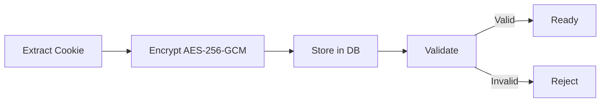

  <picture>
    <source media="(prefers-color-scheme: dark)" srcset="docs/assets/favicon.svg">
    
  </picture>

<h1 align="center">🔌 Provider Guide</h1>

  <strong>Version:</strong> v1.0.0 •
  <strong>Last Updated:</strong> 2026-06-29 •
  <strong>Category:</strong> Integration

**Description:** VALTREXA-V2 — Supported Job Board Provider Configuration

---

## Table of Contents

- [Overview](#overview)
- [Supported Providers](#supported-providers)
- [Auth Methods](#auth-methods)
- [Provider Controls](#provider-controls)
- [Auto-Disable Flow](#auto-disable-flow)
- [Best Practices](#best-practices)
- [Related Documents](#related-documents)

---

## Overview

VALTREXA-V2 integrates with 5 major job boards using cookie-based authentication. Each provider requires a valid session cookie for automated job discovery and application submission.

---

## Supported Providers

| Provider  | Type             | Auth Method | Auto-Apply | Job Discovery | Cookie Names             |
| --------- | ---------------- | ----------- | ---------- | ------------- | ------------------------ |
| LinkedIn  | Social/Job Board | Cookie      | ✅         | ✅            | `li_at`                  |
| Indeed    | Job Board        | Cookie      | ✅         | ✅            | `CTK`                    |
| Naukri    | Job Board        | Cookie      | ✅         | ✅            | `nauk_sid`               |
| Wellfound | Startup Jobs     | Cookie      | ✅         | ✅            | `_wellfound_session`     |
| Instahyre | Job Board        | Cookie      | ✅         | ✅            | `sessionid`, `csrftoken` |

---

## Auth Methods

### Cookie-Based (All 5 Providers)

Session cookies are encrypted (AES-256-GCM) and stored per-user. Users extract cookies from their browser and paste them via dashboard or Telegram.

---

## Provider Controls

Manage providers via:

- **Dashboard:** Settings → Cookies
- **Telegram:** `/providers`, `/provider_enable`, `/provider_disable`
- **API:** Provider control endpoints

Each provider has a status (`enabled`, `disabled`, `paused`, `maintenance`) and a health log.

---

## Auto-Disable Flow

1. Cookie validation fails → provider **paused**
2. Consecutive failures during Playwright → provider **disabled** (auto)
3. User must re-authenticate and re-paste cookies to re-enable

---

## Best Practices

> [!TIP]
> - Keep cookies fresh — re-extract every 2–3 weeks
> - Monitor provider status via Telegram `/provider_status`
> - Use the automated Edge extraction script for consistency
> - Enable all 5 providers for maximum job coverage
> - Check health logs regularly for early warning signs

> [!WARNING]
> If a provider remains in "disabled" state, it may indicate a site change requiring selector updates.

---

## Related Documents

- [Cookie Guide](COOKIE_GUIDE.md) — Session cookie management
- [Deployment Guide](DEPLOYMENT.md) — Production deployment instructions
- [Workflow Guide](WORKFLOW.md) — Automation pipelines & state machine

---

 

  <strong>Next Reading:</strong> <a href="PROVIDER_OPERATIONS.md">Provider Operations →</a>

