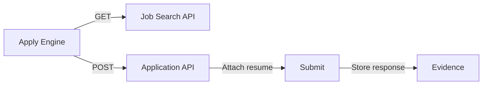

# Provider Guide

> **Last Updated:** 2026-06-26

## Supported Providers

VALTREXA-V2 integrates with nine job platforms across three categories:

### Social / Job Boards

| Provider | Auth Method | Apply Mechanism | Recruiter Discovery |
|---|---|---|---|
| LinkedIn | Cookie (`li_at`, `JSESSIONID`) | Playwright auto-apply with form fill | Profile search + Lusha/SignalHire |
| Indeed | Cookie (`__Secure-PassportAuthProxy-BearerToken`, `CTK`) | Playwright auto-apply | Limited (platform API) |
| Naukri | Cookie (`nauk_sid`, `nauk_cs`) | Playwright auto-apply | Resume database search |
| Wellfound | Cookie (browser session) | Direct apply via platform | AngelList profiles |
| Instahyre | Cookie (browser session) | Direct apply via platform | Instahyre recruiter network |

### ATS (Applicant Tracking Systems)

| Provider | Auth Method | Apply Mechanism | Notes |
|---|---|---|---|
| Greenhouse | API key (public boards) | REST API `POST /v1/applications` | No cookie auth needed; public API |
| Lever | API key (public boards) | REST API `POST /v1/opportunities` | Public board only; no auth needed |
| Ashby | API key (public boards) | REST API `POST /v1/applications` | Public board only |
| Workable | API key (public boards) | REST API `POST /v1/jobs/:id/apply` | Public board only |

## Capabilities Matrix

| Capability | LinkedIn | Indeed | Naukri | Wellfound | Instahyre | Greenhouse | Lever | Ashby | Workable |
|---|---|---|---|---|---|---|---|---|---|
| Auto-Apply | ✅ | ✅ | ✅ | ✅ | ✅ | ✅ | ✅ | ✅ | ✅ |
| Bulk Apply | ✅ | ✅ | ✅ | ✅ | ✅ | ✅ | ✅ | ✅ | ✅ |
| Job Discovery | ✅ | ✅ | ✅ | ✅ | ✅ | ✅ | ✅ | ✅ | ✅ |
| Recruiter Discovery | ✅ | ❌ | ✅ | ✅ | ✅ | ❌ | ❌ | ❌ | ❌ |
| Outreach | ✅ | N/A | ✅ | ✅ | ✅ | N/A | N/A | N/A | N/A |
| Evidence Capture | ✅ | ✅ | ✅ | ✅ | ✅ | ✅ | ✅ | ✅ | ✅ |

- Auto-Apply status for Job Boards depends on valid cookie session
- ATS providers work with **public API keys** and do not require cookies
- Outreach is only relevant for platforms with recruiter profiles (LinkedIn, Naukri, Wellfound, Instahyre)

## Auth Methods

### Cookie Auth (Job Boards)

For LinkedIn, Indeed, Naukri, Wellfound, Instahyre:
1. Extract session cookies from authenticated browser
2. Upload via dashboard or API (see [COOKIE_GUIDE.md](COOKIE_GUIDE.md))
3. System encrypts (AES-256-GCM) and stores per-user
4. Playwright injects cookies into persistent browser context

### API Key / Public Board (ATS)

Greenhouse, Lever, Ashby, Workable:
1. Find the company's public board URL (e.g., `https://boards.greenhouse.io/companyname`)
2. No authentication needed — ATS public APIs are open
3. System scrapes job listings and submits applications via REST API

### Env Fallback Cookies

For development/testing, cookies can be set as env vars:

```env
LINKEDIN_COOKIE=AQED...
INDEED_COOKIE=...
NAUKRI_COOKIE=...
```

See `cookie-manager.ts` for fallback resolution order: DB → env → error.

## Provider Controls

Per-provider control available via:
- **Dashboard:** `/admin` → Provider Controls tab → toggle/disable per provider
- **Telegram:** `/providers` command, `/pause linkedin`, `/resume indeed`

Each provider has:
- `is_enabled` — global toggle
- `is_paused` — temporary pause (for rate limiting / maintenance)
- `health_status` — `healthy` / `degraded` / `down`
- `auto_disabled_at` — auto-disabled after consecutive failures
- `failure_count` — running failure counter
- `last_error` — most recent error message

## Import Methods

| Method | Description |
|---|---|
| Manual Import | Upload job descriptions via dashboard |
| Auto-Discovery | Workflow runner fetches new jobs from all enabled providers |
| Match Engine | New jobs are auto-scored against candidate brain |
| Batch Import | Bulk fetch from provider job feeds |

## Apply Mechanisms

### Playwright (Job Boards)


Self-healing selectors in `playwright-platform.ts` try multiple selector strategies (text, placeholder, aria-label, CSS) before failing.

### REST API (ATS)



Direct HTTP calls with resume attachment via multipart/form-data or base64 payload.

## Provider-Specific Notes

### LinkedIn
- Requires both `li_at` and `JSESSIONID` cookies
- Form fields are highly dynamic; self-healing selectors critical
- Easy Apply workflow requires multi-step modal navigation
- Recruiter search via Google dorking + LinkedIn Sales Navigator if available

### Indeed
- `CTK` cookie is the primary auth token
- Apply flow redirects through Indeed's internal apply system (IAS)

### Naukri
- Uses token-based cookie (`ntoken` + `NAUKRI_SESSION`)
- Resume submission is pre-filled from Naukri profile
- Recruiter search via Naukri recruiter database

### Greenhouse
- `POST /v1/applications` with job_id, candidate info, resume
- Public board API is open; no auth needed
- Returns application ID on success

### Lever
- `POST /v1/opportunities` with posting ID and candidate data
- Similar to Greenhouse — public board API
- Supports multiple resume attachments

### Ashby
- `POST /v1/applications` with job ID and candidate payload
- Returns application confirmation

### Workable
- `POST /v1/jobs/:id/apply` with candidate details
- Supports resume URL or file upload
