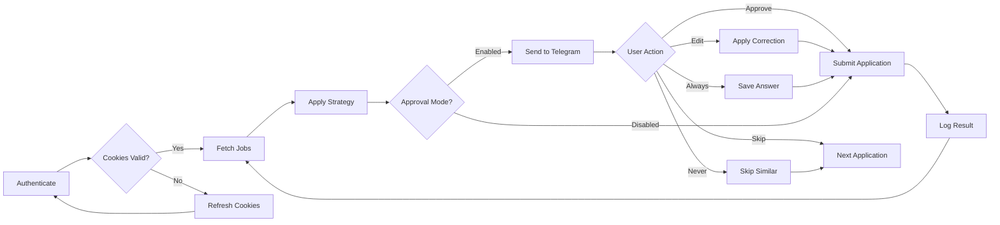

<p align="center">
  <picture>
    <source media="(prefers-color-scheme: dark)" srcset="assets/favicon.svg">
    
  </picture>
</p>

<h1 align="center">📄 Provider Operations</h1>

<p align="center">
  <strong>Version:</strong> v1.0.0 •
  <strong>Last Updated:</strong> 2026-06-29 •
  <strong>Category:</strong> Operations / Provider Management
</p>

**Description:** Supported provider configurations, cookie refresh workflows, batch application pipeline strategies, and recovery procedures.

---

## Table of Contents

- [Overview](#overview)
- [Supported Providers](#supported-providers)
- [Cookie Refresh Workflow](#cookie-refresh-workflow)
- [Batch Application Pipeline](#batch-application-pipeline)
- [Recovery Procedures](#recovery-procedures)
- [Provider Operations Flow](#provider-operations-flow)
- [Best Practices](#best-practices)
- [Related Documents](#related-documents)

---

## Overview

This document defines the operational procedures for all supported job providers. It covers authentication methods, cookie management, batch application strategies with approval modes, and recovery actions for common issues.

> [!NOTE]
> All providers use cookie-based authentication. Cookies must be refreshed periodically to maintain active sessions.

> [!IMPORTANT]
> Batch application strategies range from conservative to aggressive. Choose the strategy that matches your risk tolerance and job requirements.

## Supported Providers

| Provider | Auth | Key Cookies | Apply Type |
|---|---|---|---|
| LinkedIn | Cookie | `li_at` | Playwright |
| Indeed | Cookie | `CTK` | Playwright |
| Naukri | Cookie | `nauk_sid` | Playwright |
| Wellfound | Cookie | `_wellfound_session` | Playwright |
| Instahyre | Cookie | `sessionid`, `csrftoken` | Playwright |

## Cookie Refresh Workflow

### Automated (Local Machine)

```bash
npx.cmd tsx scripts/refresh-cookies.ts --provider linkedin --user-id <UUID>
```

Requires Edge with logged-in session.

### Manual (Any Machine)

1. Login to provider in browser
2. DevTools → Application → Cookies → Copy values
3. Paste in VALTREXA-V2 dashboard

## Batch Application Pipeline

### Strategies

1. **Conservative** — Tier A only, Easy Apply, ≤3 days old, min 85% match
2. **Balanced** — Tiers A+B, Easy Apply preferred, ≤7 days, min 70% match
3. **Aggressive** — All tiers, any apply type, ≤30 days, min 50% match

### Approval Mode

When enabled, applications wait for Telegram approval before submission:

- ✅ Approve → Submit
- ✏️ Edit → User provides corrected answer
- ⏭️ Skip → Skip this application
- 🔁 Always → Save answer permanently
- 🚫 Never → Skip similar questions in future

## Recovery Procedures

| Issue | Action |
|---|---|
| Expired cookie | Re-authenticate → re-extract → re-paste |
| Auto-disabled | Fix cookie → manually re-enable |
| Maintenance mode | Wait for auto-recovery or manual override |
| Rate limited | Wait — the system automatically backs off |

## Provider Operations Flow



## Best Practices

- **Refresh cookies before batch runs**: Schedule cookie refresh 30 minutes before any large batch operation to avoid mid-run failures.
- **Start conservative**: Begin with the Conservative strategy and escalate only after validating provider behavior.
- **Monitor approval queues**: When using Approval Mode, check Telegram regularly to prevent bottlenecks.
- **Log all recovery actions**: Every cookie refresh, re-authenticate, and manual override should be recorded in the audit trail.
- **Test strategies offline**: Run dry passes against a small job set before committing to full batch runs.

---

## Related Documents

- [Provider Failure Registry](PROVIDER_FAILURE_REGISTRY.md) — Comprehensive failure mode catalog per provider
- [Provider Guide](PROVIDER_GUIDE.md) — Full provider integration guide

---

<br/>
<div align="center">
  <strong>Next Reading:</strong> <a href="PROVIDER_FAILURE_REGISTRY.md">Provider Failure Registry →</a>
</div>
