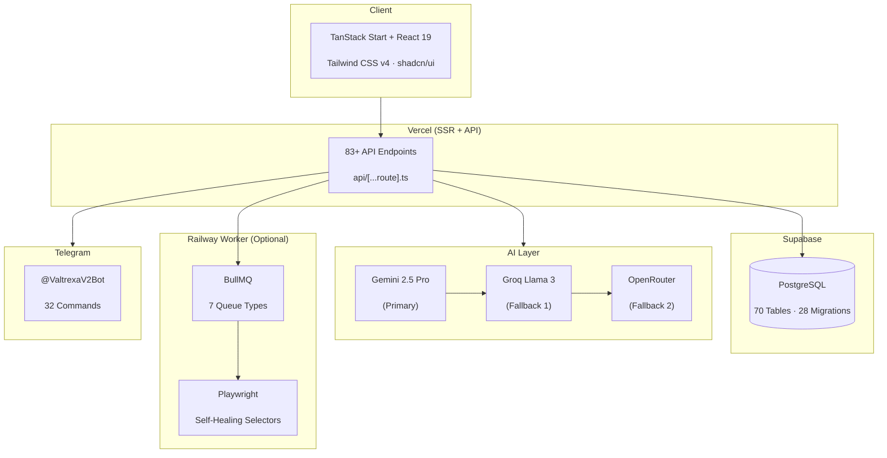

<p align="center">

<picture>

<source media="(prefers-color-scheme: dark)" srcset="../docs/assets/favicon.svg">


</picture>

</p>

<h1 align="center">📄 Quickstart Guide</h1>

<p align="center">
<strong>Version:</strong> v1.0.1 •
<strong>Last Updated:</strong> 2026-07-05 •
<strong>Category:</strong> Getting Started
</p>

**Description:** Get VALTREXA-V2 running in 5 minutes — from clone to your first automated workflow

---

## Table of Contents

- [Overview](#overview)
- [Step 1: Clone & Install](#step-1-clone--install)
- [Step 2: Configure Environment](#step-2-configure-environment)
- [Step 3: Set Up Database](#step-3-set-up-database)
- [Step 4: Start the Dev Server](#step-4-start-the-dev-server)
- [Step 5: Connect Telegram](#step-5-connect-telegram)
- [Step 6: Run Your First Workflow](#step-6-run-your-first-workflow)
- [Next Steps](#next-steps)
- [Best Practices](#best-practices)

---

## Overview

VALTREXA-V2 automates the end-to-end software engineering job search — from resume parsing and job discovery through automated applications and outreach orchestration.
This guide gets you running in 5 minutes.

> [!NOTE]
> **Prerequisites:** Node.js 22+, npm 10+, Supabase account (free), Telegram account

---

## Step 1:

Clone & Install

```bash
git clone https://github.com/chauhandigvijay1/Valtrexa-V2.git
cd Valtrexa-V2
npm install
```

The system architecture at a glance:



---

## Step 2:

Configure Environment

```bash
cp .env.example .env
```

Only six variables are absolutely required to start:

| Variable
| How to Get It
|
|

---

|

---

|
| `SUPABASE_URL`
| Supabase Dashboard → Settings → API
|
| `SUPABASE_SERVICE_ROLE_KEY`
| Supabase Dashboard → Settings → API
|
| `SESSION_SECRET`
| Run `npx uuid`
|
| `TELEGRAM_BOT_TOKEN`
| BotFather on Telegram
|
| `OPENROUTER_API_KEY`
| openrouter.ai/keys
|
| `COOKIE_ENCRYPTION_KEY`
| Run `npx uuid && npx uuid`
|

> [!WARNING]
> `SUPABASE_SERVICE_ROLE_KEY` bypasses all Row Level Security. Never expose it to the client or commit it to version control.

See [Environment Variables](ENVIRONMENT.md) for the full reference including optional variables.

---

## Step 3: Set

Up Database

1. Create a free project at [supabase.com](https://supabase.com)
2. Run all 28 migrations in alphanumeric filename order:

```bash
npx supabase migration up --include-all \
--db-url "postgresql://postgres:<password>@<project>.supabase.co:5432/postgres"
```

3. Reload the PostgREST schema cache:

```sql
NOTIFY pgrst, 'reload schema';
```

4. Verify all migrations applied:

```sql
SELECT * FROM supabase_migrations.schema_migrations ORDER BY version;
```

---

## Step 4: Start the

Dev Server

```bash
npm run dev
```

Open **http://localhost:5173** in your browser.

> [!NOTE]
> Redis is optional.
Without it, BullMQ executes jobs inline.
The system works fully for local development and single-user deployments without a Redis instance.

---

## Step 5:

Connect Telegram

1. Message [@BotFather](https://t.me/BotFather) on Telegram
2. Use `/newbot` to create a bot — name it `ValtrexaV2Bot`
3. Set the received token as `TELEGRAM_BOT_TOKEN` in your `.env`
4. Restart the dev server — the bot auto-registers its webhook and 32 commands on startup
5.
In the web dashboard, go to **Settings → Telegram Connection** → **Generate Connection Token**
6. Send `/connect <token>` to the bot on Telegram

---

## Step 6: Run Your

First Workflow

1. **Upload your resume** via the onboarding wizard (Settings → Profile → Resume)
2. **Configure provider cookies** (Settings → Cookies) — extract session cookies from LinkedIn and other job portals using browser DevTools, then paste them into the dashboard
3. **Set job preferences** — target roles, locations, salary range, work mode
4. Click **Start Workflow** on the dashboard
5.
The system begins its 8-phase automation cycle (`import_jobs` → `match_jobs` → `discover_recruiters` → `high_value_pipeline` → `apply_pipeline` → `followups` → `health_check` → `analytics`)
6. Check **Telegram** for real-time notifications on new matches, application submissions, and status updates

> [!TIP]
> Start with approval mode enabled so you can review each application before submission. Disable it once you are comfortable with the match quality.

---

## Next Steps

- [Setup Guide](SETUP.md) — Full local development environment setup
- [Environment Variables](ENVIRONMENT.md) — Complete env reference with all optional variables
- [Tutorials](TUTORIALS.md) — Step-by-step walkthroughs for common tasks

---

## Best Practices

- **Start with Approval Mode**: Enable approval mode during your first workflow run. Review match quality before allowing auto-submission.
- **Use Cookie Management**: Re-extract provider cookies every 1-2 weeks. Use the dashboard cookie management UI to maintain active sessions.
- **Configure AI Fallbacks**: Set up at least one fallback AI provider (Groq or Gemini) alongside OpenRouter to avoid service interruptions.
- **Monitor Telegram Notifications**: Keep the Telegram bot connected for real-time alerts on matches, application status, and approval requests.
- **Verify Database Migrations**: After pulling updates, always verify migration state with `SELECT * FROM supabase_migrations.schema_migrations ORDER BY version;`.

---

## Related Documents

- [Architecture](ARCHITECTURE.md) — System design, data flow, and key decisions
- [Setup Guide](SETUP.md) — Full local development environment setup
- [API Reference](API_REFERENCE.md) — All 83+ endpoints with examples
- [Database Schema](DATABASE.md) — 70 tables, relationships, and migrations
- [Deployment Guide](DEPLOYMENT.md) — Production deployment on Vercel + Railway
- [Workflow Guide](WORKFLOW.md) — 8-phase pipeline state machine details
- [Cookie Guide](COOKIE_GUIDE.md) — Cookie extraction, validation, and management
- [Telegram Operations](TELEGRAM_OPERATIONS.md) — Bot commands, multi-user binding, approvals
- [Troubleshooting](TROUBLESHOOTING.md) — Common issues and solutions

---

<br/>
<div align="center">
  <strong>Next Reading:</strong> <a href="SETUP.md">Setup Guide →</a>
</div>
