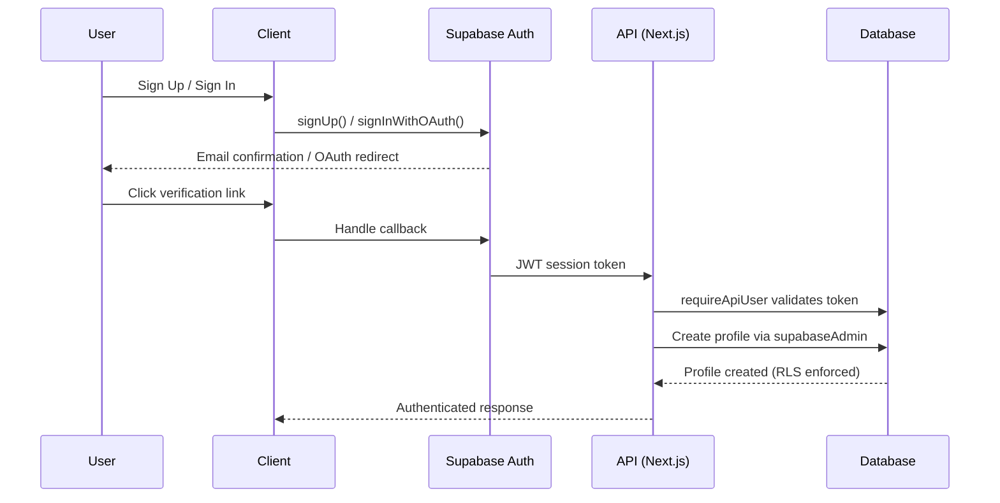

  <picture>
    <source media="(prefers-color-scheme: dark)" srcset="docs/assets/favicon.svg">
    
  </picture>

<h1 align="center">🔒 Security Architecture</h1>

  <strong>Version:</strong> v1.0.0 •
  <strong>Last Updated:</strong> 2026-06-29 •
  <strong>Category:</strong> Security

**Description:** VALTREXA-V2 — Security Architecture, Threat Model & Hardening Guide

---

## Table of Contents

- [Overview](#overview)
- [Authentication](#authentication)
- [Session Management](#session-management)
- [Service Role Key](#service-role-key)
- [Row Level Security](#row-level-security-rls)
- [Webhook Event System Security](#webhook-event-system-security)
- [Encryption](#encryption)
- [Rate Limiting](#rate-limiting)
- [Input Validation Rules](#input-validation-rules)
- [Best Practices](#best-practices)
- [Related Documents](#related-documents)

---

## Overview

VALTREXA-V2 employs a defense-in-depth security architecture strategy covering authentication, encryption, rate limiting, input validation rules, and Row Level Security (RLS) for multi-tenant data isolation.

---

## Authentication

VALTREXA-V2 uses **Supabase Auth** with two methods:

| Method           | Use Case           | Status                               |
| ---------------- | ------------------ | ------------------------------------ |
| Email + Password | Traditional signup | Requires email confirmation          |
| Google OAuth     | One-click signup   | Uses state param for CSRF protection |

### Signup Flow Security

1. Password is hashed by Supabase (bcrypt)
2. Email confirmation is **enabled** — user must click verification link
3. Rate limited via `safeRouteRequest` (100 req/60s/IP)
4. On signup, a profile is created in `profiles` table via `supabaseAdmin` (service role)

### OAuth Flow Security

1. **State parameter:** `crypto.randomUUID()` generated client-side, stored in `sessionStorage`
2. Passed as `queryParams.state` in `signInWithOAuth()`
3. On callback, the returned `state` is compared to the stored value
4. Mismatch → toast error + redirect to `/login` (prevents CSRF)
5. Redirect URL: `https://valtrexa-v2.vercel.app/auth/callback`

### Authentication Sequence

---

## Session Management

- Supabase session tokens (JWT) with configurable expiry
- `requireApiUser` middleware validates on every API request
- **Email-only users:** 403 returned if `email_confirmed_at` is null (unconfirmed)
- OAuth users bypass the email confirmation check

---

## Service Role Key

- `SUPABASE_SERVICE_ROLE_KEY` used server-side only (API routes, workers)
- Bypasses Row Level Security (RLS) — all queries must include `user_id` filter
- All server-to-database operations are scoped via `.eq("user_id", userId)`
- **145+ write operations audited:** 0 unscoped writes found

---

## Row Level Security (RLS)

All user-scoped tables enforce RLS:

| Table              | Policy                 | Effect                              |
| ------------------ | ---------------------- | ----------------------------------- |
| `profiles`         | `id = auth.uid()`      | User can only access own profile    |
| `applications`     | `user_id = auth.uid()` | User can only see own applications  |
| `candidate_memory` | `user_id = auth.uid()` | User can only see own memory        |
| `provider_cookies` | `user_id = auth.uid()` | User can only see own cookies       |
| `notifications`    | `user_id = auth.uid()` | User can only see own notifications |
| All others         | Same pattern           | Consistent per-user isolation       |

> [!NOTE]
> The service role client bypasses RLS but enforces user scoping in code.

---

## Webhook Event System Security

### Telegram Webhook

- **Secret token:** `TELEGRAM_WEBHOOK_SECRET` compared against `x-telegram-bot-api-secret-token` header
- **Per-chat rate limit:** Max 10 requests per 3 seconds per chat ID (in-memory)
- **Global rate limit:** All routes, including webhook, are rate-limited by `safeRouteRequest`
- **No env-var fallback:** The legacy `TELEGRAM_USER_ID` env var is no longer used. Each user must bind via `/connect`. Unbound chats receive a "not connected" response.
- **User mapping:** `resolveUserIdFromTelegramChat` queries `telegram_bindings` table by `chat_id`. Returns `""` for unbound chats — all command handlers check for empty userId before processing.

### Webhook URL

`https://valtrexa-v2.vercel.app/api/telegram/webhook`

---

## Encryption

### Provider Cookie Encryption

| Property       | Value                                            |
| -------------- | ------------------------------------------------ |
| Algorithm      | AES-256-GCM (authenticated encryption)           |
| Key Derivation | SHA-256(`COOKIE_ENCRYPTION_KEY`)                 |
| IV             | Random 16 bytes per encryption                   |
| Storage        | Hex-encoded `iv:authTag:ciphertext` in column    |
| Rotation       | User re-pastes cookies; old blob is overwritten  |

> [!WARNING]
> Without `COOKIE_ENCRYPTION_KEY`, the key is SHA-256("") which is a known constant. Always set a strong random value.

### Environment Variable Security

| What                        | How It's Protected                                  |
| --------------------------- | --------------------------------------------------- |
| `SESSION_SECRET`            | Stored in Vercel env, never exposed to client       |
| `SUPABASE_SERVICE_ROLE_KEY` | Server-only, RLS bypass requires careful scoping    |
| `COOKIE_ENCRYPTION_KEY`     | Must be set in production — empty key is detectable |
| `GMAIL_CLIENT_SECRET`       | Stored in Vercel env, server-only                   |
| `GMAIL_REFRESH_TOKEN`       | Single-mailbox token, server-only                   |
| `TELEGRAM_BOT_TOKEN`        | Stored in Vercel env, server-only                   |

---

## Rate Limiting

- **In-memory, IP-based:** 100 requests per 60-second window (configurable)
- **Applied globally:** All API routes pass through `safeRouteRequest`
- **Telegram webhook:** Additional per-chat limit (10 req / 3s)
- **Limit exceeded:** HTTP 429 with `retry-after` header

---

## Input Validation Rules

- All API payloads parsed via `readJson<T>()`
- Required fields checked, invalid requests rejected with 400
- SQL injection prevented by Supabase JS client (parameterized queries)
- IDOR prevented by mandatory `user_id` filters in all queries

---

## Best Practices

> [!TIP]
> - Rotate `COOKIE_ENCRYPTION_KEY` periodically (with user re-authentication)
> - Monitor Supabase audit logs for unusual access patterns
> - Keep `SESSION_SECRET` strong and unique
> - Never log encryption keys or service role tokens
> - Use environment-specific secrets (dev/staging/production isolation)
> - Regularly review Telegram bindings for orphaned chats

---

## Related Documents

- [Deployment Guide](DEPLOYMENT.md) — Production deployment instructions
- [Setup Guide](SETUP.md) — Local development & production setup
- [Cookie Guide](COOKIE_GUIDE.md) — Session cookie management

---

 

  <strong>Next Reading:</strong> <a href="TESTING.md">Testing Framework →</a>

