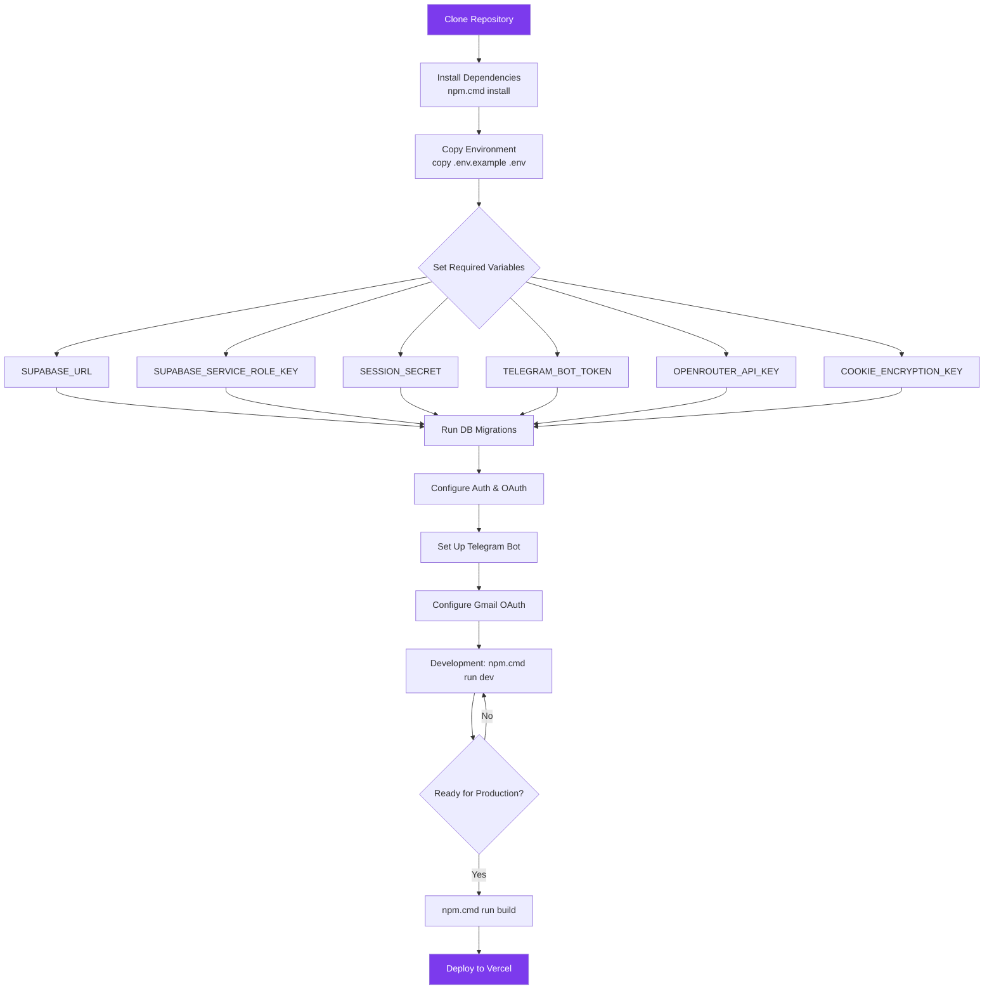

<p align="center">
  <picture>
    <source media="(prefers-color-scheme: dark)" srcset="docs/assets/favicon.svg">
    
  </picture>
</p>

<h1 align="center">⚙️ Configuration Lifecycle Guide</h1>

<p align="center">
  <strong>Version:</strong> v1.0.1 •
  <strong>Last Updated:</strong> 2026-06-30 •
  <strong>Category:</strong> Development
</p>

**Description:** VALTREXA-V2 — Local Development & Production Setup Instructions

---

## Table of Contents

- [Overview](#overview)
- [Prerequisites](#prerequisites)
- [Clone & Install](#clone--install)
- [Environment Variables](#environment-variables)
- [Supabase Setup](#supabase-setup)
- [Telegram Bot Setup](#telegram-bot-setup)
- [Google OAuth for Gmail](#google-oauth-for-gmail)
- [Development](#development)
- [Build for Production](#build-for-production)
- [Deploy to Vercel](#deploy-to-vercel)
- [Troubleshooting](#troubleshooting)
- [Best Practices](#best-practices)
- [Related Documents](#related-documents)

---

## Overview

Complete guide for configuring VALTREXA-V2 through the setup lifecycle locally and deploying to production. Covers all prerequisites, environment variables, service integrations, and troubleshooting.

---

## Setup Process Flow



## Prerequisites

| Requirement          | Version       | Purpose         |
| -------------------- | ------------- | --------------- |
| Node.js              | 22+           | Runtime         |
| npm                  | 10+           | Package manager |
| Supabase account     | Free tier+    | Database + Auth |
| Telegram Bot Token   | BotFather     | Bot integration |
| OpenRouter API key   | openrouter.ai | AI generation   |
| Google Cloud Project | Free tier     | Gmail OAuth     |
| Vercel account       | Hobby+        | Hosting         |

---

## Clone & Install

```bash
git clone <your-repo-url>
cd career-compass-pro
npm.cmd install
```

> [!NOTE]
> For Windows: Always use `npm.cmd` or `npx.cmd` — never `npm` or `npx` bare.

---

## Environment Variables

Copy the template and fill in your values:

```bash
copy .env.example .env
```

### Required Variables (Must Set Before Starting)

| Variable                    | Description                          | How to Get                        |
| --------------------------- | ------------------------------------ | --------------------------------- |
| `SUPABASE_URL`              | Supabase project URL                 | Supabase Dashboard → Settings     |
| `SUPABASE_SERVICE_ROLE_KEY` | Service role key                     | Supabase Dashboard → API          |
| `SESSION_SECRET`            | Session encryption secret            | `npx.cmd uuid`                    |
| `TELEGRAM_BOT_TOKEN`        | Telegram bot token                   | BotFather                         |
| `OPENROUTER_API_KEY`        | AI generation key                    | openrouter.ai/keys                |
| `COOKIE_ENCRYPTION_KEY`     | Cookie encryption secret             | `npx.cmd uuid && npx.cmd uuid`    |

See [`ENVIRONMENT.md`](./ENVIRONMENT.md) for the complete reference.

---

## Supabase Configuration Lifecycle

1. **Create a project** at [supabase.com](https://supabase.com)
2. **Run all migrations** in `supabase/migrations/` in order via SQL Editor:
   - Navigate to Supabase dashboard → SQL Editor
   - Open each `.sql` file, copy contents, paste, run
   - Run them in **alphanumeric filename order**
   - After all migrations: `NOTIFY pgrst, 'reload schema';`
3. **Configure Authentication:**
   - Go to **Authentication → Settings → URL Configuration**
   - **Site URL:** `https://valtrexa-v2.vercel.app` (or `http://localhost:4173` for dev)
   - **Redirect URLs:** `https://valtrexa-v2.vercel.app/auth/callback`
4. **Enable Google OAuth:**
   - Authentication → Providers → Google
   - Client ID + Secret from [Google Cloud Console](https://console.cloud.google.com)
   - Authorized redirect URI: `https://<project>.supabase.co/auth/v1/callback`

---

## Telegram Bot Configuration Lifecycle

1. Message [@BotFather](https://t.me/BotFather) on Telegram
2. Create a new bot: `/newbot` → name it `ValtrexaV2Bot`
3. Save the token as `TELEGRAM_BOT_TOKEN`
4. Set a webhook secret: `TELEGRAM_WEBHOOK_SECRET` (random 32+ chars)
5. The bot auto-registers its commands and webhook on startup when `PUBLIC_URL` is set

**Webhook URL:** `https://valtrexa-v2.vercel.app/api/telegram/webhook`

### Telegram Multi-User Binding

Each user must connect their Telegram chat via a one-time token:

1. In the web dashboard, go to **Settings → Telegram Connection** → **Generate Connection Token**
2. Copy the generated token (expires in 15 minutes)
3. Send `/connect <token>` to the bot
4. The bot confirms binding — now your chat is linked to your account
5. All commands (except `/health`, `/start`, `/help`, `/menu`) require a binding

> [!WARNING]
> No env-var fallback for inbound. Users without a binding will see "not connected".

---

## Google OAuth for Gmail

1. Go to [Google Cloud Console](https://console.cloud.google.com)
2. Create a project → Enable **Gmail API**
3. Go to **APIs & Services → Credentials**
4. Create OAuth 2.0 Client ID (Desktop app type)
5. **Authorized redirect URIs:** `https://valtrexa-v2.vercel.app`
6. Save `GMAIL_CLIENT_ID` and `GMAIL_CLIENT_SECRET`
7. Obtain a refresh token via the OAuth consent flow

---

## Development

```bash
# Terminal 1: Redis (required for queue)
docker run -p 6379:6379 redis:7

# Terminal 2: Dev server
npm.cmd run dev
```

---

## Build for Production

```bash
npm.cmd run build
```

The output goes to `dist/client` (static) and `dist/server` (SSR).

---

## Deploy to Vercel

1. Push to GitHub
2. Import repo in Vercel
3. Set all environment variables in Vercel dashboard
4. Deploy — the `vercel.json` config handles the rest

---

## Troubleshooting

| Issue                         | Solution                                                |
| ----------------------------- | ------------------------------------------------------- |
| `tsc --noEmit` errors         | Check imports and TypeScript types                      |
| Build fails on missing module | `npm.cmd install`                                       |
| Database connection fails     | Verify `SUPABASE_URL` and `SUPABASE_SERVICE_ROLE_KEY`   |
| Telegram bot not responding   | Check `TELEGRAM_BOT_TOKEN` and webhook URL              |
| Playwright browser not found  | Install Chromium: `npx.cmd playwright install chromium` |
| Redis connection refused      | Start Redis: `docker run -p 6379:6379 redis:7`          |

---

## Best Practices

> [!TIP]
> - Use `nvm` to manage Node.js versions (v22+)
> - Keep `.env` out of version control — use `.env.example` as template
> - Run migrations in a staging environment before production
> - Test the Telegram bot locally with `ngrok` before deploying
> - Set up Vercel Preview Deployments for feature branches
> - Backup `COOKIE_ENCRYPTION_KEY` and `SESSION_SECRET` in a password manager

---

## Related Documents

- [Deployment Guide](DEPLOYMENT.md) — Production deployment instructions
- [Environment Reference](ENVIRONMENT.md) — Complete environment variable reference
- [Telegram Operations](TELEGRAM_OPERATIONS.md) — Bot command reference

---

<br/>
<div align="center">
  <strong>Next Reading:</strong> <a href="ARCHITECTURE.md">System Architecture →</a>
</div>
