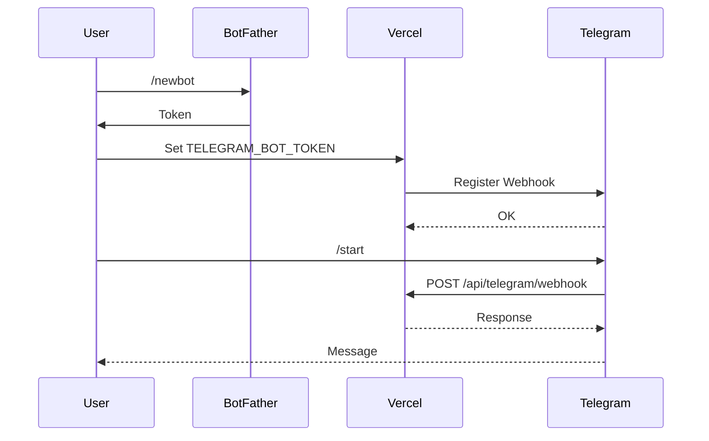

<p align="center">
  <picture>
    <source media="(prefers-color-scheme: dark)" srcset="docs/assets/favicon.svg">
    
  </picture>
</p>

<h1 align="center">🤖 Telegram Operations</h1>

<p align="center">
  <strong>Version:</strong> v1.0.1 •
  <strong>Last Updated:</strong> 2026-06-30 •
  <strong>Category:</strong> Operations
</p>

**Description:** VALTREXA-V2 — Bot Command Reference & Operational Guide

---

## Table of Contents

- [Overview](#overview)
- [Setup](#setup)
- [Commands](#commands-32-registered-with-botfather)
- [Multi-User Binding](#multi-user-binding)
- [Interactive Approvals](#interactive-approvals)
- [Notifications](#notifications)
- [Troubleshooting](#troubleshooting)
- [Command Verification](#command-verification)
- [Best Practices](#best-practices)
- [Related Documents](#related-documents)

---

## Overview

**Bot username:** @ValtrexaV2Bot
**Webhook URL:** https://valtrexa-v2.vercel.app/api/telegram/webhook

The Telegram bot provides full operational control over VALTREXA-V2 with 32 registered commands, interactive approvals, and real-time notifications.

---

## Setup

1. Message [@BotFather](https://t.me/BotFather) → `/newbot` → `ValtrexaV2Bot`
2. Set `TELEGRAM_BOT_TOKEN` in Vercel environment
3. Set `TELEGRAM_WEBHOOK_SECRET` (random 32+ chars)
4. Set `PUBLIC_URL=https://valtrexa-v2.vercel.app`
5. Deploy — the bot auto-registers its webhook on first request



---

## Commands (32 Registered with BotFather)

### General

| Command   | Description                                  |
| --------- | -------------------------------------------- |
| `/start`  | Welcome message with connection instructions |
| `/help`   | List all commands                            |
| `/menu`   | Interactive menu with inline buttons         |
| `/health` | System health check                          |
| `/status` | Dashboard summary (jobs, apps, interviews)   |

### Account

| Command            | Description                                                        |
| ------------------ | ------------------------------------------------------------------ |
| `/connect <token>` | Link Telegram to your account using a one-time token from Settings |

### Jobs & Applications

| Command            | Description              |
| ------------------ | ------------------------ |
| `/jobs`            | Recent 10 job imports    |
| `/applications`    | Recent 10 applications   |
| `/approvals`       | Pending approvals        |
| `/highvalue`       | High value companies     |
| `/followups`       | Overdue follow-ups       |
| `/interviews`      | Upcoming interviews      |
| `/analytics`       | System analytics         |
| `/recruiters`      | Discovered recruiters    |
| `/matching_status` | Job matching results     |

### Provider Management

| Command                        | Description                          |
| ------------------------------ | ------------------------------------ |
| `/provider_status`             | Provider status overview             |
| `/provider_enable <name>`      | Enable a provider                    |
| `/provider_disable <name>`     | Disable a provider                   |
| `/provider_pause <name>`       | Pause a provider                     |
| `/provider_resume <name>`      | Resume a provider                    |
| `/provider_history <name>`     | Provider downtime history            |

### Cookie Management

| Command                                    | Description                          |
| ------------------------------------------ | ------------------------------------ |
| `/refresh_cookies`                         | Check/refresh all provider cookies   |
| `/refresh_cookies <provider>`             | Check specific provider cookie       |
| `/refresh_cookies <provider> <value>`      | Set new cookie value                 |

> [!NOTE]
> `/refresh-cookies` (hyphen) is also accepted as a text alias but not registered with BotFather (Telegram commands only allow `[a-z0-9_]`)

### Workflow

| Command              | Description                   |
| -------------------- | ----------------------------- |
| `/workflow_start`   | Start the automation workflow |
| `/workflow_stop`    | Stop the automation workflow  |
| `/workflow_pause`   | Pause the automation workflow |
| `/workflow_resume`  | Resume the automation workflow|
| `/workflow_status`  | Check workflow status         |

### Operations & Stats

| Command                | Description                     |
| ---------------------- | ------------------------------- |
| `/queue_status`        | Operations queue status         |
| `/jobs_imported`       | Job import statistics           |
| `/applications_today`  | Today's application count       |
| `/recruiters_found`    | Recruiters discovered           |
| `/outreach_status`     | Outreach generation status      |

---

## Multi-User Binding

- All commands (except `/health`, `/start`, `/help`, `/menu`) require a Telegram account binding
- Bind via `/connect` → visit the provided URL → confirm → done
- Unbound users see a "not connected" prompt
- No env-var fallback — each user must bind their own chat

---

## Interactive Approvals

When an application needs approval (Telegram approval mode enabled):

```
📋 New Application: Senior Engineer at Acme Corp
┌─────────────────────────────────────┐
│  ✅ Approve    ✏️ Edit              │
│  ⏭️ Skip                            │
│  🔁 Always     🚫 Never             │
└─────────────────────────────────────┘
```

| Action    | Description                                      |
| --------- | ------------------------------------------------ |
| Approve   | AI-generated answer is accepted → application continues |
| Edit      | User sends corrected answer as reply             |
| Skip      | Application is skipped (not submitted)           |
| Always    | Answer saved permanently for similar questions   |
| Never     | Question will be auto-skipped in future          |

---

## Notifications

The bot sends notifications for:

- New job matches
- Application submissions (success/failure)
- Cookie expiry warnings
- Provider failures
- Workflow state changes
- Batch approval requests

---

## Troubleshooting

| Issue                             | Solution                                                                                 |
| --------------------------------- | ---------------------------------------------------------------------------------------- |
| Bot doesn't respond               | Check `TELEGRAM_BOT_TOKEN` is correct                                                    |
| "Not connected" error             | Use `/connect` to link your account                                                      |
| Webhook not registering           | Verify `PUBLIC_URL` is set                                                               |
| Commands not found                | Bot registers commands on startup — may need re-deploy                                   |
| Callback data errors              | Update to latest version (fixes 64-byte truncation)                                      |
| `/help` missing from command list | BotFather registration issue — re-deploy re-runs `registerTelegramCommands()`            |
| `/refresh-cookies` not in menu    | Hyphenated names are invalid for BotFather — use `/refresh_cookies` (underscore) instead |

---

## Command Verification

All 32 commands registered with BotFather can be verified:

```bash
curl -X POST "https://api.telegram.org/bot<TELEGRAM_BOT_TOKEN>/getMyCommands"
```

---

## Best Practices

> [!TIP]
> - Register all 32 commands with BotFather for the best UX
> - Set a strong `TELEGRAM_WEBHOOK_SECRET` (32+ random characters)
> - Monitor webhook error rates via Vercel logs
> - Use `/health` and `/status` regularly to verify operations
> - Keep Telegram client updated to avoid callback data truncation

---

## Related Documents

- [Setup Guide](SETUP.md) — Local development & production setup
- [Workflow Guide](WORKFLOW.md) — Automation pipelines & state machine
- [Provider Guide](PROVIDER_GUIDE.md) — Supported job board provider configuration

---

<br/>
<div align="center">
  <strong>Next Reading:</strong> <a href="COOKIE_GUIDE.md">Session Management →</a>
</div>
