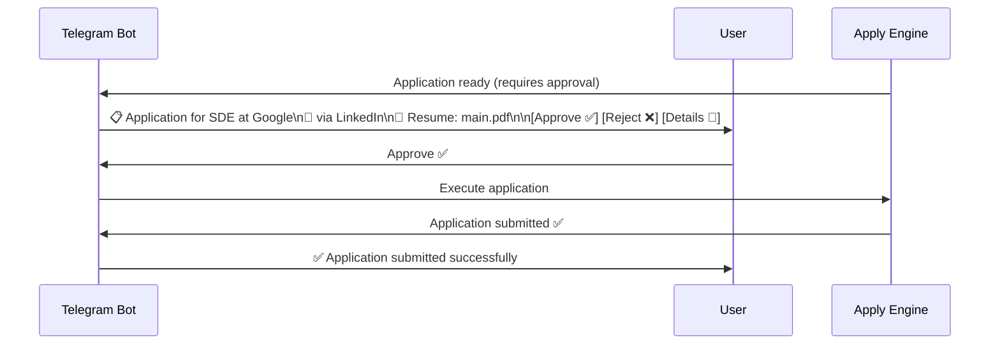

# Telegram Operations Guide

> **Last Updated:** 2026-06-26

## Overview

The Telegram bot is the primary operational interface for VALTREXA-V2. It provides real-time notifications, interactive approvals, and command-based control of the workflow. The bot is deployed as a webhook endpoint at `/api/telegram/webhook`.

## Setup

1. Create a bot via [@BotFather](https://t.me/botfather)
2. Set `TELEGRAM_BOT_TOKEN` in environment
3. Set `TELEGRAM_BOT_USERNAME` in environment (e.g., `valtrexa_bot`)
4. Bot auto-registers webhook on startup via `registerWebhook()` in `telegram-init.ts`

## Bot Commands

### Control Commands

| Command | Description | Access |
|---|---|---|
| `/start` | Initialize bot, link user account | All |
| `/link` | Link Telegram chat to user account (get OTP from dashboard) | All |
| `/status` | Show system status: workflow state, provider health, queue depth | Authenticated |
| `/pause` | Pause the workflow | Authenticated |
| `/resume` | Resume the workflow | Authenticated |
| `/stop` | Stop the workflow (reset to idle) | Authenticated |
| `/restart` | Restart the workflow from scratch | Authenticated |

### Provider Commands

| Command | Description | Access |
|---|---|---|
| `/providers` | List all providers with status (enabled/paused/disabled) | Authenticated |
| `/check linkedin` | Validate LinkedIn cookie health | Authenticated |
| `/pause linkedin` | Pause a specific provider | Authenticated |
| `/resume linkedin` | Resume a specific provider | Authenticated |
| `/enable linkedin` | Enable a disabled provider | Authenticated |
| `/disable linkedin` | Disable a provider | Authenticated |

### Job Commands

| Command | Description | Access |
|---|---|---|
| `/jobs` | Show recent job matches | Authenticated |
| `/jobs --limit 5` | Show last N matched jobs | Authenticated |
| `/apply` | Trigger manual apply cycle | Authenticated |

### Analytics Commands

| Command | Description | Access |
|---|---|---|
| `/analytics` | Show application statistics | Authenticated |
| `/analytics --days 7` | Filter analytics by time window | Authenticated |
| `/history` | Show workflow run history | Authenticated |
| `/stats` | Show match statistics, scores, success rates | Authenticated |

### Admin Commands

| Command | Description | Access |
|---|---|---|
| `/broadcast <message>` | Send announcement to all linked users | Admin |
| `/inspect <user_id>` | View user details | Admin |
| `/admin-status` | Detailed admin system status | Admin |

## Interactive Approval Workflow

When approval mode is enabled (`approval_mode: true`):

Approval messages include:
- Job title and company
- Provider name
- Resume to be used
- AI-generated cover letter or answers (if applicable)
- Action buttons: Approve / Reject / Details

Outreach approval follows the same pattern with:
- Recipient name and title
- Channel (cold_email / linkedin_message / founder_outreach)
- Draft content preview
- Action buttons: Approve / Reject / Edit

## Notification Types

Notifications are delivered to the linked Telegram chat with category-specific icons:

| Category | Icon | Example |
|---|---|---|
| application_submitted | ✅ | `✅ Applied: SDE at Google` |
| application_failed | ❌ | `❌ Apply failed: SDE at Google (form not found)` |
| match_found | 🎯 | `🎯 New match: SDE at Google (85%)` |
| workflow_update | 🔄 | `🔄 Pipeline A started` |
| approval_requested | 📋 | `📋 Approval needed: SDE at Google` |
| approval_approved | ✅ | `✅ Application approved by you` |
| approval_rejected | ❌ | `❌ Application rejected by you` |
| cookie_expired | ⚠️ | `⚠️ LinkedIn cookie expired — please re-upload` |
| error | 🚨 | `🚨 Workflow error: Playwright context crashed` |
| provider_down | 🔴 | `🔴 LinkedIn provider auto-disabled` |
| provider_recovered | 🟢 | `🟢 Indeed provider health restored` |
| system | ℹ️ | `ℹ️ Workflow completed: 5 applied, 2 failed` |
| outreach | 📤 | `📤 Outreach draft ready for John Doe` |
| batch_complete | 📊 | `📊 Batch apply complete: 12 submitted, 3 failed` |

## Cookie Management via Telegram

| Command | Description |
|---|---|
| `/check linkedin` | Validate cookie for provider |
| `/cookies` | List all stored cookies and expiry status |
| `/expired` | List expired cookies needing renewal |

## Troubleshooting

| Problem | Likely Cause | Solution |
|---|---|---|
| Bot doesn't respond | Webhook misconfigured | Check `TELEGRAM_BOT_TOKEN` and webhook URL |
| `/link` returns "Chat not found" | Chat ID not registered | Run `/start` first |
| Approve/Reject not working | Inline keyboard timeout (old message) | Re-run `/apply` or wait for new approval |
| Notifications not arriving | User not linked | Run `/link` with OTP from dashboard |
| Commands return "Unauthorized" | Chat not linked to any user | Link account via `/link` |
| Bot sends to wrong chat | User linked from wrong Telegram account | Re-link with correct account |

## Security

- **Authentication:** Users must link their Telegram chat to their VALTREXA-V2 account via a one-time code from the dashboard
- **Admin commands:** Protected by chat ID allowlist (`TELEGRAM_ADMIN_IDS`) — supports multiple comma-separated IDs
- **Data isolation:** Bot only accesses data for the linked user
- **No raw secrets:** Bot never exposes encrypted cookie values or API keys
