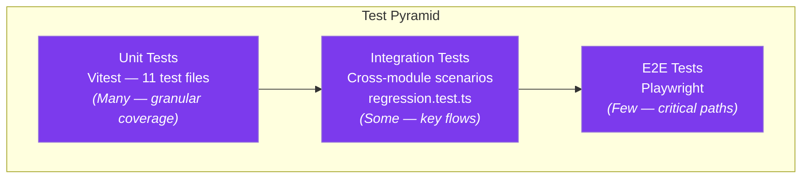
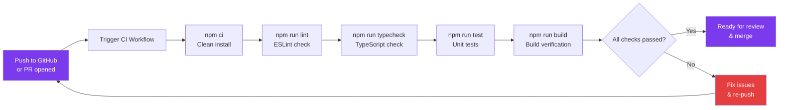

<p align="center">
  <picture>
    <source media="(prefers-color-scheme: dark)" srcset="docs/assets/favicon.svg">
    
  </picture>
</p>

<h1 align="center">📄 Testing Framework Guide</h1>

<p align="center">
  <strong>Version:</strong> v1.0.1 •
  <strong>Last Updated:</strong> 2026-07-05 •
  <strong>Category:</strong> Quality Assurance
</p>

**Description:** Testing Framework strategy, unit tests, E2E testing, and CI infrastructure for the VALTREXA-V2 platform.

---

## Table of Contents

- [Overview](#overview)
- [Test Stack](#test-stack)
- [Unit Tests](#unit-tests)
- [Running Tests](#running-tests)
- [Configuration Reference](#configuration-reference)
- [Writing Tests](#writing-tests)
- [End-to-End Tests](#end-to-end-tests)
- [Continuous Integration](#continuous-integration)
- [Best Practices](#best-practices)
- [Related Documents](#related-documents)

---

## Overview

VALTREXA-V2 uses **Vitest** for unit testing with **Playwright** available for E2E testing.

Tests focus on engine functions, utility modules, and handler logic — the core business logic that powers the platform's **8-phase workflow**, **7 BullMQ queues**, and **83+ API endpoints**.

## Test Pyramid



> [!TIP]
> Focus unit tests on engine functions and utility modules. Leave browser behavior to E2E tests and database queries to integration tests.

---

## Test Stack

| Tool       | Purpose              | Configuration       |
| ---------- | -------------------- | ------------------- |
| Vitest v4  | Unit test runner     | `vitest.config.ts`  |
| Playwright | E2E browser testing  | Available as dev dependency |
| dotenv     | Test environment variables | Loaded in `vitest.config.ts` |

---

## Unit Tests

### Test Files

11 unit test files in `tests/unit/`:

| Test File                    | Module Under Test       | Focus                                                     |
| ---------------------------- | ----------------------- | --------------------------------------------------------- |
| `ai-provider.test.ts`        | AI provider abstraction | Interface compliance, fallback chain (Gemini → Groq → OpenRouter) |
| `batch-apply-engine.test.ts` | Batch apply engine      | Strategy selection, rate limiting, 3 apply strategies     |
| `high-value-engine.test.ts`  | High-value assessment   | Scoring algorithm, tier assignment, company research      |
| `inbox-intelligence.test.ts` | Gmail classification    | Message patterns, categorization, follow-up detection     |
| `match-engine.test.ts`       | Job matching engine     | 8-factor scoring (skills 0.32, role 0.20, experience 0.16, location 0.10, salary 0.07, freshness 0.07, companyQuality 0.05, recruiter 0.03), threshold logic |
| `playwright-apply.test.ts`   | Automated apply engine  | Selector resolution, 3-tier fallback, element matching    |
| `providers.test.ts`          | Provider registry       | Registration, capability checks, 9 provider support       |
| `recruiter-discovery.test.ts`| Recruiter discovery     | Contact finding, email verification, multi-strategy       |
| `regression.test.ts`         | Regression suite        | Cross-module integration scenarios, end-to-engine flows   |
| `salary-parser.test.ts`      | Salary parsing          | Range parsing, currency handling, normalization           |
| `telegram.test.ts`           | Telegram bot            | Command parsing, 32 commands, message formatting, binding flow |

---

## Running Tests

```bash
npm run test            # Single run
npm run test:watch      # Watch mode (re-runs on file changes)
npm run test:coverage   # Run with coverage report
```

---

## Configuration Reference

Located in `vitest.config.ts`:

```typescript
import { defineConfig } from "vitest/config";
import { config } from "dotenv";

config();

export default defineConfig({
  test: {
    include: ["tests/**/*.test.ts"],
    testTimeout: 30000,
    hookTimeout: 30000,
    env: {
      SUPABASE_URL: "https://test-project.supabase.co",
      SUPABASE_SERVICE_ROLE_KEY: "test-service-role-key",
      // ... mocked credentials for all services
    },
  },
});
```

> [!NOTE]
> Test credentials are mocked in `vitest.config.ts`. Never use real credentials in tests.

---

## Writing Tests

### Test Pattern

```typescript
import { describe, it, expect } from "vitest";
import { someFunction } from "../../api/_lib/some-module";

describe("someFunction", () => {
  it("should handle the basic case", () => {
    const result = someFunction(input);
    expect(result).toEqual(expectedOutput);
  });

  it("should handle edge cases", () => {
    const result = someFunction(edgeInput);
    expect(result.status).toBe("error");
  });

  it("should return expected shape", () => {
    const result = someFunction(input);
    expect(result).toMatchObject({
      success: true,
      data: expect.any(Object),
    });
  });
});
```

### What to Test

Focus on:
- **Engine functions** — Match engine, high-value engine, batch apply engine, follow-up engine
- **Utility functions** — Rate limiter, providers, role taxonomy, salary parser
- **Handler logic** — Request validation rules, response shapes, error recovery lifecycle states
- **Fallback behavior** — AI provider fallback chain, queue inline fallback

### What Not to Test

- Supabase client — trust the library; mock it
- Playwright browser behavior — test in E2E, not unit
- External API responses — mock HTTP calls
- TanStack Query cache logic — trust the library

---

## End-to-End Tests

Playwright is available as a dev dependency for E2E testing:

```bash
PLAYWRIGHT_TEST_BASE_URL=http://localhost:5173 npx playwright test
```

For authenticated flows, use the test user credentials or mock the auth session.

---

## Continuous Integration

The project is configured for CI via:

| Check        | Command             | Description                     |
| ------------ | ------------------- | ------------------------------- |
| ESLint       | `npm run lint`      | Code quality and style enforcement |
| Prettier     | `npm run format`    | Code formatting check           |
| TypeScript   | `npm run typecheck` | Type safety verification        |
| Vitest       | `npm run test`      | Unit test suite                 |

All checks must pass before merging any pull request. CI runs on every push to `main` and on pull requests.

### CI Pipeline Flow



### CI Configuration

The CI pipeline (`.github/workflows/ci.yml`) runs:
1. `npm ci` — Clean install dependencies
2. `npm run lint` — ESLint check
3. `npm run typecheck` — TypeScript check
4. `npm run test` — Unit tests
5. `npm run build` — Build verification (ensures production build succeeds)

---

## Best Practices

- **Write tests alongside code**: Every new engine function, utility module, or handler should include corresponding unit tests before merging.
- **Mock external dependencies**: Supabase client, AI provider APIs, and Playwright browser interactions should all be mocked in unit tests. Never make real network calls.
- **Cover edge cases and fallbacks**: Test failure modes — AI provider fallback chain, queue inline fallback, rate limit exceeded, and invalid input shapes.
- **Keep tests fast and isolated**: Unit tests should complete in milliseconds. Use `testTimeout: 30000` only for integration scenarios.
- **Run CI checks locally before pushing**: Execute `npm run lint && npm run typecheck && npm run test && npm run build` to catch issues early.
- **Use the 3-tier test pattern**: Each function should have tests for basic case, edge case, and expected return shape.
- **Never commit real credentials**: Use mocked values in `vitest.config.ts` and `.env.example` for documentation only.

---

## Related Documents

- [Contributing Guide](../CONTRIBUTING.md) — Development conventions and PR process
- [Backend Architecture](BACKEND.md) — Module structure for test organization
- [Setup Guide](SETUP.md) — Local development setup
- [Deployment Guide](DEPLOYMENT.md) — CI/CD pipeline integration

---

<br/>
<div align="center">
  <strong>Next Reading:</strong> <a href="DEPLOYMENT.md">Deployment Pipeline →</a>
</div>
