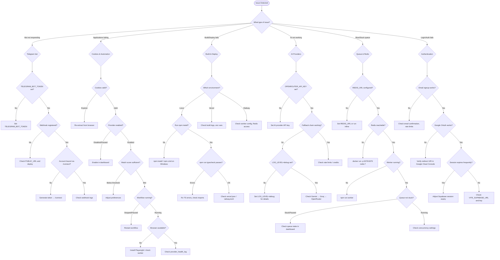

<p align="center">
  <picture>
    <source media="(prefers-color-scheme: dark)" srcset="docs/assets/favicon.svg">
    
  </picture>
</p>

<h1 align="center">📄 Troubleshooting Guide</h1>

<p align="center">
  <strong>Version:</strong> v1.0.1 •
  <strong>Last Updated:</strong> 2026-07-05 •
  <strong>Category:</strong> Operations
</p>

**Description:** Common issues, solutions, and diagnostic procedures for the VALTREXA-V2 platform.

---

## Table of Contents

- [Overview](#overview)
- [Quick Reference](#quick-reference)
- [Installation & Build](#installation--build)
- [Authentication](#authentication)
- [Database](#database)
- [Telegram Bot](#telegram-bot)
- [Provider Cookies](#provider-cookies)
- [Browser Automation](#browser-automation)
- [AI Providers](#ai-providers)
- [Queue & Redis](#queue--redis)
- [Deployment](#deployment)
- [Best Practices](#best-practices)
- [Related Documents](#related-documents)

---

## Overview

> [!NOTE]
> This guide covers common issues across all VALTREXA-V2 subsystems. Start with the Quick Reference table for fast symptom-to-solution lookup, or use the decision tree for guided diagnosis.

> [!TIP]
> Enable `LOG_LEVEL=debug` for detailed diagnostic output when troubleshooting any subsystem.

## Diagnostic Decision Tree



---

## Quick Reference

| Symptom              | Likely Cause              | Quick Fix                                            |
| -------------------- | ------------------------- | ---------------------------------------------------- |
| Bot not responding   | Missing token or webhook  | Check `TELEGRAM_BOT_TOKEN`; verify webhook registration |
| "Not connected"      | No Telegram binding       | `/connect <token>` from Settings → Telegram Connection |
| Cookie expired       | Session timeout           | Re-extract from browser and paste in dashboard       |
| Build fails          | Missing dependencies      | `npm install`; delete `node_modules` and `package-lock.json` |
| DB connection fails  | Wrong credentials         | Verify `SUPABASE_URL` and `SUPABASE_SERVICE_ROLE_KEY` |
| AI not working       | Missing or invalid API key| Check `OPENROUTER_API_KEY` or fallback keys (Gemini, Groq) |
| Playwright fails     | Browser not installed     | `npx playwright install chromium`                    |
| Redis connection refused | Redis not running     | Start Redis: `docker run -p 6379:6379 redis:7`       |
| Workflow stuck       | Stale state >2h           | Auto-stopped; restart workflow from dashboard        |
| Application fails    | Invalid cookie            | Re-extract provider cookie from browser              |

---

## Installation & Build

### `npm` command not found (Windows)

Use `npm.cmd` instead of `npm` on Windows systems.

### Build fails on missing module

```bash
npm install
```

If issues persist:

```bash
rm -rf node_modules package-lock.json
npm install
```

### TypeScript compilation errors

Check for:
- Import path mismatches (case-sensitive on some systems)
- Missing type definitions (`npm install @types/node @types/react`)
- Verify `tsconfig.json` paths are correct
- Run `npm run typecheck` for detailed diagnostics

### Build output issues

The build produces three directories:
- `dist/client/` — Static assets
- `dist/server/` — SSR server bundle
- `api/_dist/` — Vercel serverless function bundle

> [!WARNING]
> If `api/_dist/server.js` is missing, the SSR entry point may have failed to compile.

---

## Authentication

### Cannot sign up

- Email confirmation is required — check your inbox (including spam)
- Rate limit may be active — wait 60 seconds and retry
- Ensure `VITE_SUPABASE_URL` and `VITE_SUPABASE_PUBLISHABLE_KEY` are set correctly

### Google OAuth redirects to error page

- Verify the redirect URI in Google Cloud Console matches the Supabase callback URL: `https://<project>.supabase.co/auth/v1/callback`
- Ensure the state parameter matches (CSRF protection)
- Check browser console for error details
- Verify authorized Java Script origins include `https://valtrexa-v2.vercel.app`

### Session expires frequently

- Default Supabase session expiry may be too short
- Configure session length in Supabase Authentication settings
- Check that `SESSION_SECRET` is set correctly

---

## Database

### Migration fails

- Run migrations in **alphanumeric filename order**
- Verify the database connection string is correct
- Run `NOTIFY pgrst, 'reload schema';` after all migrations
- Check for conflicting table names or types across migration files

### Query returns no data despite having permissions

- Verify `user_id` is being set correctly in the query
- Check RLS policies are properly configured on the table
- Service role queries must include `.eq("user_id", userId)` — the architecture flow executes audits 145+ write operations to ensure zero unscoped writes

### Performance issues

- Ensure indexes are created (28 migrations include schema-optimized indexes)
- Queries should filter by `user_id` first, then status or date
- For 70 tables, verify RLS policies don't cause sequential scans

---

## Telegram Bot

### Bot doesn't respond

| Check                    | Command                                                                     |
| ------------------------ | --------------------------------------------------------------------------- |
| Token is correct         | Verify `TELEGRAM_BOT_TOKEN` in environment                                  |
| Webhook is registered    | `curl -X POST "https://api.telegram.org/bot<TOKEN>/getWebhookInfo"`         |
| Commands registered (32) | `curl -X POST "https://api.telegram.org/bot<TOKEN>/getMyCommands"`          |
| Deployed correctly       | Check Vercel deployment logs for `/api/telegram/webhook`                    |

### "Not connected" error

- Generate a connection token from Settings → Telegram Connection
- Send `/connect <token>` to the bot within 15 minutes
- Tokens expire — generate a fresh one if expired
- Re-binding is required if you switch Telegram accounts

### Webhook not registering

- Verify `PUBLIC_URL` is set in environment
- On first request, the webhook auto-registers — ensure the deployment is accessible
- Check that `TELEGRAM_WEBHOOK_SECRET` is set (32+ random characters)

### Commands not found

The bot registers **32 commands** on startup. If some are missing:
- The webhook may not have been registered yet
- Trigger a deployment to re-register
- Manually set commands via Bot Father if needed

---

## Provider Cookies

### Cookie shows "expired"

1. Log into the provider in your browser
2. Re-extract the cookie from DevTools → Application → Cookies
3. Paste the fresh cookie in the dashboard (Settings → Cookies)

### Cookie shows "captcha_required"

1. Log into the provider manually in your browser
2. Solve any CAPTCHA challenges
3. Re-extract the cookie immediately after solving
4. Reduce automation frequency to avoid triggering CAPTCHAs

### "No cookie configured"

Add a cookie via:
- Dashboard: Settings → Cookies → Add Cookie
- Telegram: `/refresh_cookies <provider> <cookie_value>`

### Encryption key changed

All stored cookies become unrecoverable. Set the new `COOKIE_ENCRYPTION_KEY` and re-paste all provider cookies.

> [!WARNING]
> Cookies are encrypted with AES-256-GCM at rest. Changing the encryption key renders existing cookies permanently undecryptable.

---

## Browser Automation

### Playwright browser not found

```bash
npx playwright install chromium
```

### Playwright fails on Windows

- Ensure Microsoft Edge is installed for cookie extraction
- Set `EDGE_PATH` to the correct Edge executable path
- For headless mode, set `PLAYWRIGHT_HEADLESS=true`
- On Railway, the nixpacks builder includes Chromium dependencies

### Applications fail consistently

- Verify provider cookies are valid (not expired)
- Check provider health status in dashboard
- Examine `provider_health_log` for specific failure reasons
- Try reducing batch size or switching to a more conservative strategy
- Check provider is among the 9 supported providers and is enabled

### "Browser context not available"

- The Railway worker may not be running
- Verify `npm run worker` is executing
- Check Redis connection if queues are used

---

## AI Providers

### AI generation fails

- Verify `OPENROUTER_API_KEY` is set and has credits
- Check the API key has access to the configured model
- The system falls back through: **Gemini → Groq → OpenRouter**
- Set `LOG_LEVEL=debug` for detailed error logs
- Verify fallback provider keys (`GEMINI_API_KEY`, `GROQ_API_KEY`) are set

### Slow AI responses

- Default model is `gpt-4o-mini` via OpenRouter — consider faster models
- Network latency to AI providers may vary
- Check provider status pages for outages
- Fallback chain may cause additional latency if primary provider fails

### Which AI providers are supported?

The platform supports **9 providers** total — 6 AI models via OpenRouter, Groq, and Gemini:
- **OpenRouter**: GPT-4o-mini, Claude 3.5 Sonnet, DeepSeek V3
- **Groq**: Llama 3
- **Gemini**: Gemini 2.5 Pro

---

## Queue & Redis

### Redis connection refused

```bash
# Start Redis locally
docker run -p 6379:6379 redis:7
```

### Jobs not processing

- Verify `REDIS_URL` is correct
- Check if the Railway worker is running (`npm run worker`)
- The architecture flow executes fallback to inline execution if Redis is unavailable
- For the `apply` queue (concurrency 2), ensure Playwright is installed

### Queue stuck or paused

Check the queue state in the dashboard. Queues have 4 lifecycle states: `idle`, `running`, `paused`, `stopped`.

### Workflow auto-stopped

> [!IMPORTANT]
> Workflows stale for >2 hours without updates are auto-stopped. Restart from the dashboard.

---

## Deployment

### Vercel deployment fails

- Check build logs for dependency issues
- Verify all required environment variables are set in Vercel dashboard
- Ensure the build command is `npm run build` (not `npm.cmd run build`)
- Verify `vercel.json` is present in the root directory

### SSR returns 500 error

- Check Vercel function logs for errors
- Verify the SSR entry point (`api/ssr.ts`) is correct
- Ensure `api/_dist/server.js` was generated during build
- Check that all environment variables are set

### Railway worker fails to start

- Verify `railway.toml` is configured correctly
- Check that `npm run worker` starts without errors
- Ensure Redis is accessible from the Railway network
- Playwright system dependencies must be available (nixpacks handles this)

### Database connection fails in production

- Verify `SUPABASE_URL` and `SUPABASE_SERVICE_ROLE_KEY` are set in Vercel environment
- Check Supabase project hasn't been paused (free tier)
- Verify IP restrictions on Supabase project (if any)

### Cookie encryption issues in production

- Ensure `COOKIE_ENCRYPTION_KEY` is consistent across all deployments
- If the key changes, all existing cookies become undecryptable
- The key must be the same in Vercel and Railway environments

> [!WARNING]
> Changing `COOKIE_ENCRYPTION_KEY` in any environment renders all stored cookies permanently undecryptable. Ensure the key is identical across Vercel and Railway deployments.

---

## Best Practices

- **Start with the Quick Reference table**: When encountering an issue, scan the symptom/likely cause/quick fix table first — it covers the most common problems.
- **Enable debug logging early**: Set `LOG_LEVEL=debug` before reproducing an issue to capture detailed error context without needing to reproduce again.
- **Check provider health first for application failures**: Applications failing is most often caused by expired cookies — verify provider cookie status in the dashboard before deep-diving.
- **Keep `COOKIE_ENCRYPTION_KEY` consistent across deployments**: If using both Vercel and Railway, ensure the encryption key is identical to avoid cookie decryption failures.
- **Use the decision tree for guided troubleshooting**: Follow the Mermaid decision tree flowchart above for step-by-step diagnosis of common issue categories.
- **Run `npm run typecheck` before deployment**: Catch TypeScript compilation errors early to avoid build failures in production.
- **Monitor queue states regularly**: Queues can get stuck in `paused` or `stopped` states — check the dashboard periodically to ensure all 7 queues are processing.

---

## Related Documents

- [FAQ](FAQ.md) — Frequently asked questions
- [Setup Guide](SETUP.md) — Local development setup
- [Cookie Guide](COOKIE_GUIDE.md) — Cookie management
- [Provider Guide](PROVIDER_GUIDE.md) — Provider failure registry
- [Deployment Guide](DEPLOYMENT.md) — Production deployment
- [Glossary](GLOSSARY.md) — Terminology reference

---

<br/>
<div align="center">
  <strong>Next Reading:</strong> <a href="FAQ.md">FAQ →</a>
</div>
