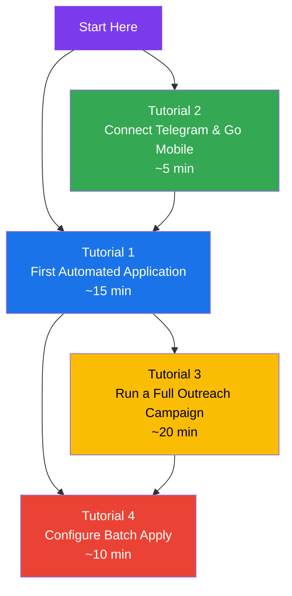
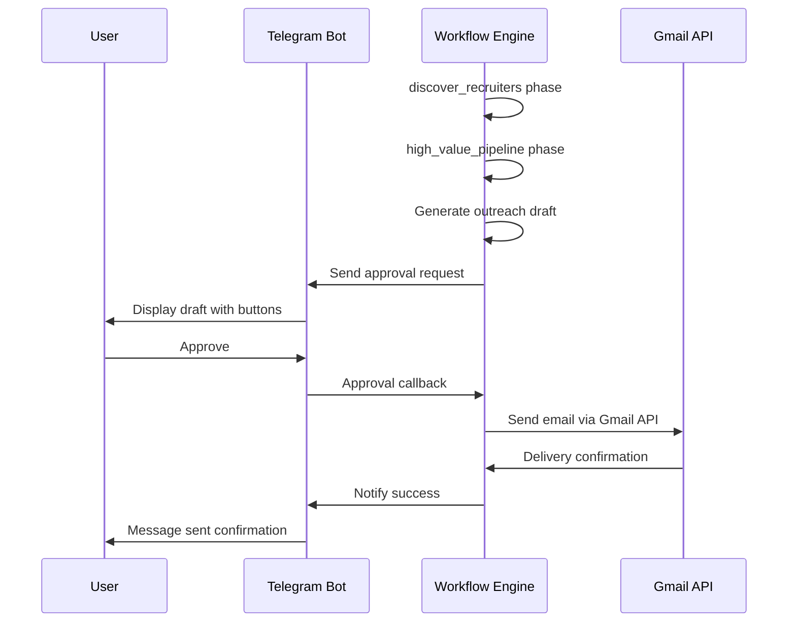

<p align="center">
  <picture>
    <source media="(prefers-color-scheme: dark)" srcset="docs/assets/favicon.svg">
    
  </picture>
</p>

<h1 align="center">📄 Tutorials — VALTREXA-V2</h1>

<p align="center">
  <strong>Version:</strong> v1.0.1 •
  <strong>Last Updated:</strong> 2026-07-05 •
  <strong>Category:</strong> Tutorials & Guides
</p>

**Description:** Step-by-step walkthroughs for common VALTREXA-V2 use cases — from first auto-apply to advanced batch configuration

---

## Table of Contents

- [Overview](#overview)
- [Tutorial 1: First Automated Application](#tutorial-1-first-automated-application)
- [Tutorial 2: Connect Telegram & Go Mobile](#tutorial-2-connect-telegram--go-mobile)
- [Tutorial 3: Run a Full Outreach Campaign](#tutorial-3-run-a-full-outreach-campaign)
- [Tutorial 4: Configure Batch Apply for Maximum Results](#tutorial-4-configure-batch-apply-for-maximum-results)
- [Best Practices](#best-practices)
- [Related Documents](#related-documents)

---

## Overview

These tutorials walk you through the most common VALTREXA-V2 workflow engine flows — from your first automated application to running a full outreach campaign and fine-tuning batch apply settings.



---

## Tutorial 1: First Automated Application

**Goal:** Upload your resume, configure a provider, and submit your first automated application.

**Time:** ~15 minutes

### Step 1: Upload Resume

Navigate to **Dashboard > Upload Resume**. Supported formats are PDF (preferred) and DOCX.

The architecture flow executes parsing of your resume into structured data — skills, experience history, education, and certifications. A progress indicator shows parsing status. On completion, you are redirected to the Candidate Brain review screen.

### Step 2: Review Candidate Brain

Go to **Dashboard > Candidate Brain** to verify the extracted profile.

The brain stores:
- **Skills** — Technical and soft skills extracted from your resume
- **Experience** — Role titles, companies, date ranges, and key responsibilities
- **Education** — Degrees, institutions, and graduation years
- **Preferences** — Desired roles, locations, salary range, and work mode (remote/hybrid/onsite)

Correct any parsing errors before proceeding. Accurate profile data directly impacts match quality.

### Step 3: Configure Provider Cookies

VALTREXA-V2 uses browser-automation cookies to apply on your behalf.

For LinkedIn:
1. Log into LinkedIn in your browser
2. Open DevTools (F12) > Application > Storage > Cookies > `www.linkedin.com`
3. Copy the `li_at` cookie value
4. Go to **Dashboard > Settings > Cookies** and paste the value

Supported providers and their priority tiers:

| Provider    | Tier   | Cookie Key            |
| ----------- | ------ | --------------------- |
| LinkedIn    | High   | `li_at`               |
| Indeed      | High   | `__cf_bm` + `cto_bundle` |
| Naukri      | Medium | `naukri`              |
| Wellfound   | Medium | `remember_token`      |
| Instahyre   | Medium | `session`             |
| Greenhouse  | Low    | API key               |
| Lever       | Low    | API key               |
| Ashby       | Low    | API key               |
| Workable    | Low    | API key               |

### Step 4: Set Match Threshold

Go to **Settings > Matching** and set your minimum match threshold.

The recommended starting point is 70% (Balanced mode).

The architecture flow executes scoring of every job against your profile using 8 weighted factors:

| Factor         | Weight | Description                                        |
| -------------- | ------ | -------------------------------------------------- |
| Skills         | 0.32   | Overlap between job requirements and your skills   |
| Role           | 0.20   | Job title and seniority alignment                  |
| Experience     | 0.16   | Years of experience match                          |
| Location       | 0.10   | Geographic proximity and work mode                 |
| Salary         | 0.07   | Stated salary range vs. your preference            |
| Freshness      | 0.07   | How recently the job was posted                    |
| Company Quality| 0.05   | Company rating, size, and reputation               |
| Recruiter      | 0.03   | Recruiter engagement signal                        |

Jobs scoring below your threshold are automatically skipped.

### Step 5: Start Workflow

Go to **Dashboard > Workflow > Start**.

The architecture flow executes the 8-phase pipeline:

```mermaid
graph LR
    I["import_jobs"] --> M["match_jobs"]
    M --> D["discover_recruiters"]
    D --> H["high_value_pipeline"]
    H --> A["apply_pipeline"]
    A --> F["followups"]
    F --> HC["health_check"]
    HC --> AN["analytics"]
    style I fill:#1a73e8,color:#fff
    style M fill:#1a73e8,color:#fff
    style D fill:#1a73e8,color:#fff
    style H fill:#1a73e8,color:#fff
    style A fill:#34a853,color:#fff
    style F fill:#34a853,color:#fff
    style HC fill:#fbbc04,color:#000
    style AN fill:#ea4335,color:#fff
```



Each phase runs sequentially. A failure in one phase does not block subsequent phases.

The dashboard shows real-time status for each phase.

### Step 6: Monitor Results

Go to **Dashboard > Applications** to view submitted applications.

Each entry shows:
- Job title, company, and source provider
- Match score percentage
- Assigned tier (A, B, or C)
- Application status (submitted, failed, pending approval)
- Timestamp

Check **Dashboard > Analytics** for daily application volume, success rate by provider, and match score distribution.

> [!TIP]
> Start with a conservative 85% threshold for your first run to validation rules verify the pipeline before scaling.

---

## Tutorial 2: Connect Telegram & Go Mobile

**Goal:** Link Telegram bot for mobile operations and real-time notifications.

**Time:** ~5 minutes

### Step 1: Start the Bot

Open Telegram and search for **@ValtrexaV2Bot**. Send the `/start` command. The bot responds with a welcome message containing a brief feature overview and instructions for connecting your account.

### Step 2: Generate Binding Token

1. Log into the VALTREXA-V2 web dashboard
2. Navigate to **Settings > Telegram Connection**
3. Click **Generate Connection Token**
4. Copy the 32-character token

> [!NOTE]
> The token expires after 15 minutes for security. If it expires, generate a new one.

### Step 3: Connect

Send the following to the bot in Telegram:

```
/connect <your-token>
```

The bot responds with:

```
Account connected!
```

Your Telegram chat ID is now bound to your VALTREXA-V2 user. The architecture flow executes multi-user isolation — each user's commands and notifications are scoped to their own account only.

### Step 4: Essential Commands

The bot supports 32 commands. The most frequently used ones are:

| Command            | Description                                                        |
| ------------------ | ------------------------------------------------------------------ |
| `/status`          | Dashboard summary with application counts and workflow state       |
| `/providers`       | Provider health status (active, error, rate-limited)               |
| `/workflow_status` | Current workflow phase and progress                                |
| `/workflow_start`  | Start workflow cycle                                               |
| `/approvals`       | List pending approval requests                                     |
| `/analytics`       | Daily application statistics                                       |
| `/followups`       | Pending follow-up tasks                                            |
| `/health`          | System health overview                                             |
| `/history`         | Recent activity log                                                |

Use `/help` at any time for the full command list.

### Step 5: Configure Notifications

Go to **Settings > Notifications** in the web dashboard and enable the notification categories you want to receive in Telegram:

| Category               | Type     | Trigger                                           |
| ---------------------- | -------- | ------------------------------------------------- |
| Application submitted  | Success  | Job successfully applied                          |
| Application failed     | Error    | Application rejected or errored                   |
| Interview invitation   | Critical | Recruiter interview request detected              |
| Provider paused        | Warning  | Provider hit rate limit or auth failure           |
| Approval needed        | Action   | Application awaiting your approval                |
| Follow-up due          | Reminder | Day 3, 7, or 14 follow-up triggered               |
| Workflow stopped       | Alert    | Workflow halted due to error                      |

### Step 6: Approve Applications on the Go

When the workflow engine encounters a job requiring approval (based on your approval mode), a message arrives in Telegram with inline buttons:

```
Job: Senior Software Engineer @ Google
Match: 91% (Tier A)
Salary: $180k - $220k
Location: Remote
✅ Approve |  ✏️ Edit |  ⏭️ Skip
🔁 Always |  🚫 Never
```

Button actions:
- **Approve** (checkmark) — Submit application with default answers
- **Edit** (pencil) — Opens a prompt to edit the application answers before submission
- **Skip** (fast-forward) — Skip this job, will not be asked again this cycle
- **Always** (arrows in circle) — Approve and remember this choice for all similar jobs
- **Never** (prohibited) — Reject and blacklist this job permanently

---

## Tutorial 3: Run a Full Outreach Campaign

**Goal:** Discover recruiters, generate AI outreach messages, and manage follow-ups for high-value opportunities.

**Time:** ~20 minutes

### Step 1: Enable High-Value Pipeline

Go to **Settings > Workflow** and enable the `high_value_pipeline` phase.

This phase runs after `match_jobs` and before `apply_pipeline`. It identifies top-tier matches and initiates recruiter outreach.

Set the minimum match score for outreach to 85% (Tier A). Only jobs scoring at or above this threshold trigger the outreach pipeline. This ensures you only invest outreach effort on the most promising opportunities.

### Step 2: Configure Gmail

VALTREXA-V2 sends outreach messages through your connected Gmail account:
1. Go to **Settings > Gmail > Connect Gmail Account**
2. You are redirected to Google's OAuth consent screen
3. Authorize offline access (required for automated sending)
4. Grant permissions for `gmail.send` and `gmail.read`

The architecture flow executes per-user OAuth token storage securely. Each user must connect their own Gmail account — there is no shared mailbox.

Gmail inbox classification automatically tags incoming messages into categories:

| Category         | Description                                          |
| ---------------- | ---------------------------------------------------- |
| interview        | Interview invitations and scheduling                 |
| assessment       | Coding challenges and take-home assignments          |
| offer            | Job offers and compensation details                  |
| rejection        | Application rejections                               |
| recruiter_reply  | Responses to your outreach messages                  |
| other            | Everything else                                      |

### Step 3: Generate Company Research

Go to **Dashboard > Companies** to review AI-generated strategic value assessments.

The architecture flow executes assignment of each company a tier based on:
- Company size and stage (startup, mid-size, enterprise)
- Engineering brand and tech stack reputation
- Compensation benchmarks
- Growth trajectory

Review and adjust these assignments. The high-value pipeline uses them to prioritize outreach order and personalize message content.

### Step 4: Approve Outreach Drafts

The AI generates personalized outreach messages for each high-value opportunity. These appear in your Telegram approval queue:

```
/send /approvals
```

Each draft includes:
- Recipient name and title (sourced from `discover_recruiters` phase)
- Company name and role title
- AI-generated message body (customized with company-specific details)
- Suggested send time

You can:
- **Approve** (checkmark) — Send immediately via your connected Gmail
- **Edit** (pencil) — Modify the message text before sending
- **Skip** (fast-forward) — Skip this outreach
- **Always** (arrows in circle) — Auto-approve all future drafts for this company



### Step 5: Monitor Follow-ups

The architecture flow executes a 3-cadence follow-up sequence automatically:
- **Day 3** — Gentle check-in: "Following up on my previous message..."
- **Day 7** — Value-add: Share a relevant article or project update
- **Day 14** — Final nudge: Last attempt before closing

Use `/followups` in Telegram to view pending follow-ups. You can skip, reschedule, or edit individual follow-ups. The architecture flow executes timing automatically based on the original outreach send date.

> [!NOTE]
> Follow-ups respect working hours and timezone settings configured in your profile. Messages are never sent outside your configured window.

---

## Tutorial 4: Configure Batch Apply for Maximum Results

**Goal:** Tune batch apply strategy, filters, and match weights for your specific job search goals.

**Time:** ~10 minutes

### Step 1: Choose Your Strategy

VALTREXA-V2 offers three built-in batch apply strategies. Select the one that aligns with your current priorities:

| Goal              | Strategy     | Min Score | Eligible Tiers | Max Age | Description                                         |
| ----------------- | ------------ | --------- | -------------- | ------- | --------------------------------------------------- |
| Quality-focused   | Conservative | 85%       | A only         | 3 days  | Only top-tier, fresh, easy-apply jobs               |
| Balanced          | Balanced     | 70%       | A, B           | 7 days  | Mix of quality and volume                           |
| Volume-focused    | Aggressive   | 50%       | A, B, C        | 30 days | Maximum applications with lower threshold           |

Set your strategy in **Dashboard > Batch Apply > Strategy**.

### Step 2: Configure Filters

Fine-tune which jobs are eligible for batch apply:

| Filter           | Type           | Description                                        |
| ---------------- | -------------- | -------------------------------------------------- |
| `minScore`       | number (0-100) | Minimum match score threshold                      |
| `tier`           | enum           | Restrict to specific tiers (A, B, C)               |
| `source`         | enum[]         | Include/exclude specific providers                 |
| `workMode`       | enum           | remote, hybrid, onsite, or any                     |
| `freshness`      | number         | Maximum days since posting                         |
| `easyApplyOnly`  | boolean        | Skip jobs requiring manual applications            |
| `companySize`    | enum           | startup, mid, enterprise, or any                   |

Multiple filters combine with AND logic — a job must pass all active filters to enter the apply pipeline.

### Step 3: Adjust Match Weights (Optional)

The default weights work well for general searches. For specialized goals, override them in **Settings > Matching > Advanced**:

```
# Example: Niche role specialization
skills: 0.42       # Increase — rare skills are the differentiator
role: 0.20         # Keep default
experience: 0.12   # Decrease slightly
location: 0.04     # Decrease — fully remote role
salary: 0.05       # Decrease — flexible negotiation
freshness: 0.07    # Keep default
companyQuality: 0.07 # Increase — targeting specific companies
recruiter: 0.03    # Keep default
```

The weights must always sum to 1.0. The UI enforces this constraint.

After changing weights, re-run the `match_jobs` phase to recalculate scores for all imported jobs.

### Step 4: Set Approval Mode

Approval mode determines which applications require your manual confirmation before submission:
- **Conservative / Balanced** — Enable approval mode. You review and approve each application before it is submitted. Use the Telegram approval flow (see Tutorial 2, Step 6).
- **Aggressive** — Disable approval mode. Applications submit automatically without review. Recommended only when you are confident in your filters and thresholds.

Approval mode is configured in **Settings > Workflow > Approval Mode**.

### Step 5: Optimize Cycle Timing

Adjust execution parameters to match your strategy:

| Setting                  | Conservative | Balanced | Aggressive |
| ------------------------ | ------------ | -------- | ---------- |
| Cycle interval           | 60 min       | 30 min   | 30 min     |
| Applications per cycle   | 5            | 10       | 20         |
| Sleep between providers  | 10s          | 5s       | 5s         |
| Approval required        | Yes          | Yes      | No         |

Configure these in **Dashboard > Batch Apply > Timing**.

> [!WARNING]
> Aggressive settings increase provider rate-limit risk. Monitor `/provider_status` regularly and reduce apps/cycle if you encounter errors.

### Step 6: Monitor & Iterate

Batch apply is an iterative process. Follow this feedback loop:
1. **Weekly** — Check `/analytics` for application volume, success rate, and interview conversion
2. **Adjust threshold** — Increase `minScore` if too many low-quality applications pass; decrease if too few jobs are eligible
3. **Review providers** — Check `/provider_status` daily. If a provider shows elevated error rates, reduce its priority or pause it
4. **Refine filters** — Add source exclusions if certain providers return irrelevant results
5. **Tweak weights** — If a specific factor (e.g., location) is causing poor matches, lower its weight

---

## Best Practices

- **Validate with a conservative threshold first**: Start at 85% minimum match score for your first few cycles. This lets you verify the pipeline works before scaling volume.
- **Keep cookies fresh**: Extract new cookies monthly or whenever a provider starts returning errors. Expired cookies are the most common cause of application failure.
- **Use Telegram approvals initially**: Enable approval mode until you trust the match quality. The 5-button inline approval flow gives you full control over every application.
- **Monitor provider health daily**: Check `/providers` each morning. Provider layout changes often cause transient failures that require selector updates.
- **Iterate on match weights gradually**: Change one or two weights per cycle and observe the impact on match quality before making further adjustments.
- **Set follow-up working hours**: Configure your timezone and working hours in profile settings to prevent outreach messages from being sent at inappropriate times.

---

## Related Documents

- [Workflow Engine](WORKFLOW.md) — 8-phase pipeline and state machine reference
- [Telegram Operations](TELEGRAM_OPERATIONS.md) — Full command reference and approval flow
- [Provider Guide](PROVIDER_GUIDE.md) — Provider configuration and failure registry
- [Cookie Guide](COOKIE_GUIDE.md) — Cookie extraction and management
- [AI Architecture](AI.md) — AI provider abstraction and match scoring
- [Setup Guide](SETUP.md) — Initial system setup
- [FAQ](FAQ.md) — Frequently asked questions

---

<br/>
<div align="center">
  <strong>Next Reading:</strong> <a href="CASE_STUDY.md">Case Study →</a>
</div>
