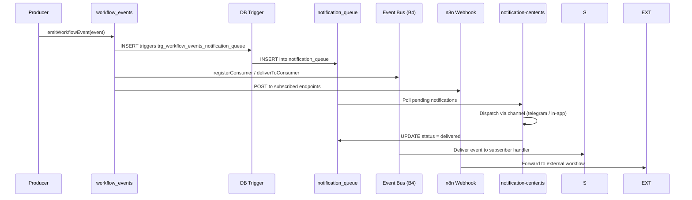

<p align="center">
  <picture>
    <source media="(prefers-color-scheme: dark)" srcset="docs/assets/favicon.svg">
    
  </picture>
</p>

<h1 align="center">📄 Webhook Event System — VALTREXA-V2</h1>

<p align="center">
  <strong>Version:</strong> v1.0.1 •
  <strong>Last Updated:</strong> 2026-07-05 •
  <strong>Category:</strong> Events & Webhooks
</p>

**Description:** Complete reference for workflow engine event types, payload schemas, trigger conditions, and consumer integration patterns

---

## Table of Contents

- [Overview](#overview)
- [Event Architecture](#event-architecture)
- [Event Catalog](#event-catalog)
- [Consumer Patterns](#consumer-patterns)
- [Best Practices](#best-practices)
- [Related Documents](#related-documents)

---

## Overview

VALTREXA-V2 emits strongly-typed workflow engine events at every phase of the automation pipeline. Events flow from producers through the `workflow_events` table and fan out to three consumer channels: the notification queue (DB trigger-driven), the Event Bus (B4 module), and external n8n webhook subscriptions.

```mermaid
flowchart LR
    P[Producers<br/>emitWorkflowEvent()] --> WE[(workflow_events)]
    WE --> TRG[DB Trigger<br/>trg_workflow_events_notification_queue]
    TRG --> NQ[notification_queue]
    WE --> EB[Event Bus B4<br/>registerConsumer / deliverToConsumer]
    WE --> N8N[n8n Webhook<br/>Subscriptions]
    NQ --> NC[notification-center.ts]
    EB --> S[Subscribers]
    N8N --> EXT[External Workflows]
```

## Webhook Event Processing Sequence



## Event Architecture

### Event Store Schema

Events are persisted immediately via `emitWorkflowEvent()` and remain available for replay.

```sql
CREATE TABLE workflow_events (
    id           UUID PRIMARY KEY DEFAULT gen_random_uuid(),
    user_id      UUID NOT NULL,
    event_type   VARCHAR(64) NOT NULL,
    entity_type  VARCHAR(32),
    entity_id    UUID,
    payload      JSONB NOT NULL DEFAULT '{}',
    created_at   TIMESTAMPTZ NOT NULL DEFAULT now(),
    delivered    BOOLEAN NOT NULL DEFAULT FALSE
);

CREATE INDEX idx_workflow_events_user
    ON workflow_events (user_id);
CREATE INDEX idx_workflow_events_type
    ON workflow_events (event_type);
CREATE INDEX idx_workflow_events_created ON workflow_events (created_at DESC);
```

### Delivery Tracking

Each delivery attempt is recorded for observability and replay.

```sql
CREATE TABLE workflow_event_deliveries (
    id             UUID PRIMARY KEY DEFAULT gen_random_uuid(),
    event_id       UUID NOT NULL REFERENCES workflow_events(id) ON DELETE CASCADE,
    consumer_type  VARCHAR(32) NOT NULL CHECK (consumer_type IN ('telegram', 'event_bus', 'n8n')),
    status         VARCHAR(16) NOT NULL DEFAULT 'pending'
                       CHECK (status IN ('pending', 'delivered', 'failed')),
    status_code    INT,
    attempt        INT NOT NULL DEFAULT 1,
    delivered_at   TIMESTAMPTZ,
    created_at     TIMESTAMPTZ NOT NULL DEFAULT now()
);

CREATE INDEX idx_wf_deliveries_event   ON workflow_event_deliveries (event_id);
CREATE INDEX idx_wf_deliveries_status  ON workflow_event_deliveries (status);
```

### Database Trigger

A PostgreSQL trigger (`trg_workflow_events_notification_queue`) automatically inserts a row into `notification_queue` for every new `workflow_events` row whose `event_type` maps to a notification category.

```sql
-- Simplified logic; routing map defined in trigger function
INSERT INTO notification_queue (user_id, channel, category, payload, scheduled_for)
VALUES (
    NEW.user_id,
    CASE WHEN NEW.event_type IN ('application_approved','application_rejected') THEN 'telegram' ELSE 'in-app' END,
    CASE NEW.event_type
        WHEN 'application_created'  THEN 'application_approval'
        WHEN 'outreach_created'     THEN 'outreach_approval'
        WHEN 'cookie_expired'       THEN 'cookie_expiry'
        WHEN 'provider_paused'      THEN 'provider_failure'
        WHEN 'workflow_error'       THEN 'workflow_state'
        WHEN 'health_check_completed' THEN 'health_alert'
        ELSE 'queue_event'
    END,
    NEW.payload,
    now()
);
```

## Event Catalog

### Resume & Profile

| Event Type       | Trigger                                   | Payload                                           |
| ---------------- | ----------------------------------------- | ------------------------------------------------- |
| `resume_parsed`  | Resume uploaded and processed by parser    | `{ user_id, resume_id, skills[], experience_years }` |

```json
{
  "event_type": "resume_parsed",
  "payload": {
    "user_id": "uuid",
    "resume_id": "uuid",
    "skills": ["Python", "React", "PostgreSQL"],
    "experience_years": 5.5
  }
}
```

### Jobs & Matching

| Event Type       | Trigger                                          | Payload                                           |
| ---------------- | ------------------------------------------------ | ------------------------------------------------- |
| `job_imported`   | New jobs fetched from a provider                 | `{ user_id, provider, count, job_ids[] }`         |
| `job_matched`    | Jobs scored against the candidate profile        | `{ user_id, match_count, tiers: { a, b, c, d } }`|

```json
{
  "event_type": "job_matched",
  "payload": {
    "user_id": "uuid",
    "match_count": 24,
    "tiers": { "a": 3, "b": 8, "c": 10, "d": 3 }
  }
}
```

### Applications

| Event Type               | Trigger                                              | Payload                                                        |
| ------------------------ | ---------------------------------------------------- | -------------------------------------------------------------- |
| `application_created`    | New application record created in DB                 | `{ user_id, application_id, job_id, provider }`                |
| `application_submitted`  | Application successfully submitted via provider      | `{ user_id, application_id, provider, tracking_url }`          |
| `application_failed`     | Submission returned an error                         | `{ user_id, application_id, provider, error, attempt }`        |
| `application_approved`   | User approved via Telegram inline button             | `{ user_id, application_id, approval_type }`                   |
| `application_rejected`   | User rejected via Telegram inline button             | `{ user_id, application_id }`                                  |

```json
{
  "event_type": "application_submitted",
  "payload": {
    "user_id": "uuid",
    "application_id": "uuid",
    "provider": "linkedin",
    "tracking_url": "https://linkedin.com/jobs/view/123"
  }
}
```

### Recruiters & Outreach

| Event Type            | Trigger                                          | Payload                                                   |
| --------------------- | ------------------------------------------------ | --------------------------------------------------------- |
| `recruiter_discovered`| New recruiter contact identified                 | `{ user_id, recruiter_id, company, source }`              |
| `outreach_created`    | Outreach message generated by LLM                | `{ user_id, outreach_id, recruiter_id, method }`          |
| `outreach_sent`       | Message sent via Gmail API                       | `{ user_id, outreach_id, recipient, message_id }`         |
| `outreach_failed`     | Gmail API returned an error                      | `{ user_id, outreach_id, error }`                         |
| `followup_sent`       | Follow-up email dispatched on cadence            | `{ user_id, outreach_id, cadence_day }`                   |

```json
{
  "event_type": "outreach_sent",
  "payload": {
    "user_id": "uuid",
    "outreach_id": "uuid",
    "recipient": "hr@example.com",
    "message_id": "gmail-message-id"
  }
}
```

### Gmail Intelligence

| Event Type            | Trigger                                            | Payload                                              |
| --------------------- | -------------------------------------------------- | ---------------------------------------------------- |
| `interview_detected`  | Email classifier labels message as interview       | `{ user_id, message_id, company, role }`             |
| `offer_received`      | Classifier detects an offer                        | `{ user_id, message_id, company }`                   |
| `rejection_received`  | Classifier detects a rejection                     | `{ user_id, message_id, company }`                   |

```json
{
  "event_type": "interview_detected",
  "payload": {
    "user_id": "uuid",
    "message_id": "gmail-thread-id",
    "company": "Acme Corp",
    "role": "Senior Engineer"
  }
}
```

### Provider & Cookies

| Event Type            | Trigger                                                | Payload                                              |
| --------------------- | ------------------------------------------------------ | ---------------------------------------------------- |
| `cookie_expired`      | Cookie validation health check failed                  | `{ user_id, provider }`                              |
| `cookie_refreshed`    | Cookie successfully refreshed via browser              | `{ user_id, provider }`                              |
| `provider_paused`     | Provider paused after consecutive failures             | `{ user_id, provider, reason }`                      |
| `provider_disabled`   | Provider auto-disabled after max failures              | `{ user_id, provider, failures }`                    |
| `provider_recovered`  | Health check passes after prior failure                | `{ user_id, provider }`                              |

```json
{
  "event_type": "cookie_expired",
  "payload": {
    "user_id": "uuid",
    "provider": "indeed"
  }
}
```

### Workflow Engine Lifecycle

| Event Type                | Trigger                                              | Payload                                                       |
| ------------------------- | ---------------------------------------------------- | ------------------------------------------------------------- |
| `workflow_started`        | User initiates the automation run                    | `{ user_id, workflow_id }`                                   |
| `workflow_stopped`        | User manually stops execution                        | `{ user_id, workflow_id }`                                   |
| `workflow_paused`         | User pauses the workflow                             | `{ user_id, workflow_id }`                                   |
| `workflow_resumed`        | User resumes a paused workflow                       | `{ user_id, workflow_id }`                                   |
| `workflow_error`          | A phase (resume, job, apply) encounters a fatal error| `{ user_id, workflow_id, phase, error }`                     |
| `health_check_completed`  | Provider health check phase finishes                 | `{ user_id, results: { provider, status }[] }`               |
| `analytics_computed`      | Daily analytics aggregation complete                 | `{ user_id, applications, interviews, offers }`              |

```json
{
  "event_type": "workflow_error",
  "payload": {
    "user_id": "uuid",
    "workflow_id": "uuid",
    "phase": "job_import",
    "error": "Provider rate limit exceeded"
  }
}
```

### Loom

| Event Type               | Trigger                                         | Payload                                              |
| ------------------------ | ----------------------------------------------- | ---------------------------------------------------- |
| `loom_script_generated`  | Loom outreach script created by LLM              | `{ user_id, script_id, recruiter_id }`               |

```json
{
  "event_type": "loom_script_generated",
  "payload": {
    "user_id": "uuid",
    "script_id": "uuid",
    "recruiter_id": "uuid"
  }
}
```

## Consumer Patterns

### 1. Notification Queue (DB Trigger)

Every event insert fires the `trg_workflow_events_notification_queue` trigger, which creates a row in `notification_queue`.

```sql
CREATE TABLE notification_queue (
    id            UUID PRIMARY KEY DEFAULT gen_random_uuid(),
    user_id       UUID NOT NULL,
    channel       VARCHAR(32) NOT NULL CHECK (channel IN ('telegram', 'in-app')),
    category      VARCHAR(64) NOT NULL,
    status        VARCHAR(16) NOT NULL DEFAULT 'pending'
                      CHECK (status IN ('pending', 'delivered', 'failed')),
    payload       JSONB NOT NULL DEFAULT '{}',
    scheduled_for TIMESTAMPTZ,
    attempts      INT NOT NULL DEFAULT 0,
    created_at    TIMESTAMPTZ NOT NULL DEFAULT now()
);
```

**Category-to-channel routing:**

| Category                | Channel  | Source Event Type                                        |
| ----------------------- | -------- | -------------------------------------------------------- |
| `application_approval`  | telegram | `application_created`                                    |
| `outreach_approval`     | telegram | `outreach_created`                                       |
| `cookie_expiry`         | telegram | `cookie_expired`                                         |
| `provider_failure`      | in-app   | `provider_paused`, `provider_disabled`                   |
| `workflow_state`        | in-app   | `workflow_started`, `workflow_stopped`, `workflow_error` |
| `health_alert`          | telegram | `health_check_completed` (on failure)                    |
| `queue_event`           | in-app   | All others                                               |

The `notification-center.ts` service polls `notification_queue` where `status = 'pending'` and `scheduled_for <= now()`, dispatches via the appropriate channel, and updates `status` to `delivered` or `failed`.

### 2. Event Bus (B4 Module)

The B4 module provides programmatic consumer registration and event replay.

```
GET  /event-bus/consumers        -- List all registered consumers
POST /event-bus/consumers        -- Register a new consumer { name, event_types[], endpoint }
POST /event-bus/replay           -- Replay events by ID range or event_type { event_ids[], event_type, from_date, to_date }
GET  /event-bus/history          -- Paginated delivery history with filters
```

**Core functions:**
- `registerConsumer(name, eventTypes, handler)` -- Subscribe to specific event types. The module inserts a consumer record and begins routing matching events.
- `deliverToConsumer(consumer, event)` -- Serialises the event payload and delivers via the consumer's registered endpoint. Records attempt in `workflow_event_deliveries`.
- `replayEvent(eventIds)` -- Re-fetches events from `workflow_events` and re-routes through `deliverToConsumer` for every active consumer.

> [!NOTE]
> Consumers receive payloads as `{ id, event_type, entity_type, entity_id, payload, created_at }`.

### 3. n8n Webhook Subscriptions

External n8n workflows subscribe to VALTREXA-V2 events via a REST endpoint.

```sql
CREATE TABLE n8n_webhook_subscriptions (
    id          UUID PRIMARY KEY DEFAULT gen_random_uuid(),
    event_type  VARCHAR(64) NOT NULL,
    target_url  TEXT NOT NULL,
    secret      VARCHAR(128) NOT NULL,
    enabled     BOOLEAN NOT NULL DEFAULT TRUE,
    created_at  TIMESTAMPTZ NOT NULL DEFAULT now()
);
```

**Subscribe:**

```
POST /api/integrations/n8n/subscribe
{
  "event_type": "application_submitted",
  "target_url": "https://n8n.example.com/webhook/valtrexa",
  "secret": "hmac-secret-key"
}
```

**Payload signing:** Every outgoing webhook includes an `X-VALTREXA-V2-Signature` header containing the HMAC-SHA256 digest of the raw JSON body, keyed by the subscription `secret`. Consumers verify integrity before processing.

```json
// Example webhook body
{
  "event_id": "uuid",
  "event_type": "application_submitted",
  "user_id": "uuid",
  "payload": {
    "application_id": "uuid",
    "provider": "linkedin",
    "tracking_url": "https://linkedin.com/jobs/view/123"
  },
  "created_at": "2026-07-05T12:00:00Z"
}
```

**Unsubscribe:**

```
DELETE /api/integrations/n8n/subscribe/{id}
```

## Best Practices

- **Use event types for observability**: Every significant workflow action should emit a strongly-typed event. The `workflow_events` table serves as your audit log and enables replay in case of consumer failure.
- **Design consumers to be idempotent**: The same event may be delivered more than once during retries. Ensure consumer handlers are idempotent by checking `event_id` before processing.
- **Monitor delivery failures**: Regularly check `workflow_event_deliveries` for failed deliveries. Set up alerts for high failure rates per consumer type.
- **Rotate n8n webhook secrets**: Regenerate the `secret` field periodically and update subscriptions to maintain security of HMAC-SHA256 signed payloads.
- **Keep notification queue consumers fast**: The DB trigger runs synchronously on event insert. Heavy processing in the trigger function can impact write throughput — keep routing logic minimal and defer heavy work to `notification-center.ts`.
- **Use event replay for recovery**: When a consumer goes down, missed events can be replayed via the Event Bus's `POST /event-bus/replay` endpoint using ID range or event_type filters.

---

## Related Documents

- [Architecture](ARCHITECTURE.md) — System context and module boundaries
- [Database Schema](DATABASE.md) — Full table reference with constraints and indexes
- [Integration Guide](INTEGRATION_GUIDE.md) — n8n webhook setup and workflow templates
- [API Reference](API_REFERENCE.md) — Endpoint documentation
- [Backend Architecture](BACKEND.md) — Event Bus (B4) module internals

---

<br/>
<div align="center">
  <strong>Next Reading:</strong> <a href="TUTORIALS.md">Tutorials →</a>
</div>
