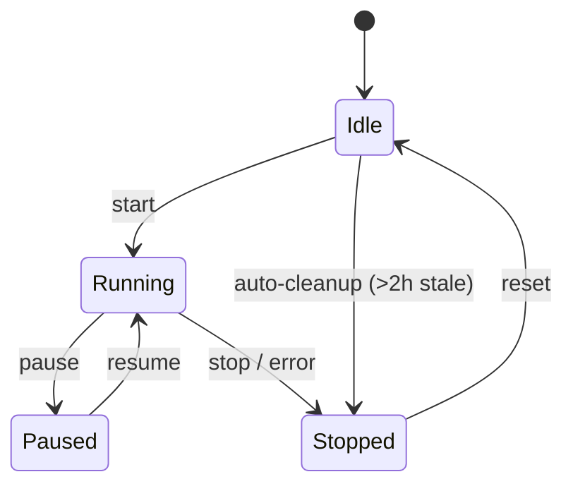
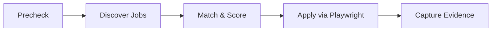
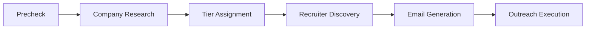

  <picture>
    <source media="(prefers-color-scheme: dark)" srcset="docs/assets/favicon.svg">
    
  </picture>

<h1 align="center">⚙️ Workflow Engine</h1>

  <strong>Version:</strong> v1.0.0 •
  <strong>Last Updated:</strong> 2026-06-29 •
  <strong>Category:</strong> Automation

**Description:** VALTREXA-V2 — Automation Pipelines, State Machine & Configuration

---

## Table of Contents

- [Overview](#overview)
- [State Machine](#state-machine)
- [Pipeline A: Auto-Apply](#pipeline-a-auto-apply)
- [Pipeline B: High-Value Outreach](#pipeline-b-high-value-outreach)
- [Configuration Defaults](#configuration-defaults)
- [Recovery & Error Handling](#recovery--error-handling)
- [Best Practices](#best-practices)
- [Related Documents](#related-documents)

---

## Overview

Two pipelines run in configurable cycles (default: every 30 minutes):

| Pipeline | Purpose                                      |
| -------- | -------------------------------------------- |
| **A**    | Auto-apply to matched jobs on 5 job boards   |
| **B**    | High-value recruiter outreach with AI messaging |

---

## State Machine

| State      | Description                                    |
| ---------- | ---------------------------------------------- |
| **Idle**   | No workflow running                            |
| **Running**| Cycle in progress                              |
| **Paused** | User paused mid-cycle                          |
| **Stopped**| Cycle ended (completion, error, or user stop)  |

> [!NOTE]
> Auto-cleanup: stale workflows (>2h without update) are auto-stopped.

---

## Pipeline A: Auto-Apply

### Stages

1. **Precheck** — Validate cookies, provider health, candidate brain completeness
2. **Discover** — Import new jobs from all enabled providers
3. **Match** — Score jobs against candidate profile (8 factors)
4. **Apply** — For matched jobs, run Playwright automation
5. **Evidence** — Capture screenshots + HTML, store in `apply_evidence`

### Strategies

| Strategy     | Tiers   | Easy Apply | Freshness | Approval | Min Score |
| ------------ | ------- | ---------- | --------- | -------- | --------- |
| Conservative | A only  | Required   | ≤3 days   | Required | 85%       |
| Balanced     | A, B    | Preferred  | ≤7 days   | Optional | 70%       |
| Aggressive   | A, B, C | Any        | ≤30 days  | Disabled | 50%       |

### Rate Limits

- Max 50 applications per cycle (configurable)
- 3-second delay between submissions per provider
- Browser timeout: 120 seconds per application

---

## Pipeline B: High-Value Outreach

### Stages

1. **Precheck** — Same as Pipeline A
2. **Company Research** — Deep-dive into target companies (pain points, tech stack, culture)
3. **Tier Assignment** — Strategic value scoring (A = outreach, B = nurture, C = monitor)
4. **Recruiter Discovery** — Find recruiters + verify emails
5. **Email Generation** — AI-crafted personalized messaging (OpenRouter)
6. **Outreach Execution** — Send via Gmail API with follow-up cadence (Day 3/7/14)

---

## Configuration Defaults

| Setting         | Default    | Description                              |
| --------------- | ---------- | ---------------------------------------- |
| Cycle interval  | 30 minutes | Time between pipeline runs               |
| Batch size      | 50         | Max applications per cycle               |
| Approval mode   | Disabled   | Requires Telegram approval before submit |
| Min match score | 70%        | Job match threshold                      |
| Max retries     | 3          | Per-application retry count              |
| Browser timeout | 120s       | Per-application timeout                  |

---

## Recovery & Error Handling

- **Phase-level isolation:** Each stage has its own try-catch
- **Auto-retry:** Transient failures retried (3 attempts with backoff)
- **Manual recovery:** Failed applications can be retried via dashboard
- **Self-healing:** Fallback selectors, fuzzy element matching, navigation auto-heal
- **Stale workflow cleanup:** >2h without update → auto-stopped

---

## Best Practices

> [!TIP]
> - Start with **Conservative** strategy and gradually increase aggressiveness
> - Monitor workflow status via Telegram `/workflow_status`
> - Review failed applications in the dashboard for pattern improvement
> - Keep batch size moderate to avoid provider rate limits
> - Enable approval mode when testing new strategies
> - Check provider health before enabling aggressive auto-apply

> [!WARNING]
> Aggressive mode bypasses approval — use with caution and ensure cookies are valid.

---

## Related Documents

- [Telegram Operations](TELEGRAM_OPERATIONS.md) — Bot command reference
- [Provider Guide](PROVIDER_GUIDE.md) — Supported job board provider configuration
- [Cookie Guide](COOKIE_GUIDE.md) — Session cookie management

---

 

  <strong>Next Reading:</strong> <a href="TELEGRAM_OPERATIONS.md">Telegram Operations →</a>

