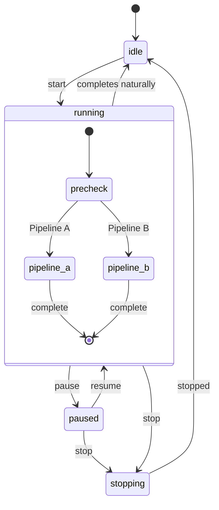
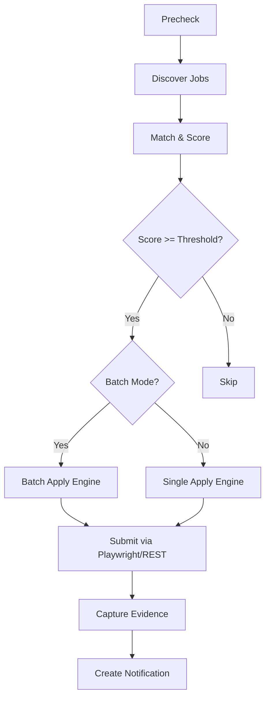
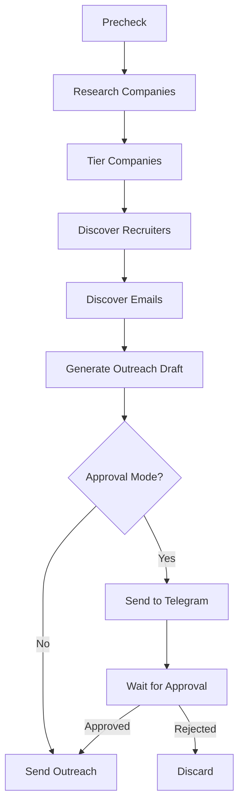

# Workflow Guide

> **Last Updated:** 2026-06-26

## Overview

The workflow runner (`workflow-runner.ts`) orchestrates two parallel pipelines:

- **Pipeline A**: Auto-apply to matched jobs from all enabled providers
- **Pipeline B**: High-value company research → recruiter discovery → outreach orchestration

Both pipelines run concurrently within each workflow cycle. Results are persisted in `workflow_events`, `applications`, `outreach_messages`, and tracked via `workflow_timeline`.

## State Machine

Defined in `workflow-state.ts`:



- **idle**: Workflow not running; ready to start
- **running**: Active cycle; executing precheck → pipelines
- **paused**: Temporarily suspended; can resume
- **stopped**: Terminated; must start fresh

## Pipeline A: Auto-Apply

### Prerequisites

1. Valid provider cookies (see [COOKIE_GUIDE.md](COOKIE_GUIDE.md))
2. Candidate brain populated (resume, skills, role preferences)
3. Provider controls enabled for at least one provider
4. Match threshold configured (default: 70%)

### Execution



### Stages

| Stage | Description |
|---|---|
| `pipeline_a_precheck` | Validate cookies, check provider health, load candidate brain |
| `discover_jobs` | Fetch new jobs from all enabled providers |
| `match_jobs` | Score each job against candidate brain (see match-engine) |
| `apply_jobs` | Submit applications (single or batch) |
| `evidence_capture` | Screenshot confirmations, store proof |

## Pipeline B: High-Value Outreach

### Prerequisites

1. Pipeline A completed (or configured as standalone)
2. High-value company list populated
3. Outreach templates available

### Execution



### Stages

| Stage | Description |
|---|---|
| `pipeline_b_precheck` | Validate credentials, load target list |
| `research_companies` | Score companies by hiring velocity, engineering maturity, remote friendliness, product momentum |
| `tier_companies` | Assign tier: ELITE, HIGH, MEDIUM, LOW |
| `discover_recruiters` | Multi-strategy recruiter search (LinkedIn, company website, google dorking) |
| `discover_emails` | Email discovery via MX validation, website extraction, pattern inference |
| `generate_outreach` | AI-personalized cold email / LinkedIn message / founder outreach |
| `execute_outreach` | Send via email API or LinkedIn message |

## Precheck Phase

Before any pipeline runs, the system verifies:

```
✓ Provider cookies valid (all enabled providers)
✓ Provider health status (healthy/degraded)
✓ Candidate brain populated (resume, skills, preferences)
✓ Workflow config valid (intervals, thresholds, providers)
✓ Inbox credentials valid (if Gmail sync enabled)
```

Precheck failure pauses the workflow and sends a notification with details.

## Recovery & Error Handling

### Phase-Level Recovery

Each phase has independent error handling. If Pipeline A fails, Pipeline B continues. Within a pipeline, a single job failure does not stop the batch.

```
workflow-runner.ts: for each phase, try/catch wraps the entire phase.
On failure: phase is marked as failed with error_message.
Workflow continues to next phase.
All failures are logged to workflow_events.
```

### Auto-Retry

- **Transient errors** (network, timeout): 3 retries with exponential backoff (1s, 5s, 15s)
- **Cookie expiry**: Marks cookie as expired, pauses provider, sends notification
- **Playwright crash**: Recreates browser context, retries operation
- **API rate limit**: Waits for rate limit reset, retries once

### Manual Recovery

1. Fix the issue (re-upload cookie, enable provider, etc.)
2. Resume workflow via Telegram (`/resume`) or dashboard
3. Workflow continues from the last successful phase

## Configuration

Default config in `workflow-config.ts`:

| Parameter | Default | Description |
|---|---|---|
| `intervalMinutes` | 60 | Time between cycles |
| `matchThreshold` | 70 | Min match score (0–100) |
| `maxApplicationsPerCycle` | 10 | Max per cycle |
| `batchSize` | 5 | Batch size for batch apply |
| `batchStrategy` | `balanced` | conservative/balanced/aggressive |
| `approvalMode` | true | Require approval before apply |
| `enabledProviders` | all | Which providers to use |

## Multi-User Isolation

Each workflow run is scoped to a single `user_id`:

- Workflow state is stored per-user in `workflow_state` table
- Timeline stages are per-user in `workflow_timeline` table
- Queue processors filter by `user_id`
- RLS policies on all tables prevent cross-user access

## Monitoring

- **Dashboard**: Timeline tab shows live progress bars, stage duration, error messages
- **Telegram**: `/status` command shows current workflow phase, provider health, queue depth
- **Notifications**: Phase transitions, failures, and completions are sent as in-app + Telegram notifications
